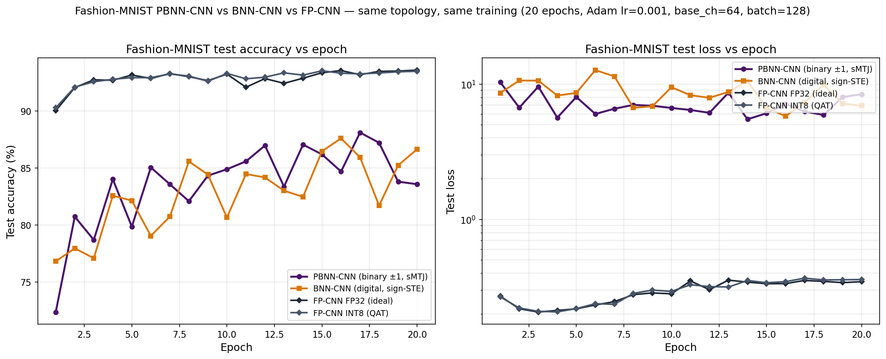
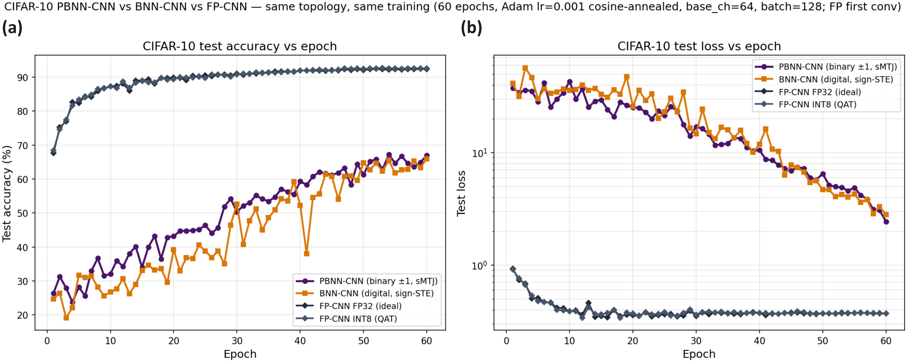
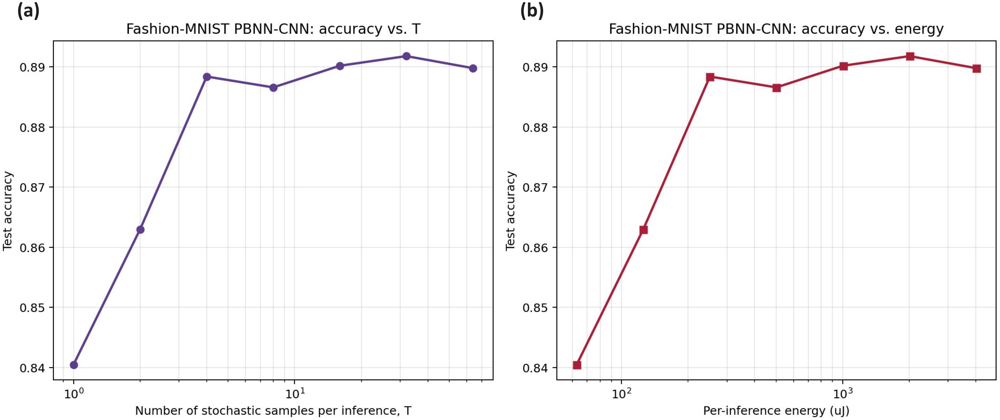
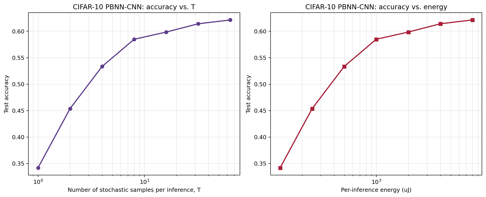

# 附录B 卷积拓扑与复杂图像数据集上的PBNN扩展实验

正文第4.4–4.5节基于MNIST手写数字与UCI表格任务，用三层PBNN-MLP完成了精度、采样次数与基线对照的核心分析。本附录把同一PBNN构造扩展到卷积拓扑 (PBNN-CNN)，并沿判别难度递增的方向迁移到两个图像数据集：Fashion-MNIST服饰分类[^xiao2017] ($$28\times 28$$灰度，难度介于手写数字与自然图像之间) 与CIFAR-10自然图像分类[^cifar10] ($$32\times 32$$ RGB，含飞机、汽车、鸟、猫等10类自然物体，是二值网络公认的难基准)，以检验正文基于MLP-MNIST得到的两个核心结论 (二值架构相对全精度的容量代价、时域展开的采样-精度收敛特性) 在更深的网络与更难的数据上是否依然成立。本附录的图表独立编号 (图B.x、表B.x)，正文编号不受影响。

## B.1 网络拓扑与训练设置

PBNN-CNN对Fashion-MNIST采用$$1\to 64\to 64\to 128\to 128$$四层卷积 (核$$3\times 3$$、pad 1，每两层接一次$$2\times 2$$最大池化，分辨率$$28\to 14\to 7$$) 加$$128\!\times\!7\!\times\!7\to 1024\to 10$$两层全连接；对CIFAR-10在前面增加一组卷积扩展为$$3\to 64\to 64\to 128\to 128\to 256\to 256$$六层卷积 (三次池化，$$32\to 16\to 8\to 4$$) 加$$256\!\times\!4\!\times\!4\to 1024\to 10$$。两套网络的卷积主干与全连接层均以PBNNConv2d/PBNNLinear实现、激活为sign-STE，与Courbariaux等人的BinaryNet配置同构[^binarynet]；遵循二值网络在RGB输入上的通行做法，CIFAR-10网络的**首层卷积保留全精度** (直接二值化三通道原始像素会摧毁过多输入信息，使精度塌缩至接近随机)，其余卷积与全连接全部二值。BNN-CNN与FP-CNN基线共用同一拓扑，分别把二值层替换为带sign-STE的`_BinConv2d`/DeterministicBinaryLinear与`nn.Conv2d`/`nn.Linear`，FP-CNN同时给出FP32与INT8两档QAT变体。Fashion-MNIST四种网络以Adam $$\mathrm{lr}=10^{-3}$$、batch 128、20轮训练；CIFAR-10的二值网络收敛显著更慢 (BinaryNet文献常需数百轮)，故统一采用60轮配余弦退火学习率[^te_cifar] (正文4.5节末段已表明余弦/OneCycle调度对二值PBNN收益最大)。两数据集的训练曲线如图B.1、图B.2所示，最佳测试精度汇总于表B.1。

**图B.1** Fashion-MNIST上PBNN-CNN (二值$$\pm 1$$、sMTJ)、确定性BNN-CNN (数字sign-STE) 与FP-CNN (FP32 + INT8 QAT) 共用四层卷积 + 两层全连接同拓扑下的测试精度 (左) 与测试损失 (右) 随训练轮数演化，对数纵轴。FP32收敛至93.58%、INT8与之相距0.06pp，二值架构 (PBNN-CNN 88.11%、BNN-CNN 87.60%) 几乎完全重合，与FP32相距约5.5个百分点；定性形态与正文图4.4(b)的MLP-MNIST曲线一致。

**图B.2** CIFAR-10上PBNN-CNN、BNN-CNN与FP-CNN (FP32 + INT8 QAT) 共用六层卷积 + 两层全连接 (首层全精度) 同拓扑、60轮余弦退火训练下的测试精度 (左) 与测试损失 (右) 演化。FP32/INT8在约20轮即收敛至92%量级，而二值架构 (PBNN-CNN 67.22%、BNN-CNN 66.01%) 需依赖余弦退火的后半程缓慢爬升、至60轮仍未完全饱和，与FP相距约25个百分点，体现出二值容量在自然图像任务上的代价急剧放大，但两条二值曲线依旧几乎重合。

**表B.1** Fashion-MNIST与CIFAR-10上同拓扑PBNN-CNN、BNN-CNN与FP-CNN的最佳测试精度 (相对各自数据集的FP32基线)。

| 数据集 | 架构 | 最佳测试精度 | 相对FP32差距 |
|---|---|---|---|
| Fashion-MNIST | FP-CNN FP32 (理想) | 93.58% | 基准 |
| Fashion-MNIST | FP-CNN INT8 (QAT) | 93.52% | $$-0.06$$pp |
| Fashion-MNIST | PBNN-CNN (二值，sMTJ) | 88.11% | $$-5.47$$pp |
| Fashion-MNIST | BNN-CNN (数字二值) | 87.60% | $$-5.98$$pp |
| CIFAR-10 | FP-CNN INT8 (QAT) | 92.75% | $$+0.34$$pp |
| CIFAR-10 | FP-CNN FP32 (理想) | 92.41% | 基准 |
| CIFAR-10 | PBNN-CNN (二值，sMTJ) | 67.22% | $$-25.19$$pp |
| CIFAR-10 | BNN-CNN (数字二值) | 66.01% | $$-26.40$$pp |

表B.1与正文表4.2、表4.3合起来给出一条清晰的二值容量代价随任务难度单调放大的曲线：MLP-MNIST下PBNN与FP32相距1.53pp、CNN-Fashion-MNIST扩大到5.47pp、CNN-CIFAR-10进一步扩大到25.19pp。这一梯度与正文4.5节末段UCI实验 (差距随样本规模、类别数与判别难度变化) 的观察一脉相承，说明二值权重的有限容量在简单任务上被网络冗余吸收、在自然图像这类高内蕴维度任务上才真正成为瓶颈。除此之外有两点跨数据集一致的结论：其一，FP32与INT8 QAT在两个CNN任务上的差距都在0.1—0.3pp以内 (CIFAR-10上INT8甚至略胜)，延续了低位宽量化不构成主要瓶颈的规律；其二，BNN-CNN与PBNN-CNN的差距在两个数据集上都不超过1.3个百分点且PBNN略占优 (Fashion-MNIST 88.11% vs 87.60%、CIFAR-10 67.22% vs 66.01%)，再次确认sMTJ随机性带来的训练精度损失对卷积拓扑同样微小，PBNN接受Bernoulli采样并未额外付出可观代价 (与正文表4.2在MLP-MNIST上的同一结论吻合)。

## B.2 时域展开在卷积拓扑上的采样-精度曲线

把两数据集训练好的PBNN-CNN分别在$$T=1, 2, 4, \ldots, 64$$下做全栈推理评估，精度-T曲线如图B.3、图B.4所示，定量数据汇总于表B.2。两条曲线都复现了正文4.4节MLP-MNIST的对数饱和形态，即精度随$$T$$快速上升后进入平台，确认时域展开的收敛特性由PBNN对Bernoulli样本均值的统计估计单独决定，与拓扑及数据集解耦。但两数据集在两个量化指标上呈现难度依赖的差异。其一，HARDWARE_AWARE训练精度与FULL_STACK渐近精度的吻合度随难度下降：Fashion-MNIST上FULL_STACK $$T=64$$ (88.98%) 甚至略胜HARDWARE_AWARE (88.11%)，二者语义一致；CIFAR-10上FULL_STACK $$T=64$$ (62.14%) 较HARDWARE_AWARE (67.22%) 低约5个百分点，这一残差源于难任务下学到的$$\theta$$置信度较低、放大100倍后Bernoulli采样与解析均值之间的截断误差更显著。其二，逼近渐近上限所需的采样次数随难度上升：Fashion-MNIST在$$T=4$$即达渐近值的0.3个百分点内，而CIFAR-10在$$T=4$$仅53.35%、需到$$T=32$$以上才进入62%平台 ($$T=4$$与$$T=64$$相差约9个百分点)。因此正文将$$T=4$$作为通用部署点的结论对Fashion-MNIST成立，但对CIFAR-10这类难任务应上调至$$T=16$$—$$32$$以换取2—3个百分点精度；这恰好量化了时域展开作为精度-能耗调节旋钮的价值，即允许在部署期按任务难度单独调节采样深度，而无需重新训练。

**图B.3** Fashion-MNIST PBNN-CNN在全栈$$T$$扫描下的精度-T曲线 (左) 与精度-能耗曲线 (右)，对数横轴。$$T\le 4$$精度随$$T$$快速上升、$$T\ge 8$$进入88.6–89.2%平台，$$T=4$$处88.84%与峰值89.18%相差0.34个百分点；FULL_STACK评估精度略胜HARDWARE_AWARE训练时的88.11%，支持正文4.3节三档共用同一检查点的设计选择。

**图B.4** CIFAR-10 PBNN-CNN在全栈$$T$$扫描下的精度-T曲线 (左) 与精度-能耗曲线 (右)，对数横轴。曲线比图B.3陡峭得多：$$T=1$$仅34.19%、$$T=4$$升至53.35%、$$T=64$$达62.14%仍在缓慢上升，反映难任务下需要更深的采样才能压低Bernoulli估计方差；$$T=64$$渐近值低于HARDWARE_AWARE训练精度67.22%约5个百分点。

**表B.2** Fashion-MNIST与CIFAR-10的PBNN-CNN在不同采样次数$$T$$下的全栈推理测试精度 (单次推理能耗随$$T$$线性增长，绝对值见各自图B.3/B.4右栏)。

| $$T$$ | Fashion-MNIST 精度 | CIFAR-10 精度 |
|---|---|---|
| 1 | 84.05% | 34.19% |
| 2 | 86.30% | 45.38% |
| 4 | 88.84% | 53.35% |
| 8 | 88.66% | 58.49% |
| 16 | 89.02% | 59.85% |
| 32 | 89.18% | 61.42% |
| 64 | 88.98% | 62.14% |

## B.3 小结

卷积拓扑扩展实验定性地确认了正文两个核心结论对一般PBNN-CNN设计同样成立：(1) sMTJ随机采样不引入可观的额外训练精度代价 (PBNN-CNN与确定性BNN-CNN在两个数据集上差距均小于1.3个百分点)；(2) 时域展开提供按需可调的精度-能耗折中。同时，实验量化了两点难度依赖的工程提示：二值架构相对全精度的容量差距随任务难度从MNIST的约1.5pp扩大到CIFAR-10的约25pp，而在难任务上达到FULL_STACK渐近精度所需的采样次数也相应上升 (CIFAR-10建议$$T=16$$—$$32$$而非MNIST的$$T=4$$)。这些结论与正文基于MNIST-MLP的分析互为补充，未改变正文的主线判断。

## 脚注

以下为说明性脚注 (随文排为脚注；与作为尾注的参考文献分列)。

[^te_cifar]: CIFAR-10二值网络的收敛是本扩展实验中的主要难点。沿用Fashion-MNIST的20轮固定学习率配置时，二值CNN在CIFAR-10上长时间停滞于约50%、远未收敛；改用60轮余弦退火后训练才稳定爬升至约67%，这也从训练动力学一侧印证了二值容量代价随任务难度急剧放大的规律。

## 参考文献

[^xiao2017]: Xiao H, Rasul K, Vollgraf R. Fashion-MNIST: a novel image dataset for benchmarking machine learning algorithms. *arXiv preprint*, 2017. [arXiv:1708.07747](https://arxiv.org/abs/1708.07747)
[^binarynet]: Courbariaux M, Hubara I, Soudry D, El-Yaniv R, Bengio Y. Binarized neural networks: training deep neural networks with weights and activations constrained to +1 or -1. *arXiv preprint*, 2016. [arXiv:1602.02830](https://arxiv.org/abs/1602.02830)
[^cifar10]: Krizhevsky A. Learning multiple layers of features from tiny images. *Technical Report*, University of Toronto, 2009.
