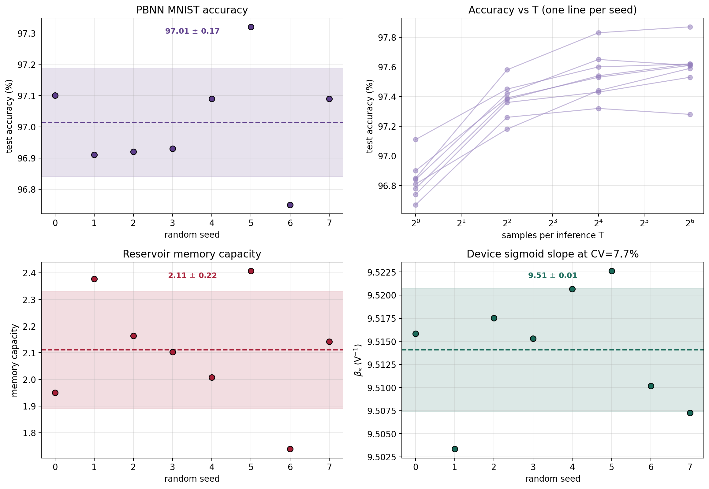

# 附录C 主要结论对随机数种子的稳健性

本文的若干核心结论依赖于含随机性的训练与蒙特卡罗仿真 (权重初始化与小批量顺序、Bernoulli 采样、器件变异抽样、储备池与输入序列的随机生成)。为排除"结论来自一次幸运的随机数种子选取"这一可能，本附录把每一项头部结论在 8 个相互独立的随机数种子 (0–7) 下整体重跑，统一经由 `set_global_seed` 设定种子，并以 8 次结果的均值 $$\pm$$ 标准差报告。若各结论的种子间标准差远小于其所依赖的方法间/配置间差异，则可判定结论是方法的属性而非种子的偶然产物。

## C.1 方法

四项头部结论各自的可变随机源被逐一暴露为种子：(1) PBNN-MLP 的 MNIST 训练 (初始化 + 优化 + 采样)；(2) 训练完成后在 $$T=1,4,16,64$$ 下的时域展开推理；(3) sMTJ 储备池 (N=100、每节点 96 器件) 的记忆容量及其相对数字 ESN 的能效；(4) 器件层在 PDK 基线变异 CV($$\Delta$$)=7.7% 下、对 20000 个器件做晶圆平均后拟合的 Sigmoid 斜率 $$\beta_s$$。其余配置 (轮数、网络规模、工艺参数) 在所有种子间保持一致。

## C.2 结果

8 个种子下各结论的统计量汇总于表C.1，逐种子分布见图C.1。

**表C.1** 头部结论在 8 个随机数种子 (0–7) 下的均值 $$\pm$$ 标准差。

| 结论 | 均值 $$\pm$$ 标准差 | 区间 |
|---|---|---|
| PBNN-MLP MNIST 最佳测试精度 | $$97.01\% \pm 0.17\%$$ | $$[96.75,\ 97.32]\%$$ |
| 时域展开差 acc($$T{=}64$$) $$-$$ acc($$T{=}4$$) | $$0.21 \pm 0.11$$ pp | $$[0.02,\ 0.41]$$ pp |
| 储备池记忆容量 (N=100, 96 器件/节点) | $$2.11 \pm 0.22$$ | $$[1.74,\ 2.41]$$ |
| 储备池相对数字 ESN 的能效优势 | $$30.2\times$$ (确定性) | — |
| 器件 Sigmoid 斜率 $$\beta_s$$ @ CV=7.7% | $$9.51 \pm 0.01$$ V$$^{-1}$$ | $$[9.50,\ 9.52]$$ |

**图C.1** 头部结论在 8 个随机数种子下的逐种子分布 (虚线为均值、阴影带为 $$\pm$$ 一个标准差)。左上：PBNN-MLP 的 MNIST 最佳测试精度紧密聚集于 97.0%；右上：每个种子的精度-$$T$$ 曲线形态一致，均在 $$T{=}4$$ 附近逼近平台；左下：储备池记忆容量；右下：器件 Sigmoid 斜率 $$\beta_s$$ (因对 20000 个器件作平均，种子间几乎不可分辨)。

## C.3 结论

四项结论均对随机数种子稳健：PBNN 的 MNIST 精度种子间标准差仅 0.17 个百分点，远小于其相对全精度基线的容量差距 (正文约 1.5 pp) 与相对更低位宽的差异；时域展开“$$T{=}4$$ 即逼近渐近精度”的判断在每个种子下都成立 (acc($$T{=}64$$) 与 acc($$T{=}4$$) 之差稳定在约 0.2 pp)；储备池记忆容量的相对波动约 10%，不影响其与数字 ESN 的能效结论 (能效优势 $$30.2\times$$ 由器件数与运算量决定，本身与种子无关)；器件标定斜率 $$\beta_s$$ 的种子间标准差仅 0.01 V$$^{-1}$$，因而由其外推的联合模型预测 ($$\beta_s \approx 44.6$$ V$$^{-1}$$) 同样与种子无关。综上，正文的主线结论并非源于种子的择优选取。
