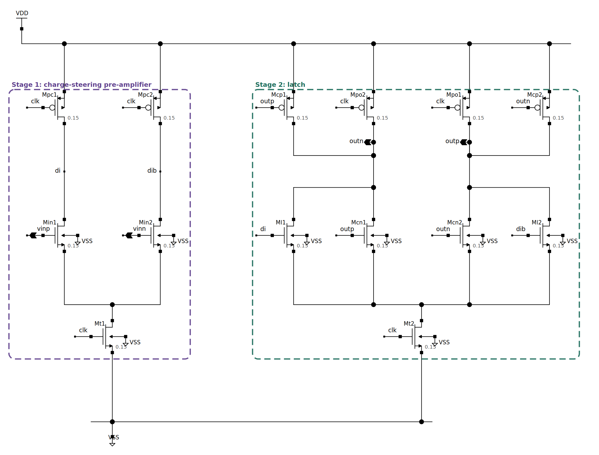
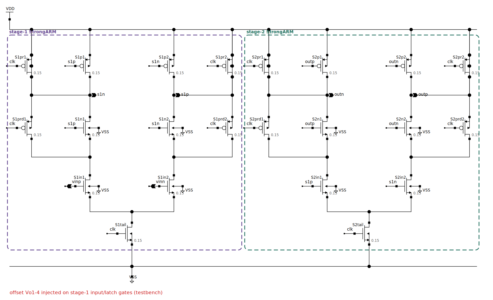
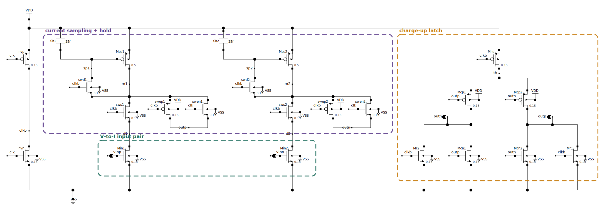
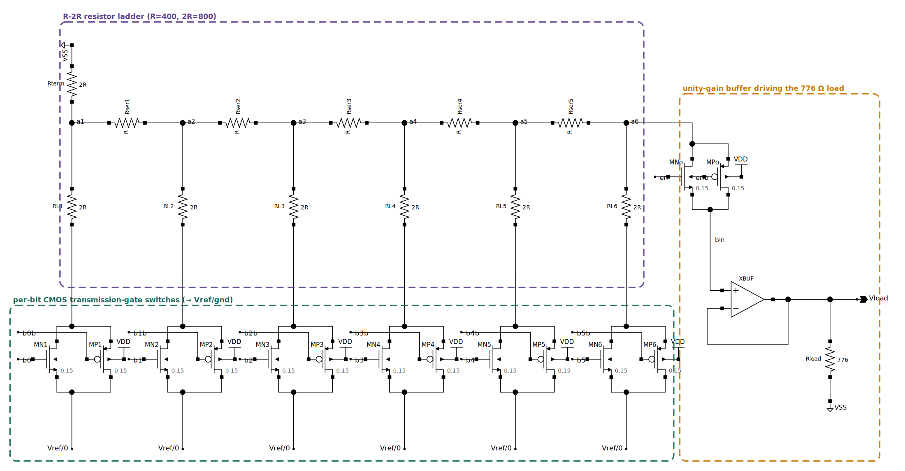
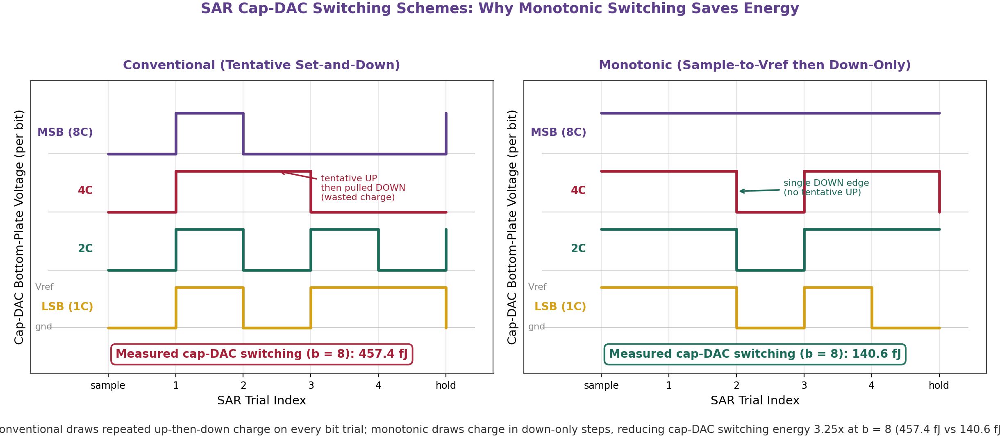
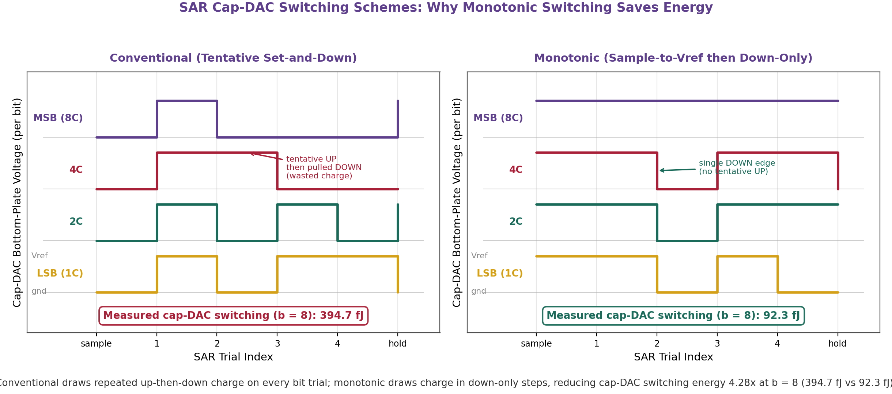
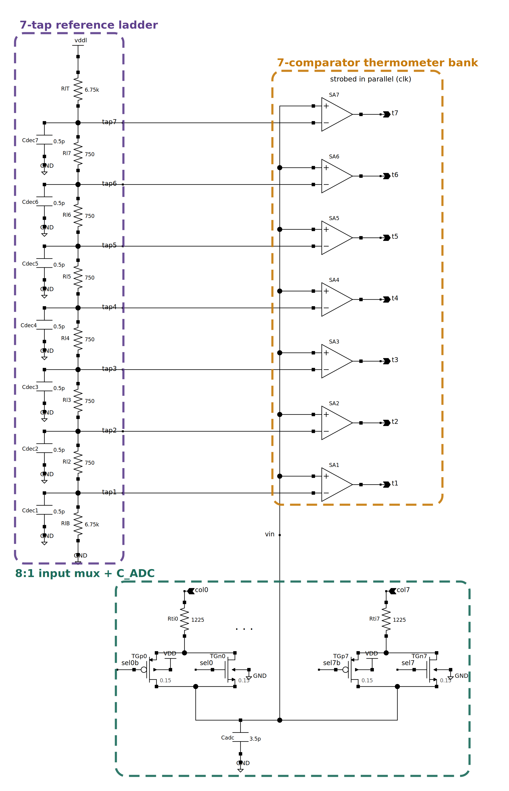
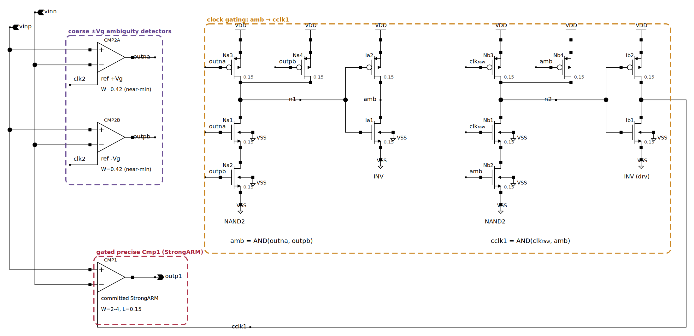
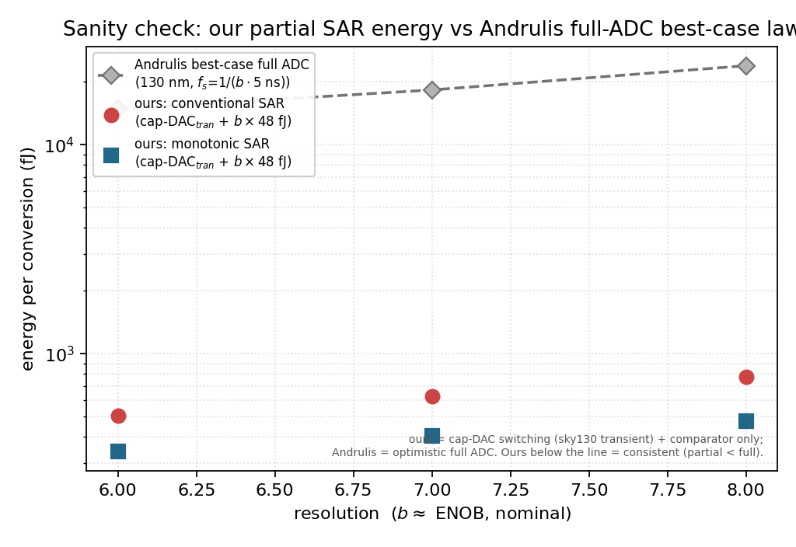

# 附录D 外围电路对比方案与同流程复现

读出灵敏放大器、写入DAC与逐次逼近 (SAR) 电容DAC三处外围模块的选型，在本附录中由可测量的同口径数据支撑：每一处的文献备选拓扑都在与本方案完全相同的sky130 + ngspice流程里重新实现并测量，故"本方案优于备选"不再是引文断言，而是由同一框架下的直接比较给出。本附录给出三处的复现电路、同口径结果与选型依据，并以一张能力对照表覆盖数量过多、不宜在本地按电路重建的更广文献。

## D.1 同流程复现方法

三处模块各自组织为"共享度量框架 + 逐方案网表"，使备选拓扑在同一口径下运行。读出比较器在输入对注入由Pelgrom失配律 ($$A_{V_T}\approx 5\ \mathrm{mV{\cdot}\mu m}$$) 生成的阈值失配，扫描输入差分电压使锁存翻转，翻转点即该样本的输入折合失调；$$N=120$$个蒙特卡罗样本的标准差$$\sigma_\mathrm{off}$$以p-bit判决窗口$$V_T=23.4\ \mathrm{mV}$$归一。写入DAC在$$0$$–$$63$$码上做直流扫描，负载取版图提取的$$776\ \Omega$$ SOT写线，由相邻码电压差得LSB、由全码对理想直线的最大偏差得INL、并判定单调性。SAR以晶体管级CMOS传输门把电容底极板在$$V_\mathrm{ref}$$与地间切换，在一次完整$$b$$步逼近序列上对参考源作暂态电荷积分$$E=-\!\int v(V_\mathrm{ref})\,i(V_\mathrm{ref})\,\mathrm{d}t$$得电容DAC开关能；比较器能取版图提取的StrongARM单次判决$$48\ \mathrm{fJ}$$，按$$b$$次叠加。各方案的复现入口见附录末。

## D.2 读出比较器

读出端须在绝对$$23.4\ \mathrm{mV}$$的窗口内分辨一次二值伯努利判决，失调而非TMR裕度是瓶颈。单级StrongARM锁存比较器 (电路见正文图4.14) 与四种文献备选在同一失调框架下复现：分离预放大与锁存的double-tail电荷转向比较器 (图D.1)、以二级重采样已判决信号令二级失调受一级增益分压的DSA双级锁存 (图D.2)、以电流域采样把镜像管失配一阶抵消的电流采样SA (图D.3)，以及在判决前相位把失调采样到电容上再串联抵消的单电容自调零SA (图D.4)，结果列于表D.1。

**图D.1** double-tail电荷转向动态比较器的晶体管级电路 (sky130)。第一级为带独立尾电流的电荷转向预放大，第二级为交叉耦合锁存，彩色虚线框标出两级。

**图D.2** DSA双级StrongARM比较器。两级StrongARM同沿串接，第二级重采样第一级已判决的输出 (彩色虚线框标出两级)。

**图D.3** 电流采样SA。采样相位中二极管接法的PMOS把V-I输入对的支路电流存于保持节点，判决相位中两路保持电流在预充低的充电型锁存中竞速 (彩色虚线框标出各功能块)。

**图D.4** 单电容自调零SA (Dong谱系)。自调零相位经单位反馈开关与二极管负载把失调采样到存储电容，判决相位为标准StrongARM评估、所存校正与输入串联 (彩色虚线框标出自调零环与锁存核)。

**表D.1** 五种读出比较器在同一sky130失调蒙特卡罗框架下的输入折合失调 ($$N=120$$，$$V_T=23.4\ \mathrm{mV}$$)。

| 方案 | 拓扑 | $$\sigma_\mathrm{off}$$ (mV) | $$\sigma_\mathrm{off}/V_T$$ | $$3\sigma_\mathrm{off}/V_T$$ |
|---|---|---|---|---|
| 本方案：StrongARM | 单级时钟锁存，差分输入对 | 9.21 | 0.393 | 1.18 |
| double-tail | 电荷转向预放大 + 独立锁存 | 9.20 | 0.393 | 1.18 |
| 电流采样 | 电流域采样前端 + 充电型锁存 | 9.15 | 0.391 | 1.17 |
| DSA | 两级StrongARM串接，同沿重采样 | 9.04 | 0.386 | 1.16 |
| 单电容自调零 | 判决前相位采样失调，判决时串联抵消 | 3.91 | 0.167 | 0.50 |

失调由输入对的Pelgrom失配主导：四种失配受限拓扑 (StrongARM、double-tail、DSA、电流采样) 的输入对面积相同，故同落于约$$0.39\,V_T$$，文献在更先进节点报告的拓扑差异在此不复现[^iter_sa]——double-tail的共模鲁棒性未转化为更小的绝对失调，DSA的增益分压在1.8 V/130 nm下因一级电压增益有限 (约3–5 V/V) 仅带来约2% 改善，电流采样把采样管失配一阶抵消后仍受输入对失配限制[^iter_cs]。单电容自调零则把失调实测压至$$3.91\ \mathrm{mV}$$ ($$0.167\,V_T$$，约58% 降幅，与Dong在28 nm报道的 >60% 相对降幅同量级[^az_residual])：失调消除在本流程中可复现且有效，但标称工作点的$$0.39\,V_T$$已在窗口预算内，而自调零需付出额外相位与约1.7倍读出能耗，故器件最少、能耗最低的单级StrongARM仍是Pareto最优，自调零作为低摆幅、宽扇入极端角 ($$\lesssim 0.4\ \mathrm V$$、扇入$$\ge 1024$$) 的已验证选项保留。列向系统性失调由按列写入DAC微调 (3–4 bit，写入开销$$<1\%$$) 压至噪声地板以下。这一失配下限另有一次独立复核：RRAM XNOR宏所用3位闪存ADC的读出切片 (7个并行比较器 + 电阻梯，见D.4) 在同一框架下测得7个码沿的合并失调$$\sigma_\mathrm{off}=0.418\,V_T$$ ($$N=40$$)，与单比较器的$$0.393\,V_T$$在统计误差内一致——并行化并不缓解失调，各文献读出端同受此下限约束。

[^iter_sa]: 选型试错记录：最初为抑制共模相关性采用double-tail，同流程蒙特卡罗显示其$$\sigma_\mathrm{off}$$与StrongARM持平；转而以DSA重采样已判决信号、期望按文献获得30%–50% 的失调抑制，实测仅约2%，归因于130 nm下一级增益偏低致增益分压偏弱；最终回到单级StrongARM，把失调直接对$$V_T$$窗口做预算——在绝对$$23.4\ \mathrm{mV}$$尺度上单级已足。

[^iter_cs]: 电流采样SA的复现也经三版迭代：初版以PMOS作采样开关，采样支路欠驱 (亚阈值电流) 致所有样本无判决翻转；二版换NMOS/传输门开关，但预充高电平的锁存被采样节点的电荷分享反相主导、实际比较的是采样电压而非电流；三版改预充低的充电型锁存后恢复电流域比较。摄动核验：输入对栅极注入 +10 mV使翻转点移动近等幅，采样管 +10 mV仅移动约2 mV (采样操作的一阶抵消被直接观测到)，锁存管几乎不移动。

[^az_residual]: 自调零的残余失调由有限采样增益、反馈开关的电荷注入失配与自调零环外的锁存管失配共同设定 (这些机制均以阈值失配源显式注入，而非理想化为零)；kT/C噪声与栅漏电未建模，与其他拓扑同为仅阈值失配的口径。

## D.3 写入DAC

sMTJ经二端SOT栅写入，有效负载约$$776\ \Omega$$；写电流流经此低阻负载沿列产生IR压降，须由细分 (4–6 bit) 写入电压码补偿，故写入DAC的首要约束是把码单调地送入低阻负载。电压模电阻串 (电路见正文图4.18) 构造上即满足这一约束；二进制加权电流舵 (图D.5) 与R-2R梯形 (图D.6) 在同一码扫描下复现，结果见表D.2。

**图D.5** 二进制加权电流舵写入DAC (sky130)。参考电流镜、权重$$1\!:\!2\!:\!\cdots\!:\!32$$的PMOS电流源阵列、$$776\ \Omega$$写负载，彩色虚线框标出三部分。

**图D.6** R-2R梯形写入DAC。R/2R电阻梯、逐位CMOS传输门开关 (接$$V_\mathrm{ref}$$或地)、单位增益缓冲驱动$$776\ \Omega$$负载。

**表D.2** 三种写入DAC在同一sky130码扫描下送入提取所得$$776\ \Omega$$负载的线性度 (6 bit，$$200\ \mathrm{mV}$$量程)。

| 方案 | LSB (mV) | 量程 (mV) | 单调 | INL (LSB) |
|---|---|---|---|---|
| 本方案：电压模电阻串 | 3.04 | 191.6 | 是 | 0.48 |
| 二进制加权电流舵 | 2.19 | 138.1 | 否 | 1.71 |
| R-2R梯形 | 3.01 | 189.4 | 否 | 2.62 |

电压模电阻串构造上即单调、INL最低 (0.48 LSB)，量程 ($$191.6\ \mathrm{mV}$$) 足以承载约$$148\ \mathrm{mV}$$的按行IR预失真，其唯一开关 (抽头传输门) 置于高阻缓冲栅极之前、导通电阻相对栅极阻抗可忽略[^iter_dac]。电流舵随负载电压升高、PMOS源漏裕度不足而退出饱和，高位电流先于低位塌缩，既非单调、量程也仅$$138\ \mathrm{mV}$$；R-2R在sky130最小沟长下传输门导通电阻 (约$$500$$–$$800\ \Omega$$) 与$$2R=800\ \Omega$$同量级，在进位码处对梯形电流造成与码相关的扰动，INL劣化至2.62 LSB。低阻写负载下单调性与INL不可妥协，电阻串的$$3.04\ \mathrm{mV}$$ (约$$0.13\,V_T$$) LSB又与按列微调步长相称。

[^iter_dac]: 选型试错记录：最初选面积最小、形如二进制码的电流舵，直流扫描即暴露非单调 (码$$8\!\to\!9$$回退)，加源跟随缓冲虽改善单调却缩短量程；继而尝试教科书式R-2R，因进位处 (码$$31\!\leftrightarrow\!32$$等) 约$$8\ \mathrm{mV}$$的凹陷而失败；最终采用分压加缓冲的电阻串，判断关键由"哪种面积最小"转为"哪种能单调驱动低阻负载"。

写通路的IR补偿方案本身也纳入同一模型比较：Truong的寄生自适应预失真 (发表于阻变存储器的电阻域编程，按其串联电路代数移植为电压域的目标比例逐行预失真) 与Zhu的电压提升 (原文不可全文核验，按公开记录取全局提升解读、以远端行标定，并以全部64码扫描给出全局族的上界)，与本方案的定电流逐行预失真在同一$$N=256$$列、同一实测DAC量化下运行 (表D.3)。补偿粒度是决定性因素：全局提升把远端行恢复到写点，却把近端行过驱入饱和，写概率残差止于约$$0.10$$ (全码扫描的全局族上界也同量级)——对确定性写入这无妨，但对以$$P_\mathrm{sw}$$本身为信号的p-bit阵列，过冲与欠驱同为误差；逐行方案则把每行压到DAC量化底板附近，Truong与本方案在此同水平[^iter_wr]，且本方案的平均附加驱动电压仅为全局提升的一半 (74对149 mV)。

**表D.3** 三种IR补偿方案在同一写通路模型上的残余写误差 ($$N=256$$、目标写概率$$0.9$$，补偿电压均量化到实测$$3.04\ \mathrm{mV}$$电阻串DAC)。

| 方案 | 补偿粒度 | max残余写压 (mV) | max $$\lvert\Delta P_\mathrm{sw}\rvert$$ |
|---|---|---|---|
| 无补偿 | — | 148.5 | 0.884 |
| Zhu全局电压提升 (远端行标定) | 全列一码 | 149.0 (近端过驱) | 0.100 |
| Truong目标比例预失真 | 逐行 | 9.2 | 0.030 |
| 本方案：定电流预失真 | 逐行 | 1.5 | 0.006 |

[^iter_wr]: 两种逐行规则仅差在补偿电流的取法 (目标比例$$V_\mathrm{target}/R_\mathrm{dev}$$对固定标定电流$$I_\mathrm{wr}$$)，远端行相差$$0.7$$–$$17\ \mathrm{mV}$$ (随目标写概率)；哪一方的预量化残差恰为零取决于施加电压模型 (定电流线性化下本方案为零、精确串联分压下Truong为零)，两模型下另一方均达约$$1.5\ \mathrm{mV}$$/$$0.006$$的量化底板，故按同水平报告，表中数值取本工作一贯使用的定电流线性化口径。Zhu方案在原文不可核验处的粒度假设 (全局而非逐行) 依公开引用语境判定并如实标注。

与按列微调相关的器件级方案也一并纳入：Yoon等的sMTJ p-bit驱动 (sMTJ/NMOS分压驱动可变阈值反相器，声称$$0.7$$–$$1.1\ \mathrm V$$、$$100\ \mathrm{mV}$$步进的阈值微调) 以本工作标定的器件模型在同流程静态复现 (电路见图D.7)。实测5个单调微调码给出$$0.725$$–$$1.076\ \mathrm V$$的阈值链 (平均步距$$88\ \mathrm{mV}$$；两上拉两下拉的使能组合实测聚为4个分立电平，均匀$$100\ \mathrm{mV}$$五档需第三支路或原文未披露的选择机制)；分压器两态间隔$$571\ \mathrm{mV}$$、为步距的$$6.3$$倍，任一码均以$$\ge 200\ \mathrm{mV}$$裕量分辨两态。但一个微调步距合$$3.75\,V_T$$——该VTC微调是两态判别的居中机制，而非写概率的分辨机制；承担毫伏级概率微调的仍是本方案$$3.04\ \mathrm{mV}$$ LSB的写DAC[^yoon_static]。

**图D.7** Yoon谱系sMTJ p-bit驱动链 (以本工作标定器件复现)。sMTJ/NMOS分压器 (器件两态电阻$$R_P$$/$$R_\mathrm{AP}$$标注于图)、两上拉两下拉的可变阈值控制器与输出反相器，彩色虚线框标出三级。

[^yoon_static]: 器件按已编译模型的两态电阻 ($$R_P=4.9$$、$$R_\mathrm{AP}=9.8\ \mathrm{k\Omega}$$) 作直流特性化 (原文毫秒级驻留使每态对应一个直流工作点)，未仿真随机暂态；VTC支路的互连是本文按论文披露信息 (仅支路数与目标档位) 所作的映射，实测的非均匀步距表征该披露信息下的可实现性，而非作者未公开电路的性能。静态电流$$138$$–$$165\ \mathrm{\mu A}$$/态，与原文"数百微安"量级相符。

## D.4 SAR 电容DAC开关方案

列共享SAR以二进制加权电荷再分配电容阵列在$$b=8$$步内逼近模拟节点电压。本方案的monotonic ("set-and-down"：采样时全置$$V_\mathrm{ref}$$，逼近时仅下拉) 较conventional ("先试探置位、再按判决保持或回拉") 在同一暂态口径下把电容DAC开关能压低约$$4.3$$倍 (两者的底极板轨迹与能耗对照见图D.8，数值见表D.4)。

**图D.8** conventional与monotonic两种SAR电容DAC开关方案的底极板电压轨迹与单次转换能 ($$b=8$$)。conventional每位先充后可能回拉、浪费电荷，monotonic仅作下拉，故开关能低约$$4.3$$倍。

**表D.4** 两种SAR开关方案在同一sky130暂态电荷积分下的单次转换能 ($$b=8$$，单位电容$$1.5\ \mathrm{fF}$$，比较器为版图提取的$$48\ \mathrm{fJ}$$/次)。

| 方案 | 电容DAC开关能 (fJ) | 比较器能 (fJ) | 单次转换总能 (fJ) |
|---|---|---|---|
| 本方案：monotonic (set-and-down) | 92.3 | 384 | 476 |
| conventional (试探置位) | 394.7 | 384 | 779 |

比较器能 ($$b\times 48\ \mathrm{fJ}$$) 与电容DAC开关能可比甚至更高 (monotonic下占单次转换总能约八成)，故SAR读出的节能着力点在于把按$$b$$线性的比较器跨列摊薄，而非削减位数。monotonic另控制更简 (无保持/回拉逻辑)、延迟与conventional相同，$$b=6,7$$同样保持约$$4$$倍差距[^iter_sar]。本方案的SAR电路见正文图5.8。

[^iter_sar]: 选型试错记录：文献中"约为conventional的$$1/10$$"的monotonic估计因忽略真实CMOS传输门的导通电阻损耗而过于乐观；以含真实传输门的电容阵列作ngspice暂态，得conventional $$395\ \mathrm{fJ}$$ (解析$$509\ \mathrm{fJ}$$)、monotonic $$92.3\ \mathrm{fJ}$$ (解析$$50.9\ \mathrm{fJ}$$)，实测约为该解析估计的$$1.8$$倍、低位时差距更大，故以实测暂态能作为电容DAC能耗依据。此处数值曾有一次修订：初次记录取自测试脚本定稿前的一轮运行、各点偏高11%–34%，以定稿脚本重跑核验后以重跑值为准。

文献中与monotonic并行的另一路省能方案是SAR/SS两步混合：高位由电容阵列逐次逼近、低位由共享斜坡以单斜率方式分辨，两相共用同一比较器。该方案也在同一流程复现：截短的$$b_M$$位电容阵列作暂态实测 (其$$b_M=6$$值与同流程$$b=6$$ monotonic实测逐位一致，$$52.7\ \mathrm{fJ}$$)，斜坡与计数项按已标定的电阻串DAC逐码能量转移[^ss_hybrid]。结论加强了上文的着力点判断——比较器项是决定性因素：纯SAR触发比较器$$b$$次，混合方案触发$$b_M+2^{b_L}$$ (最坏) 或$$b_M+2^{b_L-1}$$ (平均) 次，故按最坏计数混合方案在任何位数划分与任何共享规模下均不占优；按平均计数仅$$(6,2)$$划分与纯SAR持平触发数，此时斜坡至少跨4列共享才净胜、64列共享下约低$$7.9\%$$ (438.8对476.3 fJ)。文献报道的SAR/SS能耗优势以比较器能耗远低于DAC为前提，本流程$$48\ \mathrm{fJ}$$的提取比较器不满足该前提，混合方案对本设计仅是边际选项，比较器跨列摊薄仍是首要着力点。

[^ss_hybrid]: 实测部分为截短电容阵列的暂态开关能 (对全部$$2^{b_M}$$码穷举平均)；比较器触发与斜坡/计数为按已提取或已标定单元计的解析项，最坏与平均两种触发计数均报告、正文取最坏为主口径；斜坡逐码能量自写DAC的已标定值转移，其中约98% 为译码$$CV^2$$项、与斜坡量程无关。

读出能耗的另两条文献路线同样被同流程测量[^flash_scope]。闪存ADC (RRAM宏的读出方式，电路见图D.9) 以并行比较器换取速度：实测3位切片单次转换的比较器能为同位数SAR的$$2.27$$倍 (架构比$$7/3$$)，该比值按$$2^b-1$$对$$b$$增长、8位时达约$$32$$倍；实测还暴露一项设计代价——参考电阻梯须以足够低的阻抗吸收StrongARM的采样回踢 (裸抽头在回踢下逐码翻转失效)，其实测底板功耗约$$1.8\ \mathrm{pJ}$$/次转换，主导闪存切片的总能耗。PICO-RAM的比较器功率门控 (以近最小尺寸的粗判比较器把精判比较器的时钟门掉，电路见图D.10) 实测在均匀$$\pm5\,V_T$$与$$\pm10\,V_T$$输入系综下节省$$24\%$$–$$36\%$$的判决能且无判决错误，与其整ADC口径的$$55.8\%$$定性相符；该收益依赖输入分布——系综集中于歧义带 ($$\pm2\,V_T$$) 时转为净亏$$4.4\%$$，且粗判比较器必须自调零、否则近最小尺寸的失配即带来约$$1\%$$判决错误，与原文对粗比较器作自调零的设计取舍互相印证。两条路线均不动摇上文结论：对本任务，跨列摊薄按$$b$$线性的比较器仍是首要着力点。

**图D.9** 3位闪存ADC读出切片 (RRAM XNOR宏谱系)。7抽头参考电阻梯 (含逐抽头去耦)、8选1传输门输入复用 (含回踢匹配电容$$C_\mathrm{ADC}$$，图示2通道、余者同构) 与7比较器温度计组 (比较器为图4.14的StrongARM，以紧凑符号绘出)，彩色虚线框标出三部分。

**图D.10** PICO-RAM谱系比较器功率门控。两个近最小尺寸粗判比较器 (参考$$\pm V_g$$) 判定输入是否落于歧义带，时钟门控逻辑仅在歧义时向精判StrongARM (Cmp1) 发出选通，彩色虚线框标出三部分。

[^flash_scope]: 闪存切片与门控对的能耗均为电路图级 (未作版图提取)，标题量为与同流程单比较器之比；闪存失调MC首轮因宿主吞吐受限止于$$N=13$$，随后按结果文件所附命令补至$$N=40\times 7=280$$个码沿 (合并$$\sigma$$的标准误约4%；补跑的前13个种子样本与首轮逐位一致)，正文取补跑值；门控实验的粗判失配影响以解析模型加两点实测抽查界定。

为外部佐证D.4的能耗量级，将本方案SAR的六个工作点 ($$b=6,7,8$$ × conventional/monotonic) 按Andrulis等公开的ADC能耗-分辨率模型 (以其开源系数移植) 作下界自洽检验 (图D.11)：六点均落在该完整-ADC乐观下界的约$$1/29$$–$$1/50$$。因本方案计入的是电容DAC开关与比较器的部分能耗，此处为"不超过完整-ADC下界"的单侧检验而非等值比对，六点全部通过，说明D.4的同流程能耗与公开模型一致。

**图D.11** 本方案SAR的实测部分能耗 (电容DAC暂态开关 + 比较器，$$b=6,7,8$$) 与Andrulis等完整-ADC能耗-分辨率乐观下界的对照。六点均显著低于该下界，符合"部分能耗$$<$$完整-ADC"的自洽预期。

## D.5 小结

同流程复现把三处选型从引文断言转为同口径的测量结论：既有备选优势不复现的情形 (失配受限比较器同落于约$$0.39\,V_T$$、电流舵与R-2R均非单调)，也有备选优势可复现、但在本任务工作点不改变选型的情形 (单电容自调零把失调降至约$$0.17\,V_T$$，代价为约1.7倍读出能耗)，还有备选与本方案同水平、而对比本身给出设计规律的情形 (逐行预失真的两种规则同达DAC量化底板，全局提升残差止于约$$0.10$$；对以写概率为信号的阵列，IR补偿的粒度比公式更关键)。选型的依据均为本任务的约束本身：阻性MTJ负载、$$23.4\ \mathrm{mV}$$判决窗口、按$$b$$线性的比较器。以130 nm sky130给出的比值，在更先进的商用22至28 nm MRAM CMOS上为保守下界。对数量过多、未在本地复现的更广文献，定性能力对照标明了本方案在sMTJ特有约束上的覆盖，逐格判定依据相应文献报道与本文复现实验。
