# 第4章 基于sMTJ的概率二值网络硬件仿真器

本章是全文主线下的第二类任务评估，与第三章的伊辛求解构成对偶：前者把sMTJ抽象为伊辛自旋以承担组合优化任务，本章则把同一硬件单元转作PBNN的概率二值权重，以承担机器学习推断任务。两类任务共用第二章所交付的Sigmoid接口$(u_{\mathrm{th}},\beta_s)$与同一仿真后端，区别仅在于上层调度：前者以全阵列同步演化至热平衡的方式进行优化，后者以按层有序前馈采样的方式进行推断。本章把第一章所设计的全自旋架构与时域展开范式在机器学习任务上做完整工程化评估，并对其精度、鲁棒性与能耗进行跨架构对比。

为此本章构造一条端到端的硬件仿真流水线，以PyTorch为前端、以第二章校准后的紧凑器件模型为后端，贯穿器件、阵列、网络、采样、性能-功耗-面积 (Power-Performance-Area，PPA) 与实验六个层次。仿真器的目标在于为算法层面的设计选择提供量化反馈：在固定网络拓扑、采样次数与器件变异强度的条件下，输出训练精度、推理鲁棒性以及能耗、延迟、面积估计，使采样次数的取值、写电压失配的允许范围以及sMTJ阵列与数字MRAM在训练能耗上的取舍能够以可复现的数据加以回答，而非停留在数量级直觉之上。NeuroSim等现有CIM评估框架以确定性多比特权重为核心信号，并不承载PBNN所依赖的Bernoulli采样语义、时域累积与sMTJ概率行为，因此本章不复用既有后端，而以PyTorch自行搭建以匹配概率二值计算的语义。

## 4.1 sMTJ-PBNN的硬件工作原理

本节先把sMTJ-PBNN在硬件上如何完成一次前向计算的图景叙述清楚，作为后续仿真器各层抽象的物理参照。叙述按阵列内二值内积如何在电流域里完成、概率神经元如何由器件的随机翻转过程天然实现、以及一次完整闭环前向如何由多步采样得到稳定期望输出的顺序展开。

BNN通过将浮点乘加替换为按位同或 (XNOR) 与位计数 (popcount)，相对全精度网络在能效上有数量级提升。基于非易失性存储器的存内计算CIM架构能在阵列内部直接完成XNOR运算，进一步消除访存瓶颈。当确定性BNN向PBNN演进时，系统不再以确定性比特为运算载体，而需要原生的随机比特生成源。MTJ，尤其是工作于亚临界区的sMTJ，其热涨落驱动的翻转过程具有真实的物理随机性，可作为天然真随机数发生器 (True Random Number Generator，TRNG) [^neel1949][^brown1963]。这一物理特性使MRAM阵列同时承担两重身份：既是确定性权重的存储与计算载体，又是概率计算所需的物理熵源。考虑全连接层第$$j$$个输出神经元的预激活值$$z_j=\sum_{i=1}^{N} w_{ji} x_i$$。当输入$$x_i$$与权重$$w_{ji}$$均限定在$$\{-1,+1\}$$时，单次乘积严格等价于比特域$$\{0,1\}$$中的XNOR仿射映射$$w_{ji}x_i=2\,\mathrm{XNOR}(x_i^{(b)}, w_{ji}^{(b)})-1$$。代入并整理得$$z_j=2k_j-N$$，其中$$k_j=\mathrm{popcount}\!\bigl(\mathrm{XNOR}(\boldsymbol{x}^{(b)},\boldsymbol{w}_j^{(b)})\bigr)$$为输入与权重的符号匹配位数，这一变换将$$N$$次实数乘法压缩为一次位计数。在MRAM阵列的物理层，权重的逻辑态由MTJ的平行电导$$G_P$$与反平行电导$$G_\mathrm{AP}$$表征，输入$$x_i$$以位线电压驱动施加于单元。理想化情形下，单元输出电流可写为

$$I_{ji}=I_\mathrm{mis}+(I_\mathrm{mat}-I_\mathrm{mis})\,\mathrm{XNOR}(x_i^{(b)},w_{ji}^{(b)})$$

其中$$I_\mathrm{mat}$$与$$I_\mathrm{mis}$$分别对应符号匹配与不匹配时的单元电流；同列各单元电流由基尔霍夫电流定律汇聚为列电流

$$I_j=NI_\mathrm{mis}+(I_\mathrm{mat}-I_\mathrm{mis})k_j$$

由此可由列电流线性反演出二值内积$$z_j=\alpha_I I_j+\beta_I$$，其中$$\alpha_I=2/(I_\mathrm{mat}-I_\mathrm{mis})$$、$$\beta_I=-N(1+2I_\mathrm{mis}/(I_\mathrm{mat}-I_\mathrm{mis}))$$。在数字实现中XNOR与popcount是两个独立步骤，而在MRAM阵列内匹配由单元电导响应实现、累加由基尔霍夫电流定律自动完成，两者被统一为单一物理过程。为进一步抑制工艺漂移与共模噪声，本工作采用差分读出结构：每一权重位由一对互补MTJ单元$$(G^+_i,G^-_i)$$表示，输入以差分电压$$\pm V_\mathrm{read}/2$$编码至单元两端；在双端差分驱动下逐项展开可得

$$I_\mathrm{col}^\mathrm{diff}=(\delta G\cdot V_\mathrm{read}/2)\sum_i w_i x_i$$

其中$$\delta G=G_P-G_\mathrm{AP}$$，列电流严格正比于符号内积，偏置项天然消除。

PBNN要求节点具备随机二值输出。当施加于MTJ的写入脉冲接近临界阈值时，器件状态演化由双稳态势阱中的热涨落主导，其翻转概率$$P_\mathrm{sw}$$随激励幅值与脉宽呈连续单调S型变化。第二章已经推导，Arrhenius律在过渡区作Taylor展开后有$$P_\mathrm{sw}(V,t_\mathrm{p})\approx \sigma\!\left((V-V_\mathrm{th}(t_\mathrm{p},\Delta))/V_T\right)$$，其中$$V_\mathrm{th}$$与$$V_T$$由势垒$$\Delta$$、attempt time $$\tau_0$$、临界电压$$V_\mathrm{c0}$$与脉冲宽度$$t_\mathrm{p}$$决定，桥式公式

$$\beta_\mathrm{NB}=2\ln 2\cdot\Delta/V_\mathrm{c0}$$

把Néel-Brown (NB) 斜率与Sigmoid斜率连接起来。增益$$\beta_s=1/V_T$$与偏置$$-\beta_s V_\mathrm{th}$$严格由底层物理参数决定，可作为器件-算法协同优化的入口[^krizakova2022]。MTJ的写入结果$$m\in\{0,1\}$$构成天然的伯努利样本$$m\sim\mathrm{Bernoulli}(P_\mathrm{sw})$$，经$$2m-1$$的极性反演直接对应PBNN所需的概率神经元$$\xi\sim 2\,\mathrm{Bernoulli}(p)-1$$。与传统CMOS方案的均匀随机数发生器加概率比较器级联实现相比，sMTJ把随机熵源与计算节点在器件层面原位融合，避免了独立TRNG模块带来的面积与能耗开销。这一融合带来的能量优势在4.5节中以4.2倍的训练能耗差异定量给出。

由上述两点，PBNN在MRAM-CIM架构内的前向传播被重构为物理与数学严格对应的闭环迭代。上一层生成的随机二值向量$$\boldsymbol{x}^{(r)}$$驱动MRAM阵列与固化权重$$\boldsymbol{W}$$执行XNOR-CIM运算，列电流向量正比于$$\boldsymbol{a}^{(r)}=\boldsymbol{W}\boldsymbol{x}^{(r)}$$；列端的数模混合电路把$$\boldsymbol{a}^{(r)}$$映射为下一层目标翻转概率$$\boldsymbol{p}^{(r+1)}=g(\boldsymbol{a}^{(r)})$$，并据此生成对应的物理写入激励参数；写入激励驱动后级采样MTJ阵列发生热随机翻转，输出新一轮独立状态$$\boldsymbol{x}^{(r+1)}\sim 2\,\mathrm{Bernoulli}(\boldsymbol{p}^{(r+1)})-\boldsymbol{1}$$。第一次迭代的输入$$\boldsymbol{x}^{(0)}$$来自确定性原始数据 (如图像像素经量化后的二值编码)，随机采样从第二层起逐层引入。该闭环前向的硬件实现如图4.1所示。

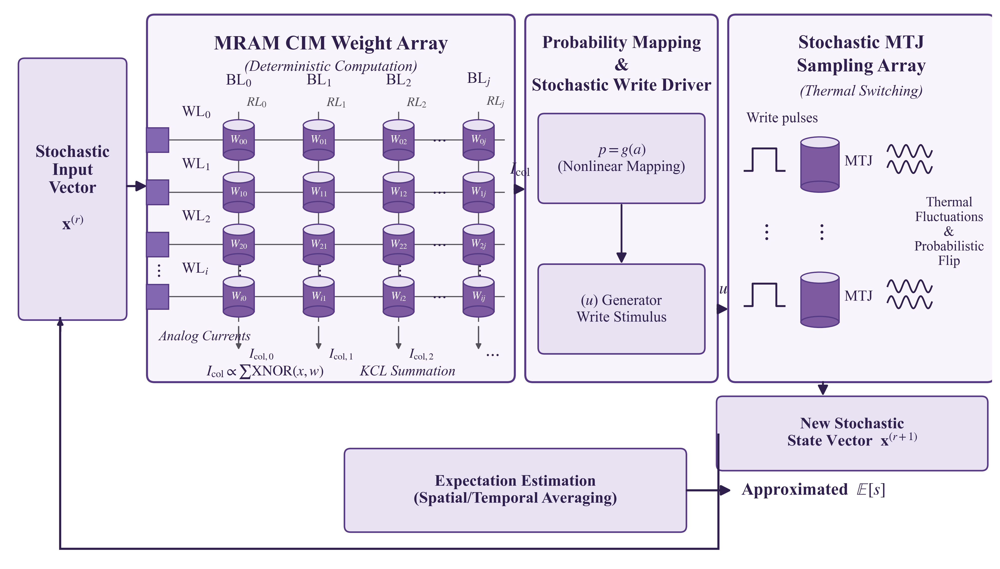

**图4.1** sMTJ-PBNN单层闭环前向的硬件实现示意。左侧MRAM-CIM权重阵列以差分单元承担确定性二值权重$$\boldsymbol{W}\in\{-1,+1\}$$，输入二值向量$$\boldsymbol{x}^{(r)}$$经位线电压编码后，列电流由基尔霍夫电流定律自动完成XNOR-popcount，得到$$\boldsymbol{a}^{(r)}=\boldsymbol{W}\boldsymbol{x}^{(r)}$$；中段为斜率匹配读出（跨阻并接StrongARM比较器，或列共享逐次逼近转换器）与写驱动（电压型电阻串写数模转换器、IR感知预畸变与CMOS驱动），把列电流数字化为$$a$$、映射为$$p=g(a)$$并生成对应的物理写脉冲，该外围已在开源sky130工艺上提取验证；右侧采样MTJ阵列在亚临界写脉冲下发生热涨落翻转，输出新一轮Bernoulli样本$$\boldsymbol{x}^{(r+1)}$$；底部对$$T$$次独立样本作空间或时域平均即近似恢复推理期望$$\mathbb{E}[s]$$。该结构把概率神经元的随机熵源与权重计算单元在同一阵列内原位融合，无需独立TRNG模块。

PBNN单次前向传播仅给出样本输出$$s^{(r)}$$，而网络推断的真实语义依赖于统计期望$$\mathbb{E}[s]=\sum_i w_i(2p_i-1)$$。对$$T$$个独立样本求均值$$\bar s_T=T^{-1}\sum_{r=1}^{T}s^{(r)}$$，依大数定律可渐近收敛于$$\mathbb{E}[s]$$，估计方差以$$\mathcal{O}(1/T)$$衰减。这一关系决定了概率网络在硬件实现中固有的精度-吞吐率权衡：采样次数越多估计方差越小，但延迟与能耗也按线性递增。MRAM-CIM的高并行列求和能力可同时利用空间并行 (多个MTJ单元独立翻转) 与时间复用 (同一单元重复写入生成bit-stream) 两种方式获取样本，从而部分缓解这一权衡；4.3节将给出$$T=4$$时MNIST精度即可达到$$T=64$$渐近值0.17个百分点之内的具体证据。期望恢复的收敛性依赖于零均值误差假设$$\mathbb{E}[\epsilon]=0$$。实际硬件中存在两类统计性质截然不同的误差：由MTJ热涨落引起的逐周期独立的循环间随机性C2C满足$$\mathbb{E}[\epsilon_\mathrm{C2C}]=0$$，可被多次采样平均消除，是支撑Bernoulli采样的有用随机源；而由器件制造离散性与寄生效应引起的器件间系统误差D2D在同一次推断中保持不变，$$\mathbb{E}[\epsilon_\mathrm{D2D}]\neq 0$$，无法通过增加采样次数由大数定律消除。综合电路级与器件级非理想，第$$r$$次采样的实际硬件输出可统一建模为

$$s^{(r)}=\underbrace{\sum_i w_i x_i^{(r)}}_{\text{ideal}}+\underbrace{\epsilon_\mathrm{IR}+\epsilon_\mathrm{leak}+\epsilon_{V_\mathrm{th}}}_{\text{D2D error}}+\underbrace{\epsilon_\mathrm{noise}}_{\text{C2C error}}$$

这一统计区分是MRAM-CIM概率计算可靠性的核心论点，亦决定了仿真器内部各层的设计取舍：仿真器的器件层把D2D误差实现为对每个物理位置抽取一次后保持不变的偏移场，C2C误差则在每次前向调用中重新抽样；阵列层的差分双端驱动设计目标是把$$\mathbb{E}[\epsilon_\mathrm{IR}]$$与$$\mathbb{E}[\epsilon_\mathrm{leak}]$$压制到可忽略水平，同时保留$$\epsilon_\mathrm{noise}$$以支撑可靠的概率计算；网络层的硬件感知训练则使梯度感知到D2D失配引起的Sigmoid偏移，避免训练-推理失配。

## 4.2 既有仿真工作与本章定位

为定位本章工作，先对相关仿真工具作一次梳理。这些工具大致可按原生支持的对象划入四类：确定性CIM加速器、模拟存算加速器、sMTJ器件级与p-bit级、PBNN算法与变分推断工具。确定性CIM加速器仿真器以Yu课题组维护的NeuroSim系列为代表：MLP+NeuroSim以C++实现单层感知机评估[^cim_neurosim_validation]，DNN+NeuroSim V2.0与PyTorch对接，覆盖电阻随机存储器 (Resistive Random-Access Memory，ReRAM)、相变随机存储器 (Phase-Change RAM，PCRAM)、自旋转移矩磁随机存储器 (Spin-Transfer-Torque MRAM，STT-MRAM)、铁电场效应晶体管 (Ferroelectric FET，FeFET)、电化学随机存储器 (Electrochemical RAM，ECRAM) 等器件的训练与推理基准[^cim_dnn_neurosim_v2]，最新的V1.5将PyTorch行为仿真与C++硬件估算解耦并引入TensorRT后训练量化以及器件级与电路级两种非理想注入模式[^cim_neurosim_v15]；MNSIM 2.0以行为级建模为目标，建立从器件到处理单元 (Processing Element，PE) 的层次化模型，支持混合精度网络的推理精度评估[^cim_mnsim2]；MICSim在NeuroSim V1.3基础上加入Transformer算子并接入HuggingFace[^cim_micsim]。这一类工具的统一假设是权重为确定性多比特，单元的随机性仅以误差源进入精度评估而不充当计算资源，其架构亦围绕模拟数字转换器 (Analog-to-Digital Converter，ADC)、缓冲与片上网络组织，与本工作以单比特概率采样为核心信号的图景偏离明显。模拟存算加速器仿真器以IBM的aihwkit为代表，覆盖全连接、卷积、长短期记忆 (Long Short-Term Memory，LSTM) 层及对应的模拟随机梯度下降 (Stochastic Gradient Descent，SGD) 优化器，支持D2D变异、C2C变异、电导响应曲线、读出与权重噪声等[^cim_aihwkit][^cim_aihwkit_apl]；其权重以连续电导编码、噪声为加性扰动，二值随机权重、Bernoulli采样语义以及由Arrhenius律决定的Sigmoid型概率台阶并不在其原生模型范围内。

sMTJ器件级仿真器关注随机翻转事件的统计性质而不直接接入神经网络。ARM公开的MRAM紧凑模型以随机Landau-Lifshitz-Gilbert-Slonczewski (s-LLGS) 方程为内核，提供Python与Verilog-A两套实现，并以Fokker-Planck求解器校准至给定写错误率，已用OOMMF微磁仿真验证[^smtj_arm_compact]；Rajpoot等人公开的STT/SHE-MTJ NGSPICE紧凑模型亦给出相近能力并兼容开源仿真链[^smtj_ngspice]。p-bit层面，Onizawa等人的GPU加速模拟退火框架以受变异修正的p-bit为采样源，对最大割 (MAX-CUT) 等组合优化问题获得相对CPU两个数量级的加速[^psl_gpu_sa]；Camsari等人系统综述了p-bit的电路实现与Bernoulli发生器的能耗代价；Borders等人展示了基于sMTJ的整数因子分解原型机[^borders_factor]，Sutton等人将其扩展为自治概率协处理器原型[^sutton_pbit]。这些工作主要服务于组合优化任务，更新规则为同步Gibbs或全异步，与PBNN所需的按层有序前馈不一致。Kaiser等人发表的基于sMTJ的in-situ玻尔兹曼机硬件感知学习电路与仿真[^kaiser_insitu_bm]是迄今最贴近本工作的先例，但仍以无向玻尔兹曼机为对象，不涉及前馈PBNN在大规模图像数据集上的精度评估。PBNN算法层面已有若干公开的PyTorch复现，包括Peters等人的原始论文复现[^pbnn_peters]以及Bayes-by-Backprop类工具如PyTorch-BayesianCNN[^bnn_bayescnn]与TyXe[^bnn_tyxe]，主要展示算法可行性而无硬件建模。将上述四类能力对照本工作目标——同时承担sMTJ Sigmoid采样、单比特Bernoulli权重、基于中心极限定理 (Central Limit Theorem，CLT) 的高斯化前向、时域展开、阵列级XNOR-popcount与PPA估算——没有一个既有工具是该交集的天然载体。本章因此选择以PyTorch自行搭建仿真流水线，复用社区已成熟的器件级与PPA估算结果 (Arrhenius $$P_\mathrm{sw}$$拟合参数、NeuroSim校准的工艺常数、aihwkit验证过的硬件感知训练范式)，但在网络层与采样层独立实现，以匹配sMTJ-PBNN的语义需求。

## 4.3 仿真器分层架构与器件层校准

仿真器组织为五个解耦层次，配合一条贯穿各层的时域展开支柱。每一层只面向相邻层暴露最小接口，便于单元测试与独立替换。层次自底向上依次为器件层、阵列电路层、网络层、PPA估算层与实验基准层。器件层把第二章建立的sMTJ磁化动力学模型抽象为可微的紧凑函数，输出在给定写电压、脉冲宽度与温度下的Bernoulli参数；阵列电路层把$$N$$个器件并行组织为子阵列，仿真位线电流求和、外围数模转换器 (Digital-to-Analog Converter，DAC) 与计数器的有限精度行为；网络层基于PyTorch实现PBNN全连接层、PBNN卷积层与直通估计器 (Straight-Through Estimator，STE) 反向传播算子，并以CLT为捷径在训练时绕过显式逐样本采样；PPA层在给定网络结构、阵列配置与时域展开因子$$T$$的条件下输出能耗、延迟与面积；实验层封装训练循环、推理流程、不确定性量化与对照实验脚本。时域展开作为横向支柱被五层共享，管理$$T$$步采样的迭代调度、Bernoulli样本生成的数值实现以及采样次数$$T$$的退火与衰减曲线，从而将器件层的单次写概率提升为网络层的统计期望、并把PPA层的单步能耗乘以采样次数得到完整推理代价。各层与PyTorch自动微分的对接遵循同一原则：前向通路完整保留器件物理与阵列非理想，反向通路在不影响梯度估计无偏性的前提下采用最廉价的近似——sign算子的反向使用Bengio等人提出的直通估计器[^ste]，Bernoulli采样的反向通过CLT得到的高斯均值与方差表达直接求导，器件变异的随机抽样视为常数场而不参与反向。这一选择保证了任何由本仿真器训练出的网络都可以在不修改梯度图的前提下，通过仅替换前向算子实现训练阶段CLT解析逼近、推理阶段显式时域采样两种模式之间的切换。仿真器的整体分层与各模块依赖如图4.2所示。

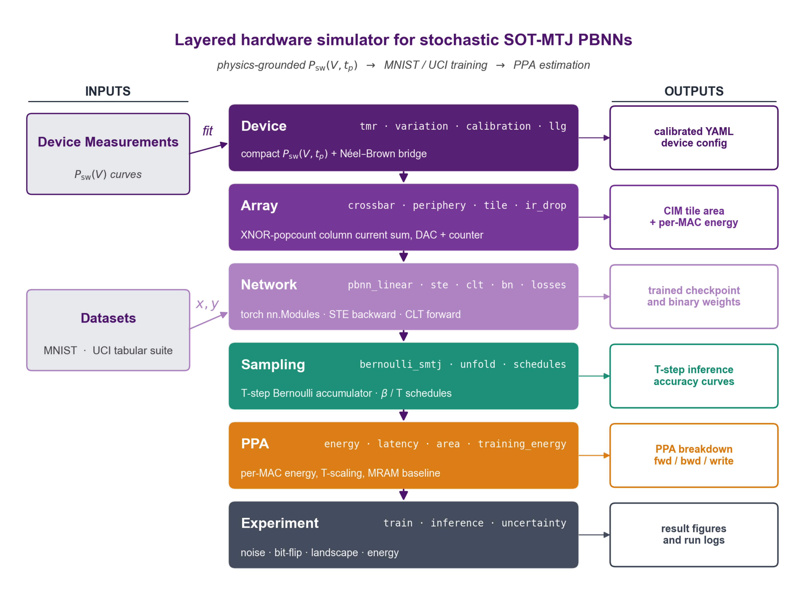

**图4.2** 分层硬件仿真器的模块组织。物理基底的器件层向上依次为阵列电路、网络、采样、PPA与实验层；左侧标注每层的主要输入 (器件实测$$P_\mathrm{sw}(V,t_\mathrm{p})$$曲线、MNIST/UCI数据集等)，右侧标注每层主要输出 (校准后的器件配置、CIM面积与每MAC能耗、训练后的检查点、$$T$$步推理精度曲线、PPA前/反/写细分、运行结果图与日志) ；底部时域展开模块以Bernoulli采样、unfold与$$\beta/T$$调度贯穿各层，把单次写概率提升为网络层期望。该组织把时域展开的算法语义与各层的物理模型严格分离，使采样次数、精度与能效在固定网络与阵列条件下能够独立扫描。

器件层以一组紧凑函数把sMTJ的物理行为封装为可微的概率算子，包括Sigmoid响应$$P_\mathrm{sw}(V,t_\mathrm{p})$$、Néel-Brown临界电压函数$$V_\mathrm{th}(t_\mathrm{p},\Delta)$$及其解析斜率，并以非线性最小二乘对第二章的实测$$P_\mathrm{sw}(V,t_\mathrm{p})$$散点拟合得到$$(V_\mathrm{th},V_T)$$。在Device A、$$P\to\mathrm{AP}$$、$$t_\mathrm{p}=0.75\,\mathrm{ns}$$参考点上，拟合给出$$V_\mathrm{th}=895.8\,\mathrm{mV}$$、$$\beta_s=42.7\,\mathrm{V}^{-1}$$、$$R^2=0.992$$，与第二章的标定值$$894\,\mathrm{mV}$$、$$44.6\,\mathrm{V}^{-1}$$、$$0.993$$分别相差$$1.8\,\mathrm{mV}$$、$$1.9\,\mathrm{V}^{-1}$$与$$0.001$$，处于46点测量数据集的拟合噪声范围之内，这一一致性是后续所有上层结果的基础。变异模块接受由实测数据估计的$$(V_\mathrm{th},V_T)$$方差与协方差，对每个物理位置抽取一组保持不变的偏移量。变异来源既可以是直接对Sigmoid操作点的相对扰动 (直接Sigmoid模式)，也可以是先对势垒$$\Delta$$采样、再经NB-to-Sigmoid桥式公式$$\beta_\mathrm{NB}=2\ln 2\cdot\Delta/V_\mathrm{c0}$$传播至Sigmoid斜率 (NB桥式模式)。后者更贴近物理，因为第二章指出主导D2D通道是无量纲的热稳定因子$$\Delta$$，其变异系数 (Coefficient of Variation，CV) 在300mm晶圆上约为7.7%，经Brinkman分解归因为66%来自MTJ柱直径、27%来自界面各向异性、7%来自饱和磁化。桥式公式的解析-数值偏差在CV$$(\Delta)$$的0%至60%范围内均不超过0.2%。这里需说明NB桥式模式的一处关键设计：直接由势垒采样得到的$$V_\mathrm{th}$$中心值约为$$0.843\,\mathrm{V}$$，而Sigmoid直接拟合得到、写驱动据以下发写电压的名义中心为$$V_\mathrm{th,nom}=0.894\,\mathrm{V}$$，两者相差约$$50\,\mathrm{mV}$$ (折合$$2.26\,V_T$$)；若以裸NB中心作为每个单元的判决阈值，会在全部权重上叠加这一系统偏差并显著拉低全栈精度[^te_anchor]。为从根本上消除它，变异模块仅以势垒$$\Delta$$的离散去驱动$$(V_\mathrm{th},V_T)$$的单元间**离散**，而把场的**均值**锚定到写驱动实际使用的标定工作点：$$V_\mathrm{th}=V_\mathrm{th,nom}+(V_\mathrm{th}^\mathrm{NB}-\overline{V_\mathrm{th}^\mathrm{NB}})$$、$$V_T=V_{T,\mathrm{nom}}\cdot(\Delta_\mathrm{nom}/\Delta)$$。如此晶圆平均的$$(V_\mathrm{th},V_T)$$按构造等于标定值[^mc_verify]，斜率离散则保持$$\mathrm{CV}(V_T)\approx\mathrm{CV}(\Delta)=7.7\%$$；推理脚本对预训练检查点默认禁用变异，作为额外的安全约定。隧穿磁阻 (Tunnel Magnetoresistance，TMR) 模块把P与AP两阻态的电导比$$G_P/G_\mathrm{AP}$$转化为位线电流贡献的实际幅值；自旋轨道矩 (Spin-Orbit Torque，SOT) 通道的写能耗按Ohmic耗散公式$$E_\mathrm{write}=V_\mathrm{wr}^2 t_\mathrm{w}/R_\mathrm{SOT}$$给出，在第二章参考点$$V_\mathrm{wr}=0.90\,\mathrm{V}$$、$$R_\mathrm{SOT}=776\,\Omega$$、$$t_\mathrm{w}=0.75\,\mathrm{ns}$$下计算得$$0.78\,\mathrm{pJ}$$，这是PPA层中唯一物理量地标定的能量数。器件层另保留一份基于s-LLGS方程的宏自旋参考实现，仅在校准阶段使用，不参与神经网络前向。

[^te_anchor]: 这是开发过程中的一处典型订正。最初实现直接以势垒采样的裸$$V_\mathrm{th}$$中心 (约0.843 V) 作为各单元判决阈值，在硬件感知训练下相当于在全部权重上叠加约50 mV ($$2.26\,V_T$$) 的系统性偏置，使全栈测试精度明显低于锚定后的水平；定位到该偏置源于势垒采样中心与写驱动名义工作点不一致后，改为仅以$$\Delta$$的离散驱动单元间方差、而把场均值锚定到标定工作点，精度方恢复至预期。

[^mc_verify]: 两万样本Monte Carlo校验给出平均$$\beta_s=1/V_T=42.7\,\mathrm{V}^{-1}$$，与器件层标定一致。

阵列电路层把器件层的Bernoulli样本组织为$$M\times N$$的子阵列，实现差分双端XNOR-popcount算子；外围电路以4到6比特DAC把潜参数$$\theta_{ij}$$转换为写电压并下发到行驱动，计数器以有限位整数累计$$T$$步的结果。可选的IR-drop模块以阻性梯子近似金属线压降，在$$256\times 256$$以下子阵列、典型工艺线宽下其对单比特读出的影响可被外围数字阈值吸收，仅以扫描方式评估而非默认开启。tile抽象封装一次完整的子阵列调用，作为网络层算子的最小硬件单元。网络层在PyTorch中实现PBNN全连接层与PBNN卷积层两种基本层。PBNN全连接层持有可训练张量$$\boldsymbol{\Theta}\in\mathbb{R}^{M\times N}$$，前向时按运行模式路由出三档行为。软件档使用理想的$$p_{ij}=\sigma(\theta_{ij})$$，不引入任何器件信息，主要用于复现已发表PBNN工作的基线；硬件感知档使用名义校准写电压$$V_\mathrm{wr}=V_\mathrm{th,nom}+V_T\cdot\theta_{ij}$$，把潜参数视为以名义器件为基准的逻辑标度，实际开关概率由每个单元的物理参数$$(V_{\mathrm{th},ij},V_{T,ij})$$决定，这是默认训练模式，在无变异时退化为$$\sigma(\theta_{ij})$$，在有变异时让梯度感知到设备失配引起的概率梯度变化；全栈档显式调用阵列层$$T$$次，由计数器累计估计期望，是评估模式，匹配真实硬件的推理行为。三档对应同一份$$\boldsymbol{\Theta}$$检查点，无需重新训练。为使批归一化 (Batch Normalization，BN) 的滑动统计在三档之间保持一致，仿真器采用硬二值STE技巧：前向输出$$p_\mathrm{hard}=\mathbb{1}[\theta\ge 0]$$对应$$w=\mathrm{sign}(\theta)\in\{-1,+1\}$$，反向梯度通过$$p_\mathrm{soft}=\sigma(\theta)$$回传，保留$$\partial p/\partial\theta=p_\mathrm{soft}(1-p_\mathrm{soft})$$的平滑性，使三档共用相同的硬二值前向、BN running stats可跨档复用。CLT高斯化前向在训练阶段把矩阵向量积$$\boldsymbol{w}\boldsymbol{x}$$近似为$$\mathcal{N}(\mu,\sigma^2)$$，其中$$\mu=(2\sigma(\boldsymbol{\Theta})-1)\boldsymbol{x}$$、$$\sigma^2=4\sigma(\boldsymbol{\Theta})(1-\sigma(\boldsymbol{\Theta}))\boldsymbol{x}^{\odot 2}$$，以单次解析计算代替$$T$$次显式抽样，使训练阶段的每步计算复杂度与一次确定性矩阵乘法相同，而不是$$T$$倍。PBNN卷积层通过PyTorch的unfold操作把卷积展开为等效Toeplitz矩阵以复用同一逻辑；针对二值激活的离散尺度，BatchNorm 1D/2D对归一化项做了参数化微调以避免标准BN在低位宽下的尺度漂移；损失模块在标准交叉熵之外提供互信息正则与权重二值化正则两个可选项。

采样层接受$$(\theta_{ij},V_{\mathrm{th},ij},V_{T,ij})$$返回单次$$\pm 1$$样本，沿真实Bernoulli路径而非Gumbel等连续松弛实现，以保证与硬件一致；时域unfold在迭代中维护$$T$$步累加器并在末端归一化为期望估计；调度模块持有$$\beta(t)$$与按层深递增的$$T$$调度，便于扫描采样次数与精度的折线。PPA层采用与NeuroSim系列同级 (40nm/28nm工艺) 的电路级数量级常数[^coeff_lib]作为系数库，其中sMTJ的SOT写能量并不取自该系数库、而由欧姆耗散$$V_\mathrm{wr}^2 t_\mathrm{w}/R_\mathrm{SOT}$$物理标定 (0.78 pJ)，位线读出与计数累加则暂以28nm数字默认值占位：单次$$T$$步前向的能量被分解为DAC驱动、行写入、位线读出与计数累加四项，延迟被分解为DAC建立、sMTJ翻转脉冲、电流积分与计数四段，面积按子阵列规模、外围电路份额与片上互连给出估计。除SOT写能量外，上述外围常数初始为数量级取值，彼时PPA层仅作能量随$$T$$相对标度的标尺；本章4.6节已在开源sky130上把读出能量提取落地、并把写数模转换器与计数器的能量及各部件面积按提取的标准单元尺寸与设计规则作一阶估算落地 (详见4.6节)，故其绝对数值已可在"一阶估算、非版图提取"的口径下谨慎引用。最上层把上述各层组合为可执行实验：训练循环接受任意网络、运行模式与优化器组合，由YAML配置完整描述；推理流程提供单次采样、$$T$$步集成与不确定性量化三种调用方式；基线对比脚本封装与数字BNN、aihwkit基线在同一数据集与网络拓扑下的精度-能效对照。运行时统一创建带时间戳的输出目录，按轮记录损失、精度与时间至CSV，并在运行结束时落盘JSON摘要，确保任何实验都可以原样回放。

[^coeff_lib]: 该系数库包含SRAM读写、ADC与DAC单位能量、H-tree互连能量与单元面积。

仿真器各层的可信度由三类相互独立的证据支撑。器件层的Sigmoid响应与方差结构由第二章的实测散点直接拟合得到，且其参数化形式由Arrhenius律的过渡区Taylor展开自然导出；算子层的CLT近似由合成线性问题上与显式蒙特卡洛的相对熵收敛行为验证；PPA层的外围工艺常数参照NeuroSim系列[^neurosim_si]的同级数量级取值，仅作能量随$$T$$相对标度之用，绝对数值待电路级提取后替换。三类证据各自独立，避免循环论证。

[^neurosim_si]: NeuroSim系列的RRAM-CIM macro经post-layout硅验证。

时域展开的收敛性由MNIST PBNN多层感知机 (Multi-Layer Perceptron，MLP，拓扑$$784\to 1024\to 1024\to 10$$) 在不同$$T$$下的全栈测试精度直接给出，结果汇总于表4.1。

**表4.1** 不同采样次数下MNIST PBNN-MLP全栈推理精度与能耗。

| $$T$$ | 测试精度 | 单次推理能耗 |
|---|---|---|
| 1 | 96.91% | 0.156 µJ |
| 2 | 97.21% | 0.312 µJ |
| 4 | 97.51% | 0.624 µJ |
| 8 | 97.62% | 1.248 µJ |
| 16 | 97.64% | 2.496 µJ |
| 32 | 97.60% | 4.991 µJ |
| 64 | 97.68% | 9.983 µJ |

$$T=4$$时测试精度即达到97.51%，与$$T=64$$的渐近上限97.68%相差仅0.17个百分点；$$T=8$$进一步收敛至97.62%，此后的额外采样收益小于0.1个百分点而能耗按线性递增。因此后文的鲁棒性与能耗对比中默认采用$$T=4$$作为部署目标，这一选择把PBNN的推理能耗压缩至$$T=64$$版本的十六分之一，而精度损失在测量噪声以内。$$T=1$$已能给出96.91%的精度，原因是后训练时把潜参数$$\theta$$作了乘100的标度处理，使得$$\sigma(\theta)$$几乎都饱和在0或1，Bernoulli样本接近确定性，$$T$$主要补偿那些$$\theta$$仍处于0附近的少数权重。CLT路径与显式$$T$$步采样的一致性在合成数据上由单元测试直接验证：随机生成$$M=64,N=256,B=8$$的概率张量，CLT解析均值与500次显式Bernoulli样本的均值差异z-score在所有元素上均小于5；CLT输出的标准差按$$\sqrt{N}$$增长，与理论一致。在MNIST PBNN-MLP上，软件档 (理想Sigmoid) 训练得到的检查点经$$\theta\times 100$$标度后再用全栈$$T=4$$评估，精度从硬件感知训练时的96.98%回升至97.51%，差距与Bernoulli样本数从无穷大降到$$T=4$$的截断误差量级一致。

## 4.4 训练流水线与基础精度

训练以YAML配置完整描述实验：数据集、网络拓扑、运行模式、优化器、学习率调度器、采样次数与变异配置。训练默认使用硬件感知档，该档的硬二值前向使损失函数的梯度面与软件档几乎一致，但在反向传播时让梯度感知到变异引起的Sigmoid斜率变化。训练结束后，将潜参数$$\theta$$统一乘以100作为部署预处理，这一步不改变$$\mathrm{sign}(\theta)$$因而不影响硬件感知档的精度，但可使全栈档的Bernoulli样本几乎确定性，从而让$$T=4$$就能匹配$$T=64$$的精度。MNIST基线使用拓扑$$784\to 1024\to 1024\to 10$$、batch 128、Adam学习率$$10^{-3}$$、20轮，三档下的测试精度依次为96.98% (硬件感知)、97.51% (全栈$$T=4$$) 与97.68% (全栈$$T=64$$)。为分别评估二值随机权重相对高位宽确定性权重以及相对**确定性二值**权重的代价，同时训练了两类基线：相同拓扑的全精度MLP在四档比特宽度下的量化感知训练 (Quantization-Aware Training，QAT) 变体，使用对称INT-N量化加STE反向传播；以及相同拓扑的确定性二值BNN-MLP[^bnn_baseline]，该基线在数学上等价于PBNN在单点采样且无器件随机性下的退化情形，可定量分离采样统计性与二值权重容量这两个变量各自的代价。MNIST PBNN-MLP的前向流图、训练曲线与$$T$$扫描如图4.3所示，最佳测试精度汇总于表4.2。

[^bnn_baseline]: 该确定性二值基线由DeterministicBinaryLinear、BatchNorm与sign-STE构成，不引入sMTJ随机翻转。

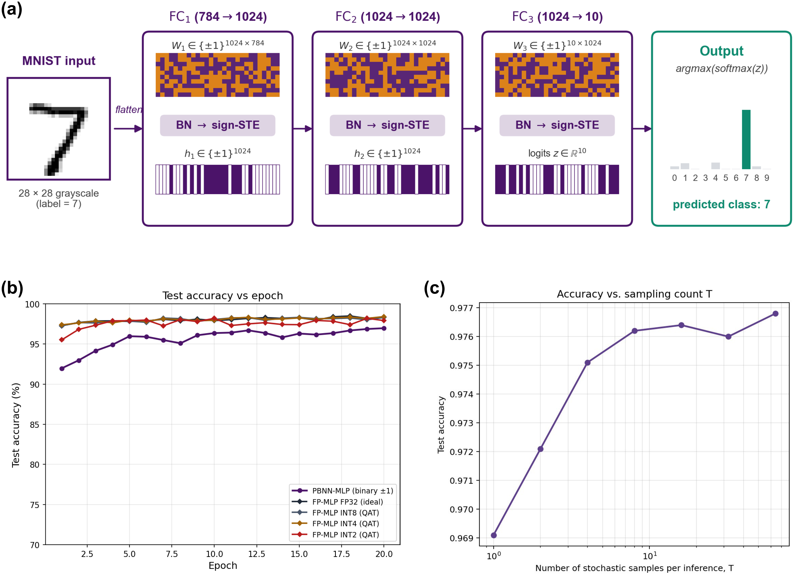

**图4.3** MNIST上PBNN-MLP的端到端验证。(a) 输入$$28\times 28$$灰度图像经三层硬二值sign-STE全连接的前向流图，每层后接BatchNorm，最末以argmax-softmax给出预测，图示样本标签为7。(b) 同拓扑下PBNN-MLP (二值$$\pm 1$$、sMTJ硬件感知训练)、确定性BNN-MLP (数字sign-STE，对应PBNN在单点采样且无器件随机性下的退化情形) 与四档比特位宽FP-MLP (INT2/INT4/INT8/FP32) QAT变体的测试精度随训练轮数演化；PBNN与BNN两条二值曲线几乎重合 (差距$$<0.1$$个百分点)，共同与FP32相距约1.5个百分点。(c) 全栈推理精度随采样次数$$T$$的演化曲线，对数横轴；$$T=4$$时已达$$T=64$$渐近上限97.68%的0.17个百分点之内，$$T\ge 8$$后的额外收益小于测量噪声。

**表4.2** MNIST上同拓扑PBNN-MLP、确定性BNN-MLP与QAT量化FP-MLP的最佳测试精度。

| 架构 | 最佳测试精度 | 相对FP32差距 |
|---|---|---|
| FP-MLP FP32 (理想) | 98.51% | 基准 |
| FP-MLP INT8 (QAT) | 98.33% | $$-0.18$$pp |
| FP-MLP INT4 (QAT) | 98.43% | $$-0.08$$pp |
| FP-MLP INT2 (QAT) | 98.21% | $$-0.30$$pp |
| BNN-MLP (数字二值$$\pm 1$$，sign-STE) | 97.05% | $$-1.46$$pp |
| PBNN-MLP (二值$$\pm 1$$，sMTJ) | 96.98% | $$-1.53$$pp |

表4.2的关键对照在于确定性BNN-MLP (97.05%) 与PBNN-MLP (96.98%) 几乎重合、仅差0.07个百分点：这把二值架构相对FP32约1.5个百分点的差距明确归因于二值权重容量本身，而非采样统计性或sMTJ硬件感知训练——即PBNN并未因接受Bernoulli采样付出额外训练精度，0.07个百分点仅是硬件感知训练相对纯数字sign-STE的微弱噪声。其余差距亦属结构性而非训练不足：相对INT2低1.23个百分点是三值到二值 (无零选项) 的容量代价，相对FP32低1.53个百分点则是同等epoch预算下与硬件能耗优势 (4.5节) 的对偶取舍。PBNN-MLP的拓扑在UCI六个表格数据集上的迁移结果如图4.4所示，定量精度汇总于表4.3。

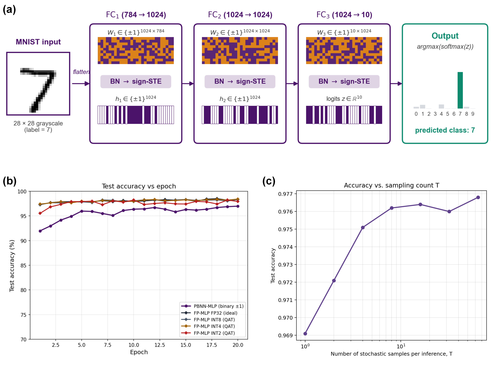

**图4.4** PBNN-MLP在UCI六类表格任务上的训练曲线。子图依次为Iris、WDBC、Yeast、Vehicle、Spambase、Satimage，每图给出同拓扑PBNN-MLP、FP-MLP与文献基线的测试精度随训练轮数的演化，这六个任务在样本规模、特征维度与类别数上跨越两个数量级。PBNN在医疗判别任务WDBC上与FP完全持平且超过文献基线，但在样本数最少的Iris与类别数最多的Yeast上落差扩大至7–10个百分点，呈现二值容量在小样本、高类别条件下代价显著的一般规律。

**表4.3** PBNN-MLP在六类UCI表格任务上的迁移精度。Vehicle与Satimage的文献基线按Statlog比较研究给出[^uci_statlog]。

| 数据集 | 形状 | 类别数 | PBNN-MLP | FP-MLP | 文献基线 |
|---|---|---|---|---|---|
| Iris | $$150\times 4$$ | 3 | 91.11% | 100.00% | 96.7%[^uci_iris] |
| WDBC | $$569\times 30$$ | 2 | 98.84% | 98.84% | 96.5%[^uci_wdbc] |
| Yeast | $$1484\times 8$$ | 10 | 51.89% | 62.14% | 62.0%[^uci_yeast] |
| Vehicle | $$846\times 18$$ | 4 | 74.22% | 86.33% | 84.0% |
| Spambase | $$4601\times 57$$ | 2 | 91.67% | 94.93% | 94.0%[^uci_spambase] |
| Satimage | $$6435\times 36$$ | 6 | 86.70% | 92.19% | 91.0% |

这组迁移印证了一条一般规律：二值权重的容量损失在特征充足的任务上被网络冗余补偿 (WDBC上PBNN与FP持平且超文献基线)，而在小样本、高类别条件 (Iris、Yeast) 下代价显著，并随训练样本规模扩大而单调收窄。

优化器与学习率调度以固定拓扑、固定epoch预算扫描八种优化器 (带动量SGD、Adam、AdamW、NAdam、RAdam、Adamax、RMSprop与Lion[^lion]) 与五种调度 (常数、StepLR、CosineAnnealingLR[^cosine]、OneCycleLR[^onecycle]、ExponentialLR)，结果见图4.5。两点可供部署参考：自适应优化器彼此相差不足1个百分点、仅带动量SGD明显落后[^sgd_lag]；学习率调度的影响显著大于优化器选择，以OneCycleLR配Adam最佳。本仿真器据此推荐OneCycleLR配Adam ($$\mathrm{max\_lr}=5\times 10^{-3}$$、$$\mathrm{pct\_start}=0.3$$)。

[^sgd_lag]: 带动量SGD落后于自适应族，是因为二值权重经硬二值STE后梯度方差较大，依赖自适应的per-parameter标度。

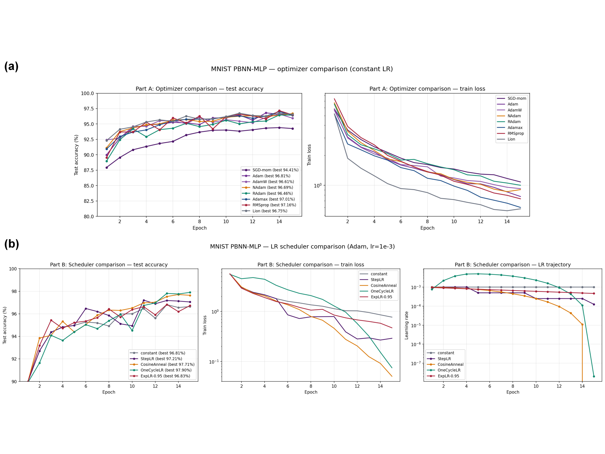

**图4.5** 优化器与学习率调度在MNIST PBNN-MLP上的对比。(a) 常学习率下八种优化器的测试精度 (左) 与训练损失 (右) 随轮数演化，带动量SGD明显落后于自适应族。(b) 固定Adam下五种学习率调度的测试精度、训练损失与学习率轨迹，OneCycleLR凭借显式warmup-anneal形成最深的收敛basin。整图表明调度对二值PBNN-MLP的影响显著大于优化器选择本身。

为解释优化器之间的差异，以Goff-Li过滤器归一化的二维随机方向投影绘制损失景观如图4.6所示。同一初始化、12轮后，带动量SGD在景观中找到的极小值是$$L(\theta^*)=2.17$$、Adam是1.38、Lion是1.14；Lion的局部曲率最尖，但绝对底部最深。在所有27个checkpoint的共享PCA投影上，三种优化器从同一初始点出发去往三个明显不同的方向 (PC1加PC2解释92.7%的方差)，Adam与带动量SGD大致同向但Adam走得更远，Lion几乎正交。成对线性插值显示带动量SGD与Lion之间存在高度0.90的损失垒，Adam与Lion之间为0.65，而带动量SGD与Adam之间仅0.30，提示Lion在二值权重的STE梯度面上找到了一个与Adam或带动量SGD定性不同的basin。

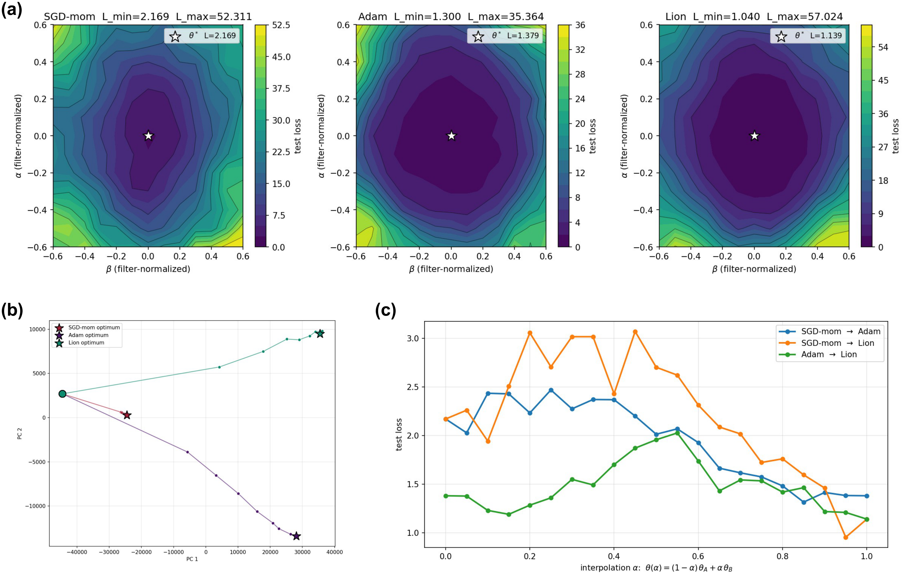

**图4.6** PBNN-MLP损失景观与checkpoint轨迹。(a) Goff-Li过滤器归一化的二维随机方向投影下，带动量SGD、Adam与Lion三种优化器找到的极小值具有定性不同的曲率与底部深度，Lion底部最深而局部曲率最尖。(b) 27个checkpoint的共享PCA投影显示三条轨迹从同一初始点走向定性不同的方向，PC1加PC2解释92.7%方差。(c) 三对极小值之间的线性插值损失曲线给出SGD-Lion、Adam-Lion、SGD-Adam三道高度递减的损失垒 (0.90/0.65/0.30)，表明Lion在二值权重的STE梯度面上落入与Adam或带动量SGD定性不同的basin。

## 4.5 鲁棒性、非理想性与跨架构能效

工程上一个二值随机权重网络若不具备相对全精度网络的某种独立优势，则没有部署价值。本节通过两组实验回答PBNN到底在哪里占优：推理时的输入扰动鲁棒性与硬件比特翻转鲁棒性。对四种网络架构 (PBNN $$T=4$$、PBNN $$T=64$$、确定性BNN、全精度FP-NN，共享拓扑$$784\to 1024\to 1024\to 10$$) 施加八种扰动，包括加性高斯噪声、椒盐噪声、speckle乘性噪声、高斯模糊、cutout遮挡、亮度位移、权重高斯扰动与十步投影梯度下降 (Projected Gradient Descent，PGD) 对抗攻击。八类扰动在同一MNIST样本上的可视化如图4.7所示，三种架构在八类扰动连续扫描下的精度衰减汇总于图4.8与表4.4。

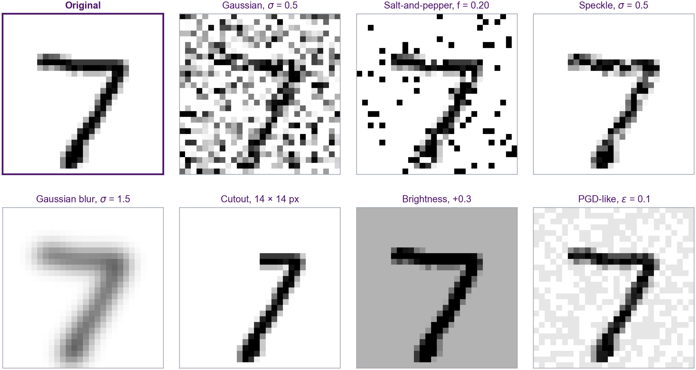

**图4.7** 八类输入扰动在同一MNIST样本 (标签7) 上的可视化。从原图出发依次叠加加性高斯噪声$$\sigma=0.5$$、椒盐噪声$$f=0.20$$、speckle乘性噪声$$\sigma=0.5$$、高斯模糊$$\sigma=1.5$$、$$14\times 14$$像素cutout、亮度位移$$+0.3$$与PGD-like对抗扰动$$\epsilon=0.1$$。该图作为图4.8的输入分布参考，说明各扰动对图像结构的破坏方式存在显著差异：高斯/椒盐保留笔画形状但叠加噪声，模糊与亮度位移整体扭曲输入分布，cutout仅去除局部，对抗扰动则在像素级搜索使网络判错的方向。

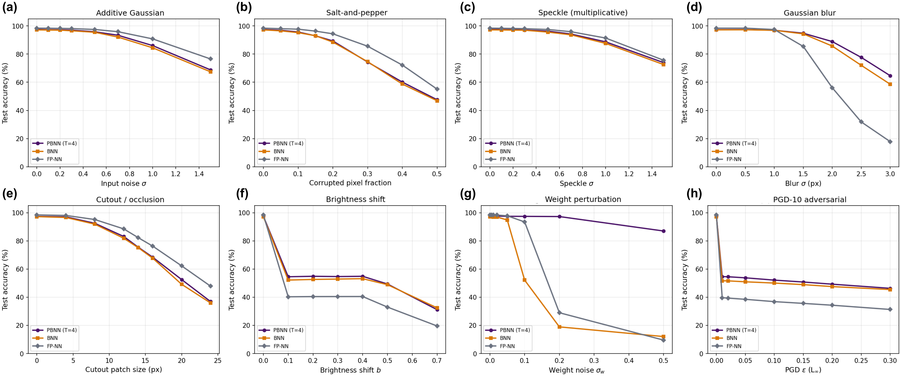

**图4.8** PBNN $$T=4$$、确定性BNN与FP-NN在八类输入扰动连续扫描下的测试精度对比。子图(a)–(h)分别对应加性高斯、椒盐、speckle、高斯模糊、cutout、亮度位移、权重扰动与PGD-10对抗攻击。FP-NN在保留输入分布的前四类扰动上领先；PBNN在扭曲输入分布的模糊与亮度位移上反超，最大差距出现在权重扰动 (PBNN在$$\sigma_w=0.5$$下仍保93%以上，BNN与FP-NN分别跌至9.4%与14%) 与PGD对抗攻击 (PBNN比FP-NN高出约15个百分点)。

**表4.4** 八类输入、权重与对抗扰动下的MNIST测试精度。

| 扰动 | 参数 | PBNN $$T=4$$ | BNN | FP-NN |
|---|---|---|---|---|
| 加性高斯 | $$\sigma=0.5$$ | 95.84 | 95.48 | 97.48 |
| 椒盐 | $$f=0.20$$ | 89.33 | 88.54 | 94.40 |
| Speckle | $$\sigma=0.5$$ | 96.31 | 95.63 | 97.48 |
| 高斯模糊 | $$\sigma=1.5$$ | 94.82 | 94.36 | 85.43 |
| Cutout | $$k=14$$px | 75.50 | 75.17 | 82.29 |
| 亮度位移 | $$b=0.3$$ | 54.65 | 52.88 | 40.47 |
| 权重扰动 | $$\sigma_w=0.05$$ | 97.44 | 94.81 | 97.78 |
| PGD-10 | $$\epsilon=0.1$$ | 52.12 | 50.03 | 36.85 |

从定性角度，FP-NN在保留输入分布的扰动 (高斯、椒盐、speckle、cutout) 上有可测的优势，因为连续权重对小幅度线性扰动的吸收最为有效；PBNN在扭曲输入分布的扰动 (模糊、亮度位移) 上反超，因为二值权重对像素绝对值的依赖更弱；在权重空间扰动和PGD对抗攻击上，PBNN的优势最为显著。在权重扰动$$\sigma_w=0.5$$这一更激烈的工况下，PBNN $$T=4$$仍保持93%以上，而BNN降至9.35%、FP-NN降至14%，体现了stochastic averaging对独立权重扰动的天然抑制：$$T$$次采样把每个权重的方差除以$$T$$。在PGD对抗攻击下，PBNN比FP-NN高出约15个百分点，其来源既包括sign函数的梯度遮蔽，也包括前向采样带来的随机性扰乱了攻击者梯度的精度。

PBNN在硬件层面更深层的优势源于编码方式本身：每个物理单元承担相同的权重重要性。FP-NN每个权重以8比特INT编码，最高有效位 (Most Significant Bit，MSB) 承载50%的动态范围；PBNN每个权重以$$T$$个独立Bernoulli样本编码，每个样本恒等地承担$$1/T$$的重要性。两种编码的逐单元贡献对比与单次翻转的有效误差分布如图4.9所示。

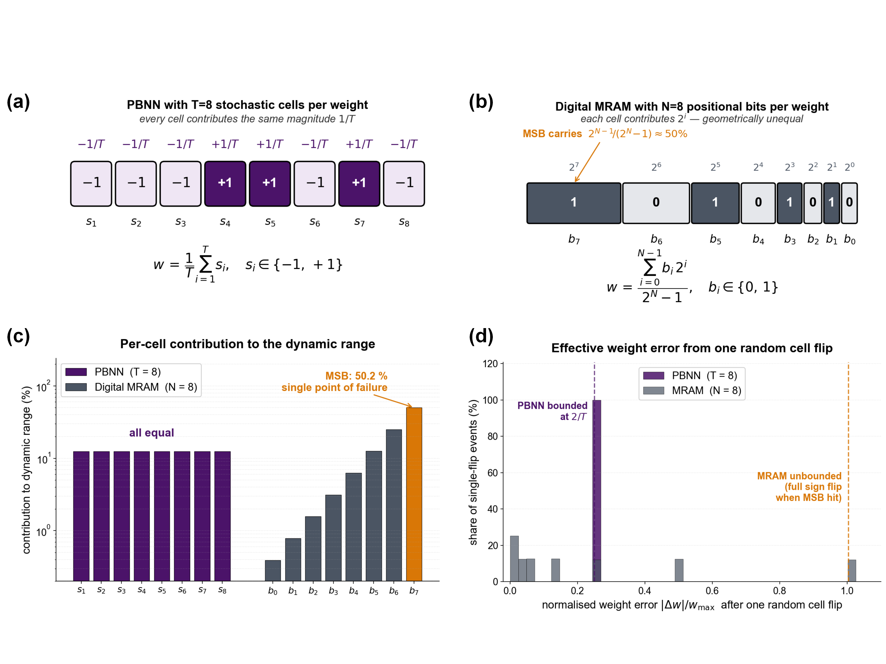

**图4.9** 概率二值编码与数字MRAM位编码的逐单元价值对比。(a) PBNN在$$T=8$$下一个权重由8个独立随机单元各承担$$1/T$$的等价幅度；(b) 数字MRAM在$$N=8$$位编码下一个权重由八个二的幂位非均等分配，MSB承担50%；(c) 每单元对动态范围的贡献条形图，PBNN各单元等高，数字MRAM呈$$2^k$$几何爬升；(d) 单次单比特翻转对有效权重的归一化误差直方图，PBNN分布严格上界于$$2/T$$ (图中竖虚线)，数字MRAM分布呈长尾，最大值可达满量程的1.5倍。

把两种编码暴露在均匀单比特翻转概率$$p$$下，得到表4.5与图4.10的精度对比。差距在$$p\ge 0.05$$时显现：在5%翻转率下PBNN $$T=64$$仍保持97.45%，而FP-NN降至92.44%；在10%翻转率下FP-NN降至52.32%，PBNN $$T=64$$保持96.73%，差距达44个百分点。把单MSB翻转作为极端情形：每个权重上翻转最高位时，FP-NN的精度从98.41% (仅翻最低位) 降至3.41% (翻最高位)，95个百分点的差距源于位置编码下不同位的非等权地位；PBNN的同等极端情形是把所有$$T$$个样本一起翻转，但单个样本翻转的影响只有$$2/T$$。这一观察解释了为何PBNN $$T=64$$在$$p=0.05$$下的有效错误幅度落在以0.1为中心的窄分布内，而FP-NN的有效错误幅度呈长拖尾，最大值可达1.5倍满量程。

**表4.5** 均匀单比特翻转率下不同权重编码的MNIST测试精度。

| $$p_\mathrm{flip}$$ | PBNN $$T=8$$ | PBNN $$T=64$$ | BNN (1比特) | FP-NN (8比特) |
|---|---|---|---|---|
| 0.000 | 97.55 | 97.59 | 96.59 | 98.42 |
| 0.020 | 97.31 | 97.66 | 96.28 | 97.65 |
| 0.050 | 97.30 | 97.45 | 95.06 | 92.44 |
| 0.100 | 96.26 | 96.73 | 91.22 | 52.32 |

**图4.10** 硬件比特翻转鲁棒性扫描。(a) FP-NN将每个权重的某一固定位翻转后的精度衰减随位次指数级放大，MSB (bit 7) 单独翻转把精度从98%打到3%，揭示位置编码的单点故障特性。(b) 同一翻转概率$$p$$下PBNN ($$T=8$$与$$T=64$$)、BNN (1比特) 与FP-NN (8比特) 的测试精度随$$p$$演化，PBNN $$T=64$$在$$p=10\%$$处仍保96.73%、FP-NN跌至52.32%，差距44个百分点。(c) $$p=0.05$$下三种编码的有效权重误差直方图，FP-NN呈现长拖尾、PBNN被严格上界于$$2/T$$，定量解释精度差距的来源。

把硬件非理想性的影响逐项拆解，可为DAC校准精度、写电压裕度与脉宽控制等设计参数提供量化优先级。以变异强度$$\sigma_\mathrm{rel}(V_\mathrm{th})$$、$$\sigma_\mathrm{rel}(V_T)$$、循环噪声$$\sigma_\mathrm{C2C}$$与back-hopping平台$$p_\mathrm{max}$$为四个独立扫描轴，固定其余三项为零并以全栈$$T=64$$评估测试精度；各非理想性对Sigmoid响应曲线的形变如图4.11所示，对应的精度衰减扫描结果如图4.12所示。

**图4.11** 五类非理想性对sMTJ Sigmoid响应曲线的影响。(a) $$V_\mathrm{th}$$与$$V_T$$联合D2D漂移；(b) 仅$$V_\mathrm{th}$$ D2D；(c) 仅$$V_T$$ D2D；(d) C2C循环噪声$$\sigma_\mathrm{C2C}$$；(e) back-hopping平台$$p_\mathrm{max}$$；(f) D2D加平台加C2C的现实组合。$$V_\mathrm{th}$$漂移把Sigmoid曲线沿$$\theta$$轴水平平移，$$V_T$$漂移仅改变斜率，back-hopping把上升段封顶为$$p_\mathrm{max}$$；C2C作为单次抽样噪声不改变期望曲线但在每个$$\theta$$处展宽样本分布。

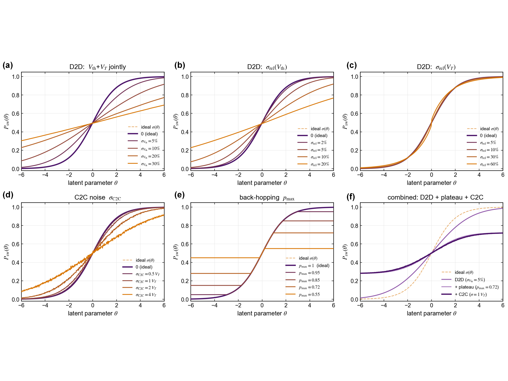

**图4.12** 各非理想性单变量与组合扫描下全栈$$T=64$$测试精度。(a)–(f)与图4.11一一对应。$$V_\mathrm{th}$$相对失配是唯一显著瓶颈：$$\sigma_\mathrm{rel}(V_\mathrm{th})=20\%$$时精度从97.5%降至92.8%；$$\sigma_\mathrm{rel}(V_T)=80\%$$与$$\sigma_\mathrm{C2C}=3V_T$$下精度均保97%以上；back-hopping在$$p_\mathrm{max}\ge 0.7$$下精度仅下降0.5个百分点、$$p_\mathrm{max}<0.6$$后急剧崩塌；现实组合 (5%/10%/1$$V_T$$/0.72) 给出97.0%精度，与无非理想的97.5%相差仅0.5个百分点。

图4.12把硬件设计的优先级清晰地指向DAC校准精度：$$V_T$$的slope抖动会被BN自动吸收，C2C噪声会被$$T$$步平均消除，真正决定网络精度的是$$V_\mathrm{th}$$的绝对位置稳定性。在此之上，给出sMTJ对单次MAC的能量分解。外围三项 (读出、DAC、计数器) 起初以28 nm数字默认值占位，后均由4.6节的sky130提取与估算落地：DAC编程约34 fJ、sMTJ SOT写$$0.78\,\mathrm{pJ}$$ (物理量地)、sMTJ读约48 fJ、计数器累加约19 fJ，累计约884 fJ每MAC，sMTJ写占约89%[^te_read]。写仍主导能量，故任何缩短脉冲宽度、降低写电压或增大$$R_\mathrm{SOT}$$的器件改进都会按$$V^2 t/R$$线性回报到全网能耗；但外围三项落地后合占约11%、已非可忽略，读出电路的能量—精度协同因而进入优化视野 (详见4.6节)。

[^te_read]: 外围能量经历了一次由占位到提取的订正。读出、数模转换器与计数器最初沿用28 nm数字默认值 (读出与数模转换器各约5 fJ、计数器约0.5 fJ)，据此曾得出外围仅约1%、优化意义不大的判断；经4.6节的sky130 StrongARM版图提取 (读出约48 fJ) 以及电阻串数模转换器与计数器的器件电容估算 (约34 fJ与约19 fJ) 订正后，外围占比升至约11%，优化重心相应从单纯的器件改进扩展到读出与写驱动电路的协同。

把PBNN sMTJ与多种有竞争性的CIM架构置于同一训练任务上做能耗对比。任务是20轮的MNIST PBNN-MLP训练 (batch 128，共9380个mini-batch)，每个mini-batch包含三次MAC pass：前向、反向输入梯度 ($$W^\top\partial L/\partial y$$) 与反向权重梯度 ($$\partial L/\partial y\cdot x^\top$$)。仿真器内置五种主流CIM存储器 (STT-MRAM[^stt_apalkov]、ReRAM[^reram_wong]、PCRAM[^pcram_burr]、铁电随机存储器 (Ferroelectric RAM，FeRAM) [^feram_mikolajick]、SRAM-CIM[^sram_khwa]) 与三种概率二值存储模式 (sMTJ自身、基于Lin等人模拟ReRAM非理想性研究构造的ReRAM采样对照[^stoch_reram_lin]、Camsari等人2019综述中的CMOS p-bit ASIC[^cmos_pbit_camsari]) 的参数表。每个条目以per-bit读能、per-cell写能、写延迟与每权重比特数四个参数描述，并附文献出处。CMOS p-bit ASIC的per-update能量为5pJ，已包含加权和、阈值与Bernoulli发生三段操作，5ns完成；Borders与Sutton等人的实测原型机给出该数据的边界。将此5pJ作为CMOS p-bit ASIC的per-sample能量，与sMTJ的0.78pJ每样本 (物理量地标定的Ohmic值) 直接比较。20轮训练总能耗的横向对比汇总于表4.6与图4.13，按总能耗升序排列。

**表4.6** 20轮MNIST PBNN-MLP训练任务下九种存储器/p-bit架构的能耗分解。

| 架构 | 前向 | 反向 | 写或$$\theta$$更新 | 总能耗 |
|---|---|---|---|---|
| FP-NN SRAM-CIM (易失) | 2.24J | 4.47J | 0.00J | 6.71J |
| FP-NN STT-MRAM | 4.02J | 6.26J | 0.14J | 10.42J |
| FP-NN FeRAM | 4.02J | 6.26J | 0.70J | 10.98J |
| PBNN sMTJ ($$T=4$$) | 7.09J | 4.47J | 0.35J | 11.91J |
| PBNN CMOS-PRNG ($$T=4$$) | 8.97J | 4.47J | 0.35J | 13.79J |
| FP-NN ReRAM | 4.02J | 6.26J | 6.99J | 17.27J |
| PBNN CMOS p-bit ($$T=4$$) | 44.70J | 4.47J | 0.35J | 49.52J |
| FP-NN PCRAM | 20.12J | 22.35J | 13.97J | 56.44J |
| PBNN stoch-ReRAM ($$T=4$$) | 447.97J | 4.48J | 0.35J | 452.80J |

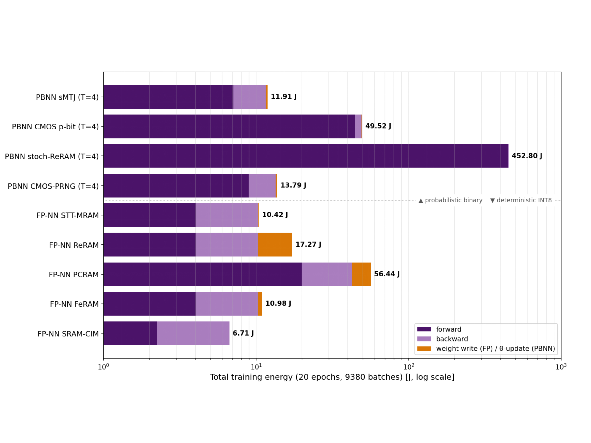

**图4.13** 九种存储器/p-bit架构在20轮MNIST PBNN-MLP训练下的总能耗对比。横轴为对数刻度的总能耗 (J)，每架构按前向、反向、写或$$\theta$$更新三段堆叠；上方四行为概率二值架构、下方五行为确定性INT8架构。PBNN sMTJ以11.91J排在所有非易失架构第二，仅比STT-MRAM高14%、低于ReRAM与PCRAM；CMOS p-bit以49.52J为sMTJ的4.2倍，反映sMTJ对CMOS Bernoulli发生器的物理优势；随机ReRAM因per-cell写能高达50–100pJ达到452.80J，在训练阶段不可承受。

该排名给出两点核心结论。其一，PBNN sMTJ以11.91 J在非易失架构中排第二[^nv_ranking]，与4.5节的鲁棒性合起来构成明确取舍：为换取5%–10%比特翻转率下精度仍保97%以上 (FP-NN同条件仅52.32%)，14%的训练能耗溢价是合理的。其二，把随机源由sMTJ换为CMOS p-bit ASIC，总能耗升至4.2倍 (49.52 J)，这一倍数即磁性器件相对CMOS的物理优势：sMTJ的Ohmic写能$$V^2 t/R$$在第二章工作点为$$0.78\,\mathrm{pJ}$$，而同等噪声裕度的CMOS Bernoulli发生器约需$$5\,\mathrm{pJ}$$。易失SRAM-CIM虽最低 (6.71 J) 但需外部刷新、不计入非易失对比；PCRAM-FP (56.44 J) 与随机ReRAM-PBNN (452.80 J) 则因per-cell写能达50–100 pJ在训练阶段不可承受。

[^nv_ranking]: 该能耗为STT-MRAM的1.14倍，低于ReRAM、PCRAM，与FeRAM持平。

## 4.6 外围电路的器件—电路协同设计与开源验证

前述各节在器件与阵列的行为级抽象上评估了精度、鲁棒性与能效，其中外围电路的能量与非理想性以工艺数量级常数代入。本节把这一层落到晶体管级：在全开源工艺设计套件 (SkyWater sky130) 上，让器件物理的定量结论去驱动读出与写入外围的电路设计，并以ngspice晶体管级仿真与版图寄生提取加以验证，使4.3节中以占位常数表示的外围项获得可信替代。

所用工艺节点与提取方式需在此明确。外围CMOS在开源的SkyWater sky130 (130 nm/1.8 V) 工艺设计套件上实现，选用该节点是因为它是目前唯一同时提供器件模型与完整开源EDA工具链 (ngspice、Magic、KLayout、Netgen) 的工艺套件，先进节点尚无可复现的开源套件；各项数值的提取按结果而定：灵敏放大器的输入折合失调由ngspice对器件阈值失配作蒙特卡洛得到，其判决能量由Magic提取的器件电容结合ngspice瞬态积分得到，写线寄生电阻与IR压降由Magic电阻提取[^extresist]标定各层方块电阻后按列几何标度得到，器件本身由OpenVAF编译的Verilog-A紧凑模型在ngspice中调用。磁隧道结是后段 (BEOL) 集成的器件，其临界尺寸 (约100 nm)、隧穿磁阻、写电流与写能量由第二章晶圆标定给出，与CMOS逻辑节点无关：这与近期实测的无沟道SOT-MRAM工艺[^hikstor][^hikstor_data]在量级上一致，本仿真的器件级写能0.78 pJ (0.9 V、0.75 ns、776 Ω) 正落在其2至5 ns工作点之间；区别仅在于本文的概率位与储备池应用采用低势垒 (Δ≈4.9) 的超顺磁变体，而非该存储器的高保持 (Δ=50–55) 调校。事实上，近期基于电压控磁隧道结的概率计算集成电路即在130 nm CMOS上实测[^pbit_asic]，可见该节点对此类器件是已被验证的工程选择；而商用磁存储器的外围CMOS通常在22至28 nm节点，故sky130的130 nm外围在能量、面积与速度上是保守上界。本节因此在绝对值之外一律以比值[^ratio_metrics]报告结论。

[^extresist]: Magic的电阻提取(extresist)经自校验给出多晶硅48.0 Ω/□，与工艺值48.2 Ω/□相差0.5%。

[^hikstor_data]: 该工艺为浙江驰拓科技在300 mm晶圆上实测的无沟道SOT-MRAM，关键指标为约100 nm临界尺寸、115% TMR、2 ns翻转，5 ns下写能约1.18 pJ/bit、2 ns下约0.54 pJ/bit、临界电流约660 µA，写错误率<$$10^{-6}$$、耐久>$$10^{12}$$，较常规SOT器件临界电流低16.5%、写功耗低39.2%。

[^ratio_metrics]: 此处的比值指失调比判决窗、能量占比与写线IR占器件比三项。

器件侧并行保留两套模型，一套是对实测数据回归的代数紧凑模型，承担全部电路与系统迭代，另一套是宏自旋Landau–Lifshitz–Gilbert随机动力学求解器，物理上更完整、计算量更大，专用于交叉验证；在0.75 ns自旋轨道矩写脉冲下两模型的判决阈值相差约0.2 mV，约为判决窗$$V_T=23.4\,\mathrm{mV}$$的百分之一 (图4.21)，足以支持以代数模型驱动整条设计流程。由这些器件级数驱动的外围在片上层面经位线、源线、字线与读线，与写通路、读通路、行列译码及模式与时序控制器相连 (整体架构层次见第五章图5.10)，本节其余部分依次给出读出与写入两条通路的器件级设计。

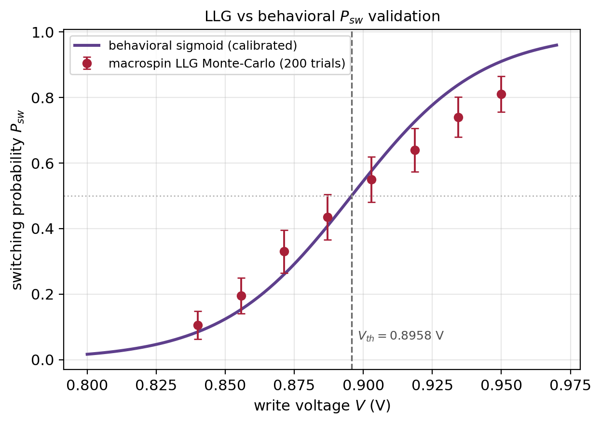

**图4.21** 紫线为对实测数据回归的开关概率Sigmoid，红点为宏自旋LLG随机求解器 (每点200次蒙特卡洛，误差棒为Wilson 95%区间)，竖虚线为标定阈值；两模型阈值吻合到$$0.01\,V_T$$，高压端偏离对应大过驱下的进动回切。

概率位判决正确与否的尺度，是器件开关概率Sigmoid的斜率所定义的伯努利判决窗$$V_T$$，而非确定性隧穿磁阻读出余量。这一规格替换是读出设计的出发点：读出灵敏放大器的输入折合失调应按$$V_T$$预算。这与既有概率位存内计算的读出处理不同，后者或以隧穿磁阻余量保证读出裕度而把比较器当作理想[^pbnn_cim]，或在训练侧补偿器件Sigmoid的斜率与位移却仍假设理想比较器[^pbit_var]，均未把比较器失调规格与器件Sigmoid斜率联系起来。在sky130上实现StrongARM锁存比较器[^strongarm][^sa_def]，对输入对与锁存管阈值失配做120次蒙特卡洛 (Pelgrom面积反比律[^pelgrom][^pelgrom_law]，失配系数取该工艺量级)，得到输入折合失调$$\sigma_\mathrm{off}=9.21\,\mathrm{mV}=0.39\,V_T$$。即未经失调消除的平凡比较器，其失调已与判决窗同量级，会以每输出列一个系统性阈值偏移的形式注入误差，恰是4.5节判定为致命的那一类误差。

[^sa_def]: StrongARM锁存为时钟触发的动态再生锁存比较器，判决稳定后无直流通路、静态功耗为零，是存储器与存内计算灵敏放大的主流拓扑。

[^pelgrom_law]: Pelgrom面积反比律指失配标准差与器件面积的平方根成反比，即$$\sigma_{\Delta V_\mathrm{th}}=A_{V_T}/\sqrt{WL}$$。

关键在于这一失调能否被读出链路吸收。以电流灵敏读出的跨阻$$R_\mathrm{TI}$$为桥，把毫伏失调折算到popcount域，有$$\sigma_\mathrm{pc}=\sigma_\mathrm{off}\cdot 2\,\mathrm{PC_{FS}}/V_\mathrm{in}$$，其中$$\mathrm{PC_{FS}}\approx 3\sqrt F$$为扇入$$F$$决定的满量程popcount，$$V_\mathrm{in}$$为比较器差分输入范围，跨阻取动态范围允许的最大增益。这给出一条协同设计准则：跨阻增益由扇入设定，并据此判定何时平凡比较器即足够。取扇入1024、$$V_\mathrm{in}=0.6\,\mathrm V$$，准则给出$$R_\mathrm{TI}=613\,\Omega$$；在sky130上以popcount正比的差分电流驱动该前端并扫描，提取失调在整条链路中映射到约2.5个popcount，落在精度曲线膝点之下，从晶体管级确认了在该扇入与输入范围下平凡比较器即足够 (图4.15)。因此对常见扇入与$$V_\mathrm{in}\ge0.5\,\mathrm V$$，平凡比较器即为帕累托最优；仅在低压、宽扇入、增益欠预算的列才需启用失调消除，可只在越过膝点的列触发单容自调零 (隐藏于地址译码、较双容方案省约15%面积、无时序代价[^sa_singlecap])，其余列直接用裸比较器，从而把磁存储读出中始终开启的失调消除[^sa_singlecap]改为按扇入与斜率条件触发；更高分辨的双StrongARM锁存可把基线失调再降约30%[^dsa][^dsa_meas]，属可选拓扑替换。读出端省下的校准由写端补上：每列残余的系统性阈值偏移折叠进写数模转换器的逐列3至4位静态微调，其附加开关能量不足单次写能量的1%。把这一读出置于近期设计空间中可见取舍之异：面向低隧穿磁阻存储的单容自调零灵敏放大器把失调降逾六成以保住约二倍阻比的小读窗[^sa_singlecap]，电荷舵双尾比较器以约$$0.3\,V_T$$的更低失调应对宽共模输入[^sa_doubletail]，二者均把失调视作须先验消除的负担；存内计算宏则多以列共享ADC摊销数字化、把比较器失调并入量化非理想[^cim_xnor_sram]。本文与之不同：先以斜率匹配把失调折算到$$V_T$$判决窗、再仅对越过膝点的列条件触发消除，于是名义工况下省去其面积与能量，并独立处理本任务特有的低阻写线IR。

[^dsa_meas]: 该双StrongARM锁存在28 nm FDSOI上实测输入折合失调约8.5 mV。

**图4.14** 斜率匹配概率位读出所用的StrongARM灵敏放大器：差分输入对、交叉耦合再生锁存、四个时钟控预充PMOS与一个尾电流源，器件均为sky130工艺单元，标注沟道宽长比。

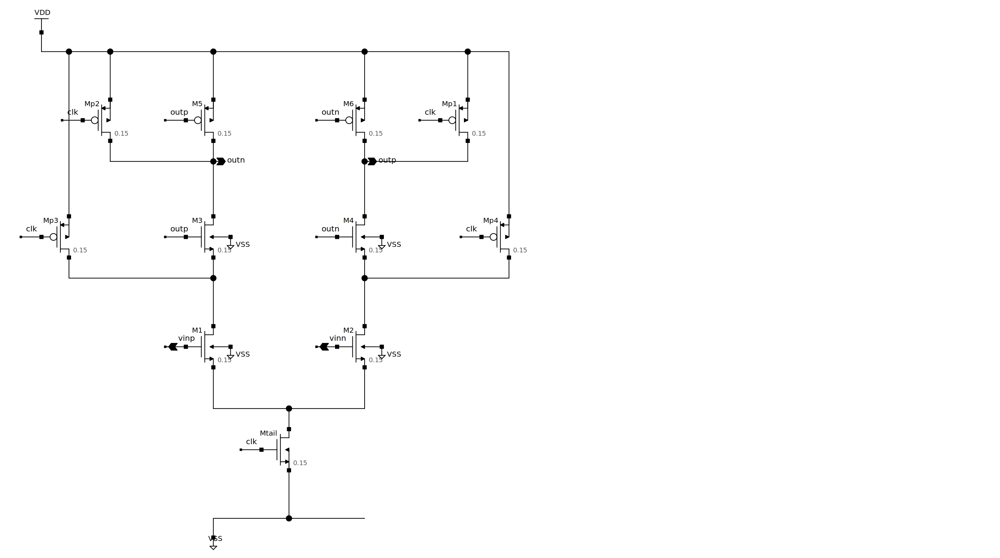

**图4.15** (a) sky130 StrongARM输入折合失调 ($$0.39\,V_T$$) 与判决窗$$V_T$$的相对关系，按$$V_T$$而非磁阻余量预算失调。(b) 扇入1024、$$V_\mathrm{in}=0.5\,\mathrm V$$下四种失调消除方案的精度跌幅对剩余失调，除最低压宽扇入区外跌幅均在统计涨落内，平凡比较器位于帕累托前沿。(c) 五种读出比较器 (本文StrongARM、double-tail、DSA、电流采样、单电容自调零) 在同一sky130失调蒙特卡罗夹具下的输入折合失调 ($$\sigma_\mathrm{off}/V_T$$，误差棒为$$\pm1$$标准误)：四种失配受限拓扑同落于约$$0.39\,V_T$$且误差棒相互重叠，文献在更先进节点报告的拓扑间失调差异在此并不复现；单电容自调零实测降至$$0.167\,V_T$$ (约58%降幅，与文献28 nm报道的逾六成同量级)，但标称工况$$0.39\,V_T$$已在窗口预算内，故器件最少的单级StrongARM仍为帕累托最优，自调零留作越过膝点的列的条件触发选项。各备选电路与同流程分析见附录D。

写通路的电路级评估同样把器件级数与外围开销分列。器件沟道的纯欧姆写能量为0.78 pJ；以sky130标准1.8 V CMOS反相器驱动776 Ω写支路并扫描上拉管宽度，要把约0.9 V写电压交付到器件需约7 µm上拉管，此时器件吸收0.785 pJ而电源取出约1.6 pJ，端到端约为器件级的两倍，开销来自驱动导通电阻与776 Ω的分压；缩小驱动会欠驱使远端写失败，放大驱动会过驱使器件能量随平方升高，故高效的写需要一条受控的约0.9 V写电压轨，应并列报告器件级0.78 pJ与端到端约1.6 pJ两个数 (图4.16)。供电完整性方面，用Magic电阻提取在sky130上标定各层方块电阻，按真实列写线长度标度：列高$$N\le64$$时金属写线往返寄生电阻不足776 Ω的5%，$$N=256$$时在met2、1 µm线宽下达约128 Ω即16.5%[^te_ir]，误用局部互连层则达千欧量级；设计指导为写线走met2及以上、加宽或对高列分段。

[^te_ir]: 写线IR压降的严重性是经版图提取才显现的。阵列层最初按可忽略处理写线寄生 (仅保留行为级接口)，相应地正文4.3节亦只把读出受IR的影响视为可被数字阈值吸收；经Magic电阻提取与ngspice直流扫描后发现，低阻SOT写线 (776 Ω) 与金属互连在$$N=256$$时往返寄生达器件电阻的约16.5%，使远端写点跌破阈值，这一发现直接催生了本节随后的IR感知逐行写预畸变方案。

这一供电发现进一步倒逼出一个写通路设计。在一条高列上若仅向列首施加写电压，行$$r$$处单元实际所见电压为$$V_\mathrm{target}-I_\mathrm{wr}R_\mathrm{par}(r)$$，远端因IR压降而跌破写点：在$$N=256$$、目标写概率0.90时，远端单元写概率塌陷至约0.016，几乎不被写入。据此提出IR感知逐行写预畸变，寻址行$$r$$时驱动$$V_\mathrm{target}+I_\mathrm{wr}R_\mathrm{par}(r)$$，其中$$R_\mathrm{par}(r)$$由提取的方块电阻与列几何算出，使每行单元都看到$$V_\mathrm{target}$$ (图4.17)；该预畸变是一张由几何决定的静态逐行查找表，码值跨0至148 mV (约5个写数模转换器位)，与逐列阈值微调合并即得一个位置与器件双重感知的写数模转换器，控制开销近零。承载这些码的写数模转换器拓扑由仿真选定：在sky130上把二进制加权电流舵数模转换器接入776 Ω低阻写负载时，随输出电压上升各电流源失去漏源裕度、电流下垂，二进制权重不再线性叠加而非单调 (积分非线性约1.7个最低有效位) 且量程偏窄，简单共源共栅又因堆叠裕度不足而电流枯竭；因此写数模转换器取电压型电阻串结构 (按构造单调、最低有效位等于参考量程除以$$2^b$$)，其抽头经CMOS传输门[^tgate]与写驱动缓冲接入写线，在200 mV参考量程下6至7位电阻串给出1.6至3.1 mV的最低有效位，足以覆盖148 mV的逐行IR预畸变与逐列微调 (图4.18)。逐行IR预畸变的思路在交叉阵列文献中已有雏形——对寄生压降先建模再预畸变写值，可在高线阻下保住识别率[^ir_predistort][^ir_pre_meas]，且远端压降随阵列尺寸近似按平方增长[^ir_linescaling]——但既有工作多停在算法或SPICE模型层，未给出驱动、数模转换器与电源轨的电路实现，且面向模拟电导而非二值开关概率；与同在130 nm CMOS上集成超顺磁磁隧道结p比特、验证毫伏级偏置可调与可变阈值微调的近期工作[^smtj_pbit_driver][^pbit_spec]相比，后者是无阵列的单器件、不涉及写线IR。本文把这两半在电路层合一：电压型电阻串写数模转换器同时承载逐行IR预畸变与逐列微调，并配一条稳压约0.9 V写轨[^write_rail]，给出二值SOT写概率的位置—器件双重感知补偿；图4.17(c) 在同一码扫描下定量对比三种写数模转换器拓扑送入$$776\,\Omega$$负载的积分非线性与单调性；文献IR补偿方案 (Truong逐行预失真、Zhu全局提升) 在同一写通路模型上的同口径对比与更广文献的能力对照见附录D。

[^ir_pre_meas]: 该方案中线阻模型对SPICE的电压偏差小于2.9%，在3 Ω线阻下把识别率由65%恢复至约100%。

[^pbit_spec]: 该工作以栅压模拟调节翻转概率，可变阈值反相器在0.7–1.1 V间以100 mV步进。

[^tgate]: CMOS传输门由并联的NMOS与PMOS构成，对轨到轨范围内的模拟电压提供低且较对称的导通电阻；相较单管开关 (近电源轨时损失约一个阈值电压、导通电阻随电平强烈变化)，它能近乎无失真地把所选电阻串抽头电压传给写驱动，是模拟选择开关的常规做法。

[^write_rail]: 该0.9 V写轨取代1.8 V核心电源，以免约一半能量损耗于驱动分压。

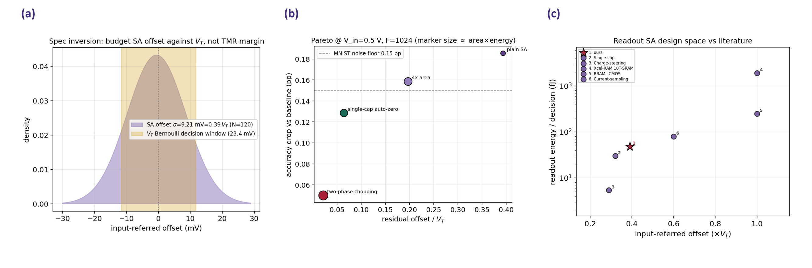

**图4.16** (a) 列写线往返金属寄生电阻占776 Ω的比例随列高$$N$$增长 (met2、1 µm线宽)，金色带为约10–20%的裕度区。(b) sky130 1.8 V CMOS反相器驱动776 Ω：交付平顶电压与驱动能量开销随上拉管宽度的变化。

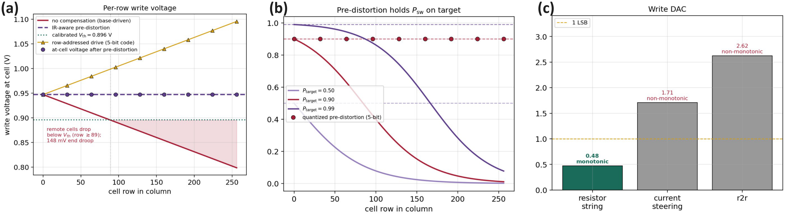

**图4.17** 沿高列的写通路设计与文献能力对照。(a) 无补偿时单元写电压随行号线性下降、远端约148 mV跌破标定$$V_\mathrm{th}$$ (红色阴影区写入失败)，IR感知预畸变使各行均见目标电压。(b) 在三个目标工作点 ($$P_\mathrm{target}=0.5/0.9/0.99$$) 下，无补偿写概率均沿列塌陷，预畸变把每行$$P_\mathrm{sw}$$拉平到各自目标 (虚线)。(c) 三种写数模转换器拓扑 (本文电压型电阻串、二进制加权电流舵、R-2R梯形) 在同一码扫描下送入$$776\,\Omega$$写负载的积分非线性与单调性：仅电压型电阻串按构造单调 (积分非线性约0.48个最低有效位)，电流舵与R-2R因源漏裕度塌缩、开关导通电阻在进位处的扰动而非单调 (积分非线性约1.7与2.6个最低有效位)。与未在本地复现的更广文献的定性能力对照见附录D。

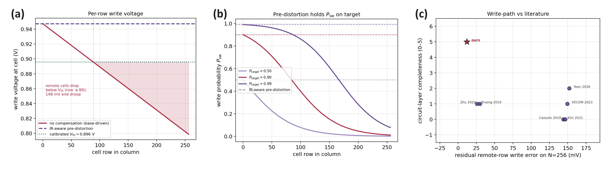

**图4.18** 写通路的晶体管级实现：电压型电阻串写数模转换器经CMOS传输门完成抽头选择，由CMOS推挽写驱动缓冲到写线，写线串联寄生电阻表征IR压降，存储单元为2T SOT-MTJ (访问管由写字线选通，读出端引出至灵敏放大器)。

读出与写入模块的功能由瞬态仿真给出端到端佐证 (图4.19)。写通路上0.9 V、0.75 ns写脉冲经776 Ω SOT支路交付，端电压在亚纳秒内建立，标定紧凑模型给出的瞬时开关概率在脉冲窗内升起、脉冲撤去后归零，一次写即产生一个伯努利样本；读出端StrongARM锁存在时钟到来前把两输出预充至电源，时钟沿后再生正反馈在数百皮秒内把10 mV差分输入放大为轨到轨判决。这两种操作在同一物理阵列上分时复用 (图4.20)：概率位推断模式下一次判决由$$T$$个伯努利样本构成，每个样本是写、弛豫、读的相位循环，$$T$$次读出取平均近似期望，置信度序贯早退可在等错误率下把平均采样数压减约一半。与第三章伊辛求解的全阵列同步演化、本章前馈推断的按层有序采样相对照，这一相位流水线给出了PBNN在硬件上的时序组织；图中储备池模式的低势垒自由演化与列共享读出属第五章内容。

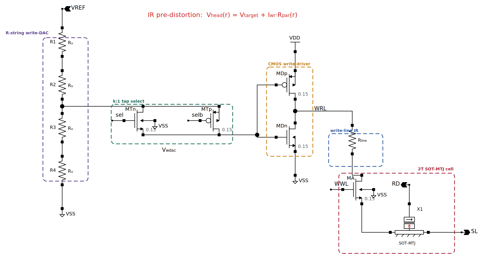

**图4.19** (a) 写脉冲交付与瞬时开关概率 (含标定紧凑模型)；(b) StrongARM再生，时钟沿后由预充态分裂为轨到轨判决 (10 mV差分输入)；(c) 列共享逐次逼近转换器的电荷再分配逐位逼近 (储备池读出，详见第五章)。(a)(b)为ngspice瞬态。

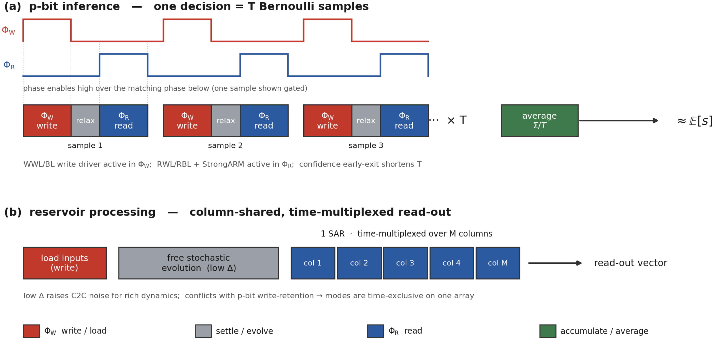

**图4.20** 工作模式流水线。(a) 概率位推断：每样本为写、弛豫、读相位循环，$$T$$次平均得期望，置信度早退缩短$$T$$。(b) 储备池处理 (第五章)：写入输入、低势垒自由演化、列共享逐次逼近转换器分时扫描各列。两模式分时复用同一阵列、在时间上互斥。

本节的电路级结论须按其方法学口径理解。随机性保留在数值采样环中、紧凑模型保持代数形式以适配开源编译器，含噪后仿的随机共仿尚未实现；sky130为130 nm/1.8 V节点，故所有电路级结论以比值报告而非绝对值；Magic的电阻型寄生与IR压降为粗集总、仅给量级且未建模串扰，故写线IR仅为量级估计；磁隧道结在版图中以抽象黑盒单元表示并附不可制造声明，因无开源工艺提供可用的SOT-MTJ单元，CMOS工艺只承担外围；写数模转换器与计数器的能量已按sky130器件电容估算落地 (电阻串数模转换器码设置约34 fJ、计数器自增约19 fJ)；外围与存储单元的面积亦已按提取的sky130标准单元尺寸 (触发器/全加器约20 µm²、行高2.72 µm) 与设计规则作一阶估算——2T存储单元约4.6 µm²[^cell_area]、电阻串数模转换器约800 µm²、列累加计数器约630 µm²，合得256×256片块面积约0.67 mm²，外围面积与阵列同量级而非可忽略——但此为单元计数级估算而非DRC洁净的版图提取，绝对面积仍俟版图细化。这一晶体管级协同设计与近期在130 nm商用CMOS上以电压控制磁隧道结作熵源实测的概率计算芯片[^pbit_asic]互为补充：后者给出实测硅，本节则以晶圆标定的紧凑模型为可信锚、在开源工艺上做可复现的器件—电路协同设计。

[^cell_area]: 2T存储单元的面积由写访问管主导：通过约1.16 mA写电流需约2.2 µm管宽。

## 4.7 本章小结

本章把全文主线下同一硬件单元在机器学习推断任务上的可达性能与边界这一问题，落到一条端到端硬件仿真流水线之上。其关键设计是让软件基线、硬件感知与全栈评估三档模式共享同一份潜参数检查点：三档既共用$\boldsymbol{\Theta}$张量，也借助硬二值STE技巧复用BN滑动统计，使训练所得检查点无需重新训练即可切换到真实硬件语义下加以评估。这一安排避免了硬件感知训练中常见的训练与推理语义不一致带来的偏差，使同一仿真器能够同时服务于训练循环、PPA估算与鲁棒性扫描。配套的CLT高斯化前向把训练阶段的$T$次显式Bernoulli抽样压缩为一次解析近似，使每步训练复杂度回到与确定性矩阵乘法相近的量级——这是PBNN由算法可行但训练昂贵推进到训练代价与确定性BNN持平的关键。

鲁棒性分析进一步揭示了PBNN相对FP位置编码的结构性优势：FP编码中高位承担更大动态范围，MSB翻转会造成远大于低位翻转的误差；PBNN则将权重展开为$T$个独立Bernoulli样本，每个样本对输出的贡献幅度均受$2/T$约束，因此单点翻转的最坏影响由编码方式直接限制。该机制解释了PBNN在比特翻转扫描中的稳定性，也表明其可靠性收益并非依赖额外纠错电路。非理想性消融也给出了清晰的工程结论：影响精度的主要瓶颈是$V_\mathrm{th}$的绝对位置稳定性，而斜率漂移、循环噪声与back-hopping可分别通过BN、$T$步平均和工作点回退缓解。硬件优化因而可优先聚焦于DAC校准与温漂补偿。

跨架构能耗对比进一步说明，sMTJ-PBNN相对CMOS p-bit ASIC的优势来自Bernoulli发生这一基本操作的物理代价差异，而非单纯的实现细节差异。与确定性STT-MRAM CIM相比，PBNN新增能耗主要集中在前向采样通路，反向传播与权重更新通路的代价基本保持同量级。PBNN由此以可量化的前向能耗开销换取比特翻转鲁棒性、采样数可调的精度-能耗折线以及原生不确定性量化能力，这一取舍可在系统层面显式评估。

本章结论仍受三方面条件约束。器件层尚未引入累积写入后的$1/f$低频漂移与势垒退化，因此长时间在线训练的耐久性仍需借助老化模型单独评估；CLT高斯化前向依赖权重独立加和假设，该假设在前馈MLP与CNN中较为自然，但向Transformer扩展时会受到注意力相关结构与自回归串行依赖的挑战；此外，本文数据集主要覆盖MNIST与UCI表格任务，更大规模视觉和语言任务中的精度、鲁棒性与能耗定位仍需进一步验证。

从主线层面看，本章工作的根本意义在于与第三章构成对偶：第三章在伊辛求解任务上验证了同一物理阵列能够以可机理归因的优势承担组合优化，本章则在PBNN推断任务上验证了同一物理阵列能够以同量级能效与结构性鲁棒性承担机器学习。两类任务之间在器件层、阵列层与仿真后端层均无硬件分歧，区别只在于外围调度——这正是第一章所设想的、由同一阵列在不同时间窗口分别承担两类传统分离任务在工程层面的可证明形态。综合两章结果，全自旋三位一体架构与时域展开范式在跨任务、跨架构、跨非理想性三个维度上均得到了可复现的定量支持，下一章将在此基础上对全文工作作出总结并讨论后续研究方向。

## 参考文献

[^neel1949]: Néel L. Théorie du traînage magnétique des ferromagnétiques en grains fins avec application aux terres cuites. *Annales de Géophysique*, 1949, 5: 99–136.

[^brown1963]: Brown W F. Thermal fluctuations of a single-domain particle. *Physical Review*, 1963, 130(5): 1677–1686. [doi:10.1103/PhysRev.130.1677](https://doi.org/10.1103/PhysRev.130.1677)

[^krizakova2022]: Krizakova V, Perumkunnil M, Couet S, Gambardella P, Garello K. Spin-orbit torque switching of magnetic tunnel junctions for memory applications. *Journal of Magnetism and Magnetic Materials*, 2022, 562: 169692. [doi:10.1016/j.jmmm.2022.169692](https://doi.org/10.1016/j.jmmm.2022.169692)

[^pbnn_cim]: Gu Y, Huang P, Chen T, Fu C, Chen A, Peng S, Zhang X, Kou X. A noise-tolerant, resource-saving probabilistic binary neural network implemented by the SOT-MRAM compute-in-memory system. *arXiv preprint*, 2024. [arXiv:2403.19374](https://arxiv.org/abs/2403.19374)

[^pbit_var]: Zhang B, Liu Y, Gao T, Yin J, Guan Z, Zhang D, Zeng L. Automatic extraction and compensation of P-bit device variations in large array utilizing Boltzmann machine training. *Micromachines*, 2025, 16(2): 133. [doi:10.3390/mi16020133](https://doi.org/10.3390/mi16020133)

[^strongarm]: Razavi B. The StrongARM latch [A circuit for all seasons]. *IEEE Solid-State Circuits Magazine*, 2015, 7(2): 12–17. [doi:10.1109/MSSC.2015.2418155](https://doi.org/10.1109/MSSC.2015.2418155)

[^pelgrom]: Pelgrom M J M, Duinmaijer A C J, Welbers A P G. Matching properties of MOS transistors. *IEEE Journal of Solid-State Circuits*, 1989, 24(5): 1433–1439. [doi:10.1109/JSSC.1989.572629](https://doi.org/10.1109/JSSC.1989.572629)

[^dsa]: Papadopoulou A, Milovanović V M, Nikolić B. A low-voltage low-offset dual strong-arm latch comparator. *IEEE Asian Solid-State Circuits Conference (A-SSCC)*, 2017: 281–284. [doi:10.1109/ASSCC.2017.8240271](https://doi.org/10.1109/ASSCC.2017.8240271)

[^pbit_asic]: Duffee C, Athas J, Shao Y, Davila Melendez N, Raimondo E, Katine J A, Camsari K Y, Finocchio G, Khalili Amiri P. An integrated-circuit-based probabilistic computer that uses voltage-controlled magnetic tunnel junctions as its entropy source. *Nature Electronics*, 2025, 8(9): 784–793. [doi:10.1038/s41928-025-01439-6](https://doi.org/10.1038/s41928-025-01439-6)

[^hikstor]: Liu E, Yang W, Zhou K, et al. A novel channel-less SOT-MRAM with 115% TMR, 2 ns switching, and high bit yield (>99.9%). *2024 IEEE International Electron Devices Meeting (IEDM)*, 2024.

[^sa_singlecap]: Dong Q, Yang K, Fick L, Fick D, Blaauw D, Sylvester D, et al. A 1 Mb 28 nm STT-MRAM with 2.8 ns read access time at 1.2 V VDD using single-cap offset-cancelled sense amplifier and in-situ self-write-termination. *IEEE International Solid-State Circuits Conference (ISSCC)*, 2018, 30.2.

[^sa_doubletail]: Zhang Z, Lei Q Q, Zhao E H, Yang Y F, Feng S. Design of low-power high-speed double-tail dynamic comparator based on charge-steering concept. *Journal of Physics: Conference Series*, 2022, 2405(1): 012014. [doi:10.1088/1742-6596/2405/1/012014](https://doi.org/10.1088/1742-6596/2405/1/012014)

[^cim_xnor_sram]: Agrawal A, Jaiswal A, Roy D, Han B, Srinivasan G, Ankit A, Roy K. Xcel-RAM: accelerating binary neural networks in high-throughput SRAM compute arrays. *IEEE Transactions on Circuits and Systems I: Regular Papers*, 2019, 66(8): 3064–3076. [doi:10.1109/TCSI.2019.2907488](https://doi.org/10.1109/TCSI.2019.2907488)

[^ir_predistort]: Truong S N. A parasitic resistance-adapted programming scheme for memristor crossbar-based neuromorphic computing systems. *Materials*, 2019, 12(24): 4097. [doi:10.3390/ma12244097](https://doi.org/10.3390/ma12244097)

[^ir_linescaling]: Zhu X, Li Z, Liu H, Li Q, Liu S, Li N, Xu H. Solution to alleviate the impact of line resistance on the crossbar array. *IET Circuits, Devices & Systems*, 2020, 14(4): 498–504. [doi:10.1049/iet-cds.2019.0313](https://doi.org/10.1049/iet-cds.2019.0313)

[^smtj_pbit_driver]: Yoon J, Caçoilo N, Madhavan A, McClelland J J, Kanai S, Ohno H, Fukami S, Borders W A. 130-nm CMOS-integrated superparamagnetic tunnel junction-based p-bit. *IEEE Electron Device Letters*, 2026. [doi:10.1109/LED.2026.3696800](https://doi.org/10.1109/LED.2026.3696800)

[^cim_neurosim_validation]: Lu A, Peng X, Li W, Jiang H, Yu S. NeuroSim simulator for compute-in-memory hardware accelerator: validation and benchmark. *Frontiers in Artificial Intelligence*, 2021, 4: 659060. [doi:10.3389/frai.2021.659060](https://doi.org/10.3389/frai.2021.659060)

[^cim_dnn_neurosim_v2]: Peng X, Huang S, Jiang H, Lu A, Yu S. DNN+NeuroSim V2.0: an end-to-end benchmarking framework for compute-in-memory accelerators for on-chip training. *IEEE Transactions on Computer-Aided Design of Integrated Circuits and Systems*, 2021, 40(11): 2306–2319. [doi:10.1109/TCAD.2020.3043731](https://doi.org/10.1109/TCAD.2020.3043731)

[^cim_neurosim_v15]: Read J, Lee M-Y, Huang W-H, Luo Y-C, Lu A, Yu S. NeuroSim V1.5: improved software backbone for benchmarking compute-in-memory accelerators with device and circuit-level non-idealities. *arXiv preprint*, 2025. [arXiv:2505.02314](https://arxiv.org/abs/2505.02314)

[^cim_mnsim2]: Zhu Z, Sun H, Qiu K, Xia L, Krishnan G, Dai G, Niu D, Chen X, Hu X S, Cao Y, Xie Y, Wang Y, Yang H. MNSIM 2.0: a behavior-level modeling tool for memristor-based neuromorphic computing systems. *Proc. ACM Great Lakes Symposium on VLSI*, 2020: 83–88. [doi:10.1145/3386263.3407647](https://doi.org/10.1145/3386263.3407647)

[^cim_micsim]: Wang C, Chen Z, Huang S. MICSim: a modular simulator for mixed-signal compute-in-memory based AI accelerator. *arXiv preprint*, 2024. [arXiv:2409.14838](https://arxiv.org/abs/2409.14838)

[^cim_aihwkit]: Rasch M J, Moreda D, Gokmen T, Le Gallo M, Carta F, Goldberg C, El Maghraoui K, Sebastian A, Narayanan V. A flexible and fast PyTorch toolkit for simulating training and inference on analog crossbar arrays. *Proc. IEEE International Conference on Artificial Intelligence Circuits and Systems*, 2021: 1–4. [doi:10.1109/AICAS51828.2021.9458494](https://doi.org/10.1109/AICAS51828.2021.9458494)

[^cim_aihwkit_apl]: Le Gallo M, Lammie C, Buechel J, Carta F, Fagbohungbe O, Mackin C, Tsai H, Narayanan V, Sebastian A, El Maghraoui K, Rasch M J. Using the IBM analog in-memory hardware acceleration kit for neural network training and inference. *APL Machine Learning*, 2023, 1(4): 041102. [doi:10.1063/5.0168089](https://doi.org/10.1063/5.0168089)

[^smtj_arm_compact]: Garcia-Redondo F, Lopez-Vallejo M, Stanley-Marbell P. A compact model for scalable MTJ simulation. *Proc. International Conference on Synthesis, Modeling, Analysis and Simulation Methods and Applications to Circuit Design*, 2021: 1–4. [doi:10.1109/SMACD52803.2021.9636229](https://doi.org/10.1109/SMACD52803.2021.9636229)

[^smtj_ngspice]: Rajpoot J, Paul R, Verma S. Novel STT/SHE MTJ compact model compatible with NGSPICE. *arXiv preprint*, 2022. [arXiv:2208.14055](https://arxiv.org/abs/2208.14055)

[^psl_gpu_sa]: Onizawa N, Sasaki R, Hanyu T. GPU-accelerated simulated annealing based on p-bits with real-world device-variability modeling. *Scientific Reports*, 2025, 15: 6614. [doi:10.1038/s41598-025-90520-3](https://doi.org/10.1038/s41598-025-90520-3)

[^cmos_pbit_camsari]: Camsari K Y, Sutton B M, Datta S. p-bits for probabilistic spin logic. *Applied Physics Reviews*, 2019, 6(1): 011305. [doi:10.1063/1.5055860](https://doi.org/10.1063/1.5055860)

[^borders_factor]: Borders W A, Pervaiz A Z, Fukami S, Camsari K Y, Ohno H, Datta S. Integer factorization using stochastic magnetic tunnel junctions. *Nature*, 2019, 573: 390–393. [doi:10.1038/s41586-019-1557-9](https://doi.org/10.1038/s41586-019-1557-9)

[^sutton_pbit]: Sutton B M, Faria R, Ghantasala L A, Jaiswal R, Camsari K Y, Datta S. Autonomous probabilistic coprocessing with petaflops-equivalent capacity. *Science Advances*, 2020, 6(20): eabb2823. [doi:10.1126/sciadv.abb2823](https://doi.org/10.1126/sciadv.abb2823)

[^kaiser_insitu_bm]: Kaiser J, Borders W A, Camsari K Y, Fukami S, Ohno H, Datta S. Hardware-aware in situ learning based on stochastic magnetic tunnel junctions. *Physical Review Applied*, 2022, 17: 014016. [doi:10.1103/PhysRevApplied.17.014016](https://doi.org/10.1103/PhysRevApplied.17.014016)

[^pbnn_peters]: Peters J W T, Welling M. Probabilistic binary neural networks. *arXiv preprint*, 2018. [arXiv:1809.03368](https://arxiv.org/abs/1809.03368)

[^bnn_bayescnn]: Shridhar K, Laumann F, Liwicki M. A comprehensive guide to Bayesian convolutional neural network with variational inference. *arXiv preprint*, 2019. [arXiv:1901.02731](https://arxiv.org/abs/1901.02731)

[^bnn_tyxe]: Ritter H, Karaletsos T. TyXe: pyro-based Bayesian neural nets for PyTorch. *arXiv preprint*, 2021. [arXiv:2110.00276](https://arxiv.org/abs/2110.00276)

[^ste]: Bengio Y, Léonard N, Courville A. Estimating or propagating gradients through stochastic neurons for conditional computation. *arXiv preprint*, 2013. [arXiv:1308.3432](https://arxiv.org/abs/1308.3432)

[^stt_apalkov]: Apalkov D, Khvalkovskiy A, Watts S, Nikitin V, Tang X, Lottis D, Moon K, Luo X, Chen E, Ong A, Driskill-Smith A, Krounbi M. Spin-transfer torque magnetic random access memory (STT-MRAM). *ACM Journal on Emerging Technologies in Computing Systems*, 2013, 9(2): 13. [doi:10.1145/2463585.2463589](https://doi.org/10.1145/2463585.2463589)

[^reram_wong]: Wong H-S P, Lee H-Y, Yu S, Chen Y-S, Wu Y, Chen P-S, Lee B, Chen F T, Tsai M-J. Metal-oxide RRAM. *Proceedings of the IEEE*, 2012, 100(6): 1951–1970. [doi:10.1109/JPROC.2012.2190369](https://doi.org/10.1109/JPROC.2012.2190369)

[^pcram_burr]: Burr G W, Brightsky M J, Sebastian A, Cheng H-Y, Wu J-Y, Kim S, Sosa N E, Papandreou N, Lung H-L, Pozidis H, Eleftheriou E, Lam C H. Recent progress in phase-change memory technology. *IEEE Journal on Emerging and Selected Topics in Circuits and Systems*, 2016, 6(2): 146–162. [doi:10.1109/JETCAS.2016.2547718](https://doi.org/10.1109/JETCAS.2016.2547718)

[^feram_mikolajick]: Mikolajick T, Schroeder U, Slesazeck S. The past, the present, and the future of ferroelectric memories. *IEEE Transactions on Electron Devices*, 2020, 67(4): 1434–1443. [doi:10.1109/TED.2020.2976148](https://doi.org/10.1109/TED.2020.2976148)

[^sram_khwa]: Khwa W-S, Chen J-J, Li J-F, Si X, Yang E-Y, Sun X, Liu R, Chen P-Y, Li Q, Yu S, Chang M-F. A 65nm 4Kb algorithm-dependent computing-in-memory SRAM unit-macro with 2.3ns and 55.8TOPS/W fully parallel product-sum operation for binary DNN edge processors. *IEEE International Solid-State Circuits Conference*, 2018: 496–498. [doi:10.1109/ISSCC.2018.8310401](https://doi.org/10.1109/ISSCC.2018.8310401)

[^stoch_reram_lin]: Lin Y-H, Wang C-H, Lee M-H, Lee D-Y, Lin Y-Y, Lee F-M, Lung H-L, Wang K-Y, Tseng T-Y, Lu C-Y. Performance impacts of analog ReRAM non-ideality on neuromorphic computing. *IEEE Transactions on Electron Devices*, 2019, 66(3): 1289–1295. [doi:10.1109/TED.2019.2894273](https://doi.org/10.1109/TED.2019.2894273)

[^uci_iris]: Fisher R A. The use of multiple measurements in taxonomic problems. *Annals of Eugenics*, 1936, 7(2): 179–188. [doi:10.1111/j.1469-1809.1936.tb02137.x](https://doi.org/10.1111/j.1469-1809.1936.tb02137.x)

[^uci_wdbc]: Wolberg W H, Mangasarian O L. Multisurface method of pattern separation for medical diagnosis applied to breast cytology. *Proceedings of the National Academy of Sciences USA*, 1990, 87(23): 9193–9196. [doi:10.1073/pnas.87.23.9193](https://doi.org/10.1073/pnas.87.23.9193)

[^uci_yeast]: Horton P, Nakai K. A probabilistic classification system for predicting the cellular localization sites of proteins. *Proc. International Conference on Intelligent Systems for Molecular Biology*, 1996, 4: 109–115.

[^uci_statlog]: King R D, Feng C, Sutherland A. Statlog: comparison of classification algorithms on large real-world problems. *Applied Artificial Intelligence*, 1995, 9(3): 289–333. [doi:10.1080/08839519508945477](https://doi.org/10.1080/08839519508945477)

[^uci_spambase]: Cranor L F, LaMacchia B A. Spam!. *Communications of the ACM*, 1998, 41(8): 74–83. [doi:10.1145/280324.280336](https://doi.org/10.1145/280324.280336)

[^lion]: Chen X, Liang C, Huang D, Real E, Wang K, Liu Y, Pham H, Dong X, Luong T, Hsieh C-J, Lu Y, Le Q V. Symbolic discovery of optimization algorithms. *Advances in Neural Information Processing Systems*, 2023, 36. [arXiv:2302.06675](https://arxiv.org/abs/2302.06675)

[^cosine]: Loshchilov I, Hutter F. SGDR: stochastic gradient descent with warm restarts. *International Conference on Learning Representations*, 2017. [arXiv:1608.03983](https://arxiv.org/abs/1608.03983)

[^onecycle]: Smith L N. A disciplined approach to neural network hyper-parameters: part 1—learning rate, batch size, momentum, and weight decay. *arXiv preprint*, 2018. [arXiv:1803.09820](https://arxiv.org/abs/1803.09820)
