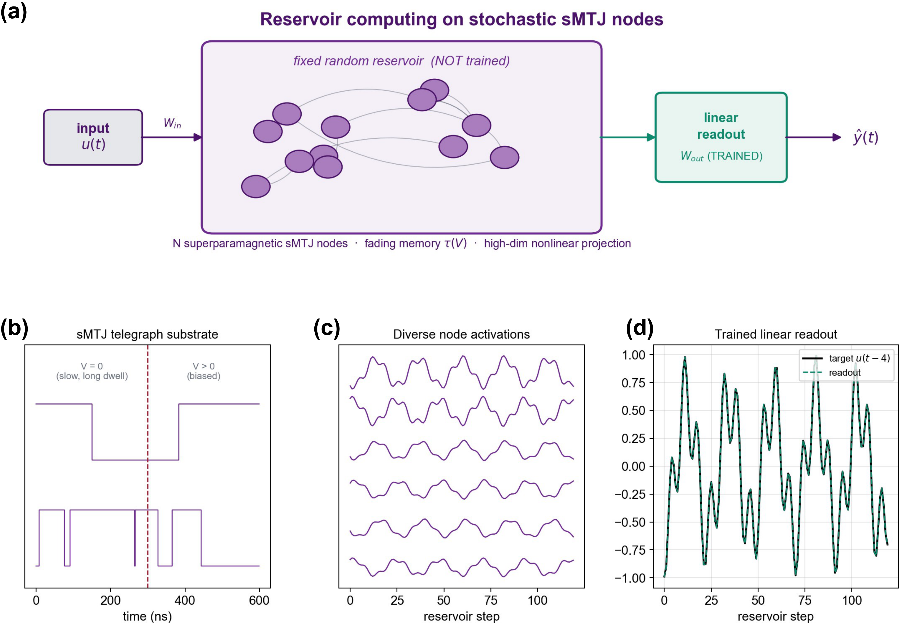
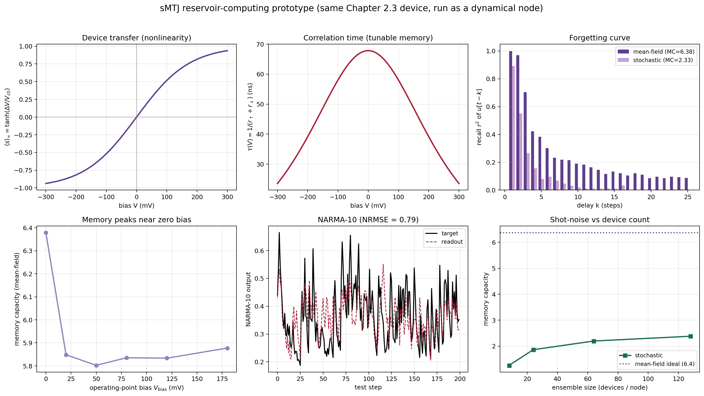
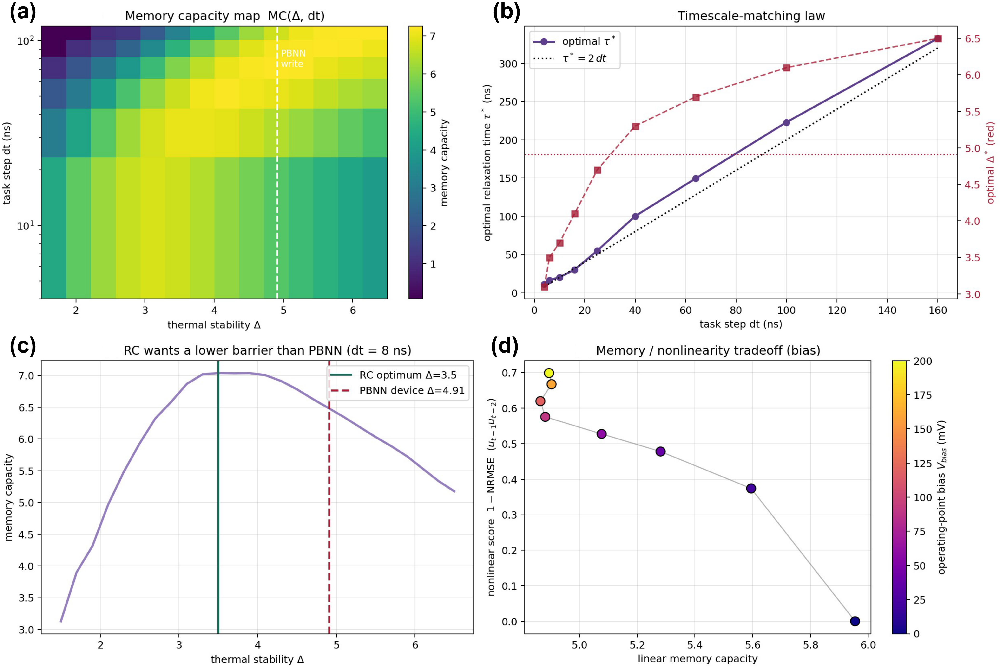
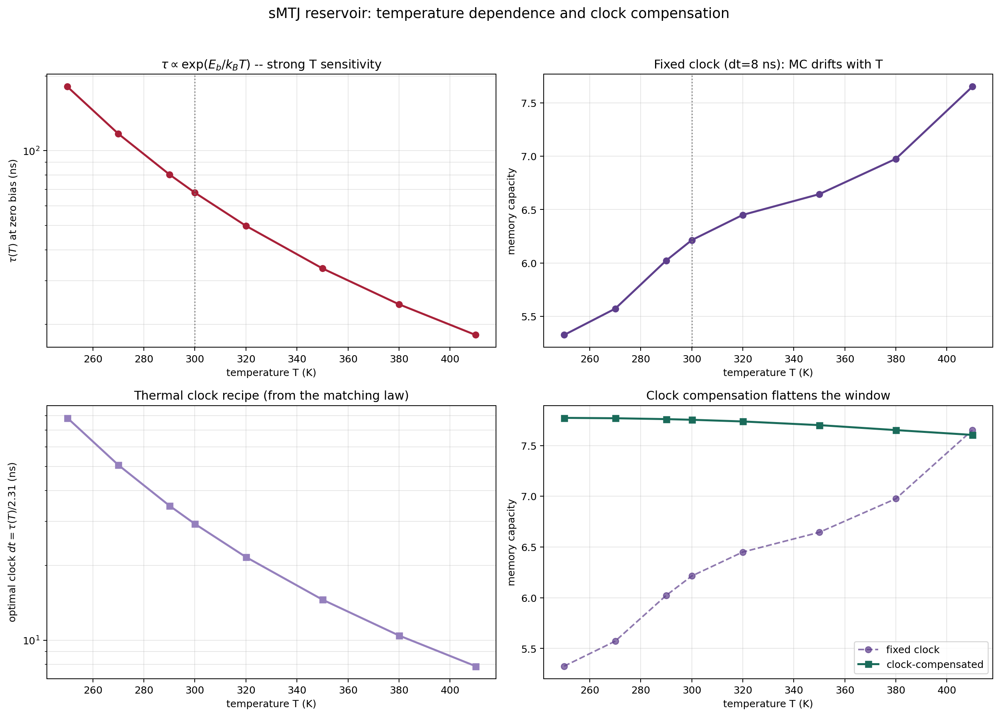
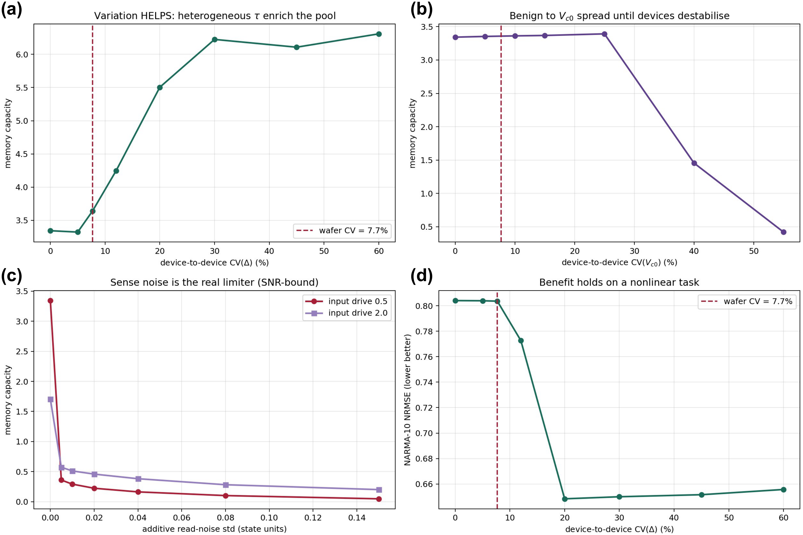
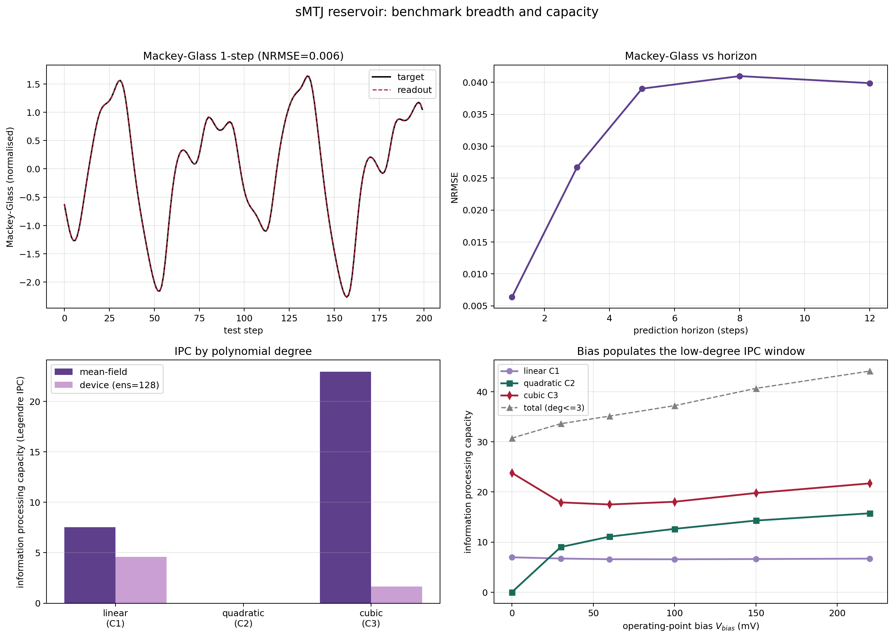
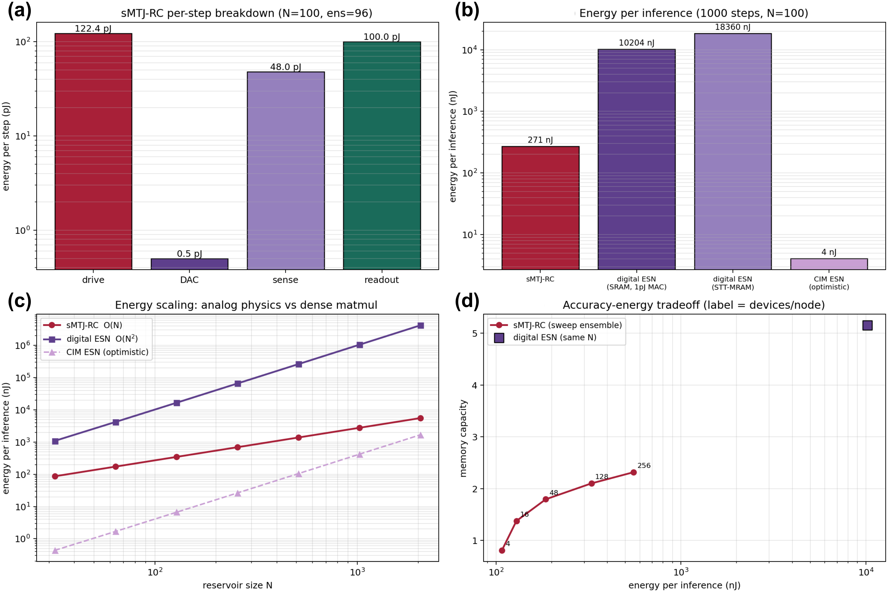

# 第5章 基于sMTJ的储备池计算：硬件评估与器件优化指导

本章是全文主线的第三类任务评估。第三章把sMTJ抽象为伊辛自旋以承担组合优化，第四章把同一硬件单元转作PBNN的概率二值权重以承担前馈机器学习推断，本章则把同一颗器件用作储备池计算 (Reservoir Computing，RC) 的随机动力学节点，以承担时序处理任务。三者共用第二章交付的器件模型与同一仿真后端，差别仅在于上层如何使用器件的随机性。伊辛求解以全阵列同步演化至热平衡的方式利用随机性逃逸局部极小，PBNN以独立同分布的Bernoulli采样并在时域平均的方式把随机性归约为确定期望，本章则保留磁矩在时间上的相关性，并把这种相关性本身当作计算资源。由此，同一物理阵列承担传统分离任务的主线，从优化与前馈推断两类扩展到含记忆的时序处理；更重要的是，被前两类任务所利用的是器件的瞬时或平衡态随机性，本章利用的则是其时域动力学，因而这一扩展并非简单地多增一类任务，而是把可用的物理资源从瞬时涨落延伸到弛豫记忆。

PBNN与RC对器件随机性的使用恰好对偶。第四章的采样路径每次独立抽取Bernoulli样本并对$$T$$次取平均，以无偏估计写概率$$\sigma(\theta)$$，其器件视图是第二章$$P_\mathrm{sw}(V,t_\mathrm{p})$$所描述的一次性、无记忆写事件。RC所依赖的恰是被PBNN平均掉的那部分信息：一个固定而不训练的高维非线性动力学系统，具备衰减记忆，使当前状态依赖近期输入历史而渐忘远期，仅训练末端的线性读出层即可完成时序映射。超顺磁sMTJ的热涨落翻转过程本身就是一个带可调时间常数的有状态系统，因而能够承担这一角色。本章不在RC算法层提出新结构，而是验证同一物理器件能否以可机理归因的方式承担这一范式，并集中回答两个面向工程的问题：该用法的硬件能效相对数字储备池处于何种位置，以及面向RC优化的sMTJ应落在怎样的器件参数区间。

## 5.1 sMTJ-RC的硬件工作原理

本节先把sMTJ如何充当储备池节点的物理图景叙述清楚，作为后续仿真器扩展的参照。储备池计算的三个要件，即高维投影、非线性与衰减记忆，在超顺磁sMTJ上分别由器件群体、热激活翻转的电压依赖性与磁矩弛豫时间承担。图5.1给出整体原理。

**图5.1** sMTJ储备池计算原理。上方为流水线：输入$$u(t)$$经固定输入权重$$W_\mathrm{in}$$注入由$$N$$个超顺磁sMTJ节点构成的固定随机储备池，节点间以固定随机递归耦合，仅末端线性读出$$W_\mathrm{out}$$被训练。下方为仿真器实际输出：(a) sMTJ随机电报噪声基底，两条真实的$$\pm1$$翻转轨迹，零偏时停留时间长而翻转缓慢，加偏后翻转加快，停留时间正是衰减记忆的载体；(b) 储备池响应，多个节点的模拟激活轨迹彼此相异，体现对输入历史的高维非线性投影；(c) 训练后的线性读出从储备池状态重建延迟目标$$u(t-4)$$。

超顺磁结的磁矩位于双势阱中，以连续时间两态马尔可夫过程在$$s\in\{-1,+1\}$$间随机跳变。偏置电压倾斜势阱，抬高一侧势垒而压低另一侧。沿用第二章的Néel-Brown热激活律，两个逃逸速率为

$$
r_\uparrow(V) = \frac{1}{\tau_0}\exp\!\big[-\Delta(1 - V/V_{c0})\big],\qquad
r_\downarrow(V) = \frac{1}{\tau_0}\exp\!\big[-\Delta(1 + V/V_{c0})\big],
$$

其中$$r_\uparrow$$即第二章$$P_\mathrm{sw}$$所内含的瞬时翻转速率，$$r_\downarrow$$为偏置反向后的同一律。由此可闭式导出RC关心的两个量。其一是稳态均值，给出输入到状态的非线性传输关系

$$
\langle s\rangle_\infty(V) = \frac{r_\uparrow - r_\downarrow}{r_\uparrow + r_\downarrow} = \tanh\!\big(\Delta V/V_{c0}\big),
$$

零偏处斜率为$$\Delta/V_{c0}\approx 5.7\,\mathrm{V^{-1}}$$。其二是弛豫时间，即衰减记忆的时间常数

$$
\tau(V) = \frac{1}{r_\uparrow + r_\downarrow},
$$

在$$V=0$$处取极大$$\tau_\mathrm{max}=\tau_0 e^{\Delta}/2$$，按第二章Device-A参数 ($$\Delta=4.91$$，$$\tau_0=1\,\mathrm{ns}$$) 约为$$68\,\mathrm{ns}$$，并随驱动增大而向$$\tau_0$$收缩。偏置电压因此身兼三重作用：它既是输入注入端口，又同时设定记忆长度与非线性强度。小偏置对应长记忆，大偏置对应强非线性饱和，二者构成RC中经典的记忆与非线性权衡关系，而此处这一关系由一个具有明确物理意义的器件参数所控制。一次完整的储备池前向计算可描述为：输入序列以时变电压注入器件群体，每个节点的磁矩在电压调制下随机演化并保持各自的时间相关，读出层在一个积分窗口内对节点状态取时间或集合平均，得到模拟激活向量，再经训练好的线性层映射到输出。

## 5.2 既有储备池工作与本章定位

第一章已从物理储备池计算的总体进展 (1.2.5节) 与复用概率二值器件承担时序处理的动机 (1.3.3节) 出发作了概述，本节在此基础上聚焦与超顺磁sMTJ-RC直接相关的工作，对相关实现作一次梳理，可分四类，各自相对超顺磁sMTJ-RC并做端到端硬件评估这一目标存在缺口。第一类是自旋力矩纳米振荡器 (STO) 储备池，以振荡器的非线性瞬态与相位为动力学来源，配合时分复用虚拟节点完成口语数字识别[^rc_torrejon]；其器件是含少量热噪声的确定性连续相位系统，与超顺磁器件的随机两态翻转在机制、噪声结构与读出方式上都不同。Grollier等人的综述系统总结了自旋电子神经形态计算的器件谱系[^rc_grollier_review]。第二类是超顺磁与随机MTJ的概率计算，将低势垒sMTJ用作p比特构建概率自旋逻辑、整数分解与玻尔兹曼机[^cmos_pbit_camsari][^borders_factor][^kaiser_insitu_bm]，第四章已引为最近先例；但其任务是无向图模型的采样与优化，不利用衰减记忆，也不处理时间序列。第三类是其他介质的储备池实现，如忆阻器网络、光子腔与延迟反馈系统[^rc_appeltant]，它们在各自介质内已较成熟，但器件物理与能耗模型与本工作不通用。第四类是RC理论本身，回声状态网络与液体状态机奠定了固定随机储备池加训练读出的范式[^rc_jaeger][^rc_maass]，线性记忆容量[^rc_jaeger_mc]与信息处理容量[^rc_ipc]给出了量化记忆与非线性的标准指标，本章直接采用。综合来看，以第二章已校准的sMTJ写概率模型为入口，把同一器件复用为RC的随机两态动力学节点，并在第四章分层仿真器内做端到端的能耗与面积评估及器件优化指导，是上述工作尚未覆盖的交集。本章因此复用第四章已成熟的器件校准、变异、阵列与PPA估算成果，仅在有状态器件演化层与储备池读出层独立实现。

## 5.3 仿真器扩展与原型验证

本章在第四章六层架构之上新增两个模块，并使之与PBNN前向通路解耦，从而不影响既有网络。设备层新增电报模型，把sMTJ群体建模为有状态的两态随机电报过程。其核心是两态连续时间马尔可夫链在任意步长$$\mathrm{d}t$$上的精确传播子

$$
P\big(s_{t+\mathrm{d}t}=+1 \mid s_t\big) = p_\infty + \big(\mathbb{1}[s_t=+1] - p_\infty\big)\,e^{-\mathrm{d}t/\tau},
$$

其中$$p_\infty = r_\uparrow/(r_\uparrow+r_\downarrow)$$，$$\tau=1/(r_\uparrow+r_\downarrow)$$，因而$$\mathrm{d}t$$无需远小于$$\tau$$即可数值稳定。该模块以NumPy实现，支持逐器件的$$\Delta$$与$$V_{c0}$$异质性，并复用第二章的速率表达式；为此在器件层新增了连续时间速率接口，属加性改动，第二章既有闭式与回归测试均不受影响。

储备池层实现固定随机的节点池及其驱动。节点电压为$$V_i(t)=V_\mathrm{bias}+(W_\mathrm{in}u(t))_i+(W_\mathrm{res}x(t-1))_i$$，三项分别为工作点、输入注入与可选的递归耦合，后者为按谱半径标定的固定随机矩阵。由于器件传输$$\tanh(\Delta V/V_{c0})$$的斜率高达$$5.7\,\mathrm{V^{-1}}$$，若把耦合直接表达为电压，会产生远超回声状态判据的有效增益，因此本层以回声状态网络的等效量指定输入尺度与谱半径，再除以该斜率换算为器件电压，使储备池稳定工作在回声状态区。读出层为闭式岭回归，是整个系统中唯一被训练的部分。为与硬件一致并抑制散粒噪声，每个逻辑节点由若干独立器件构成集合，在读出窗口内对$$\pm1$$样本取均值得到模拟激活；模块另提供噪声无关的均值场模式，演化期望磁矩，作为理想参照，其作用类比第四章PBNN的软件模式。任务与指标模块提供NARMA-10、Mackey-Glass、记忆容量输入与非线性目标，以及归一化均方根误差 (NRMSE) 与线性记忆容量。

首先验证该动力学系统确实具备可计算性。图5.2在均值场 (理想，无散粒噪声) 与真实随机采样两种模式下给出原型结果。

**图5.2** sMTJ储备池原型。(a) 器件传输$$\tanh(\Delta V/V_{c0})$$；(b) 相关时间$$\tau(V)$$，零偏约$$68\,\mathrm{ns}$$，随偏置收缩；(c) 遗忘曲线，对各延迟$$k$$重建$$u(t-k)$$的$$r^2$$，均值场与随机采样均呈衰减记忆；(d) 记忆容量随工作点偏置的变化，零偏附近最大，与$$\tau(V)$$在$$V=0$$取极大一致；(e) NARMA-10单步预测；(f) 记忆容量随每节点器件数 (集成规模) 的变化，随机采样趋向但低于均值场理想值。

均值场模式给出记忆容量约6.4，证明该储备池作为动力学系统的计算能力；真实随机采样在每节点96器件集成下记忆容量约2.3，NARMA-10的NRMSE约0.79。图5.2(d) 把记忆容量随偏置的变化与5.1节的$$\tau(V)$$联系起来：记忆在零偏附近最长，与$$\tau$$在$$V=0$$取极大相互印证。图5.2(f) 揭示了核心硬件问题：节点模拟激活的信号摆幅有限，而单器件二值采样的噪声以集合规模的平方根衰减，因此散粒噪声是真实器件RC的首要限制，且记忆深度与信噪比之间经由$$\mathrm{d}t/\tau$$存在权衡。这一观察将贯穿后续5.6与5.4节。

## 5.4 面向RC的器件优化与变异分析

本节是本章相对既有自旋电子RC工作的独特贡献。其目标不止于演示sMTJ能做RC，而是给出面向RC应当制造怎样的sMTJ这一定量且可交付工艺的结论。由于非递归储备池节点的记忆即其弛豫时间$$\tau=\tau_0 e^{\Delta}/2$$，热稳定因子$$\Delta$$是首要器件参数。本节全部在均值场模式下进行，使结论关于器件物理而非散粒噪声。

**图5.3** 器件优化指导。(a) 记忆容量在$$(\Delta,\,$$任务步长$$\mathrm{d}t)$$平面上的等高线，呈对角脊；(b) 最优$$\Delta^\ast$$与对应$$\tau^\ast$$随$$\mathrm{d}t$$的标度，给出时间尺度匹配关系；(c) 固定$$\mathrm{d}t=8\,\mathrm{ns}$$时记忆容量随$$\Delta$$的曲线，RC最优势垒明显低于PBNN写器件；(d) 记忆与非线性的权衡前沿，由工作点偏置扫描得到。

两项结论可直接交付器件设计。第一项是势垒匹配。在固定任务步长下，记忆容量随$$\Delta$$存在内部最优：过低则$$\tau\ll\mathrm{d}t$$而无记忆，过高则$$\tau\gg\mathrm{d}t$$，过度积分而丧失回声状态。对$$\mathrm{d}t=8\,\mathrm{ns}$$，记忆容量在$$\Delta\approx 3.5\text{--}4.3$$ (对应$$\tau\approx 20\text{--}40\,\mathrm{ns}$$) 构成一段平缓的高原，峰值约在$$\Delta\approx 4.1$$，整段都明显低于第二章PBNN写器件的$$\Delta=4.91$$。换言之，面向RC优化的sMTJ应比面向PBNN写操作优化的器件势垒更低，更接近超顺磁临界稳定区。第二项是时间尺度匹配：最优弛豫时间随任务步长近似线性增长，约为输入采样周期的二至三倍 (图5.3(b))，任务越慢，所需$$\Delta$$越高。图5.3(d) 进一步说明，由于$$\tanh$$是奇函数，零偏时器件只具备奇阶非线性，提高工作点偏置可换取偶阶非线性，但以记忆为代价，二者构成可量化的权衡前沿，为按任务的记忆与非线性需求选择工作点提供依据。

温度提供了调节$$\tau$$的第二条途径，也是部署中的现实挑战。由$$\Delta=E_b/(k_BT)$$，在固定势垒高度下$$\Delta(T)=\Delta_{300}\cdot 300/T$$，而$$\tau$$指数依赖$$\Delta$$，故$$\tau$$对温度极其敏感。图5.4给出该敏感性及其补偿。

**图5.4** 温度作为$$\tau$$的调节途径。(a) 零偏$$\tau(T)$$在250至410 K间从约$$181\,\mathrm{ns}$$降至约$$18\,\mathrm{ns}$$，呈Arrhenius式强敏感；(b) 固定时钟$$\mathrm{d}t=8\,\mathrm{ns}$$时记忆容量随温度漂移；(c) 由匹配关系给出的热时钟配方$$\mathrm{d}t(T)=\tau(T)/2.31$$；(d) 按该配方随温度调整储备池时钟后，记忆容量在全温区基本恒定。

固定时钟下记忆容量在250至410 K间漂移达2.33，而当储备池更新步长随温度按匹配关系调整后，漂移压缩至0.17。这给出一个简单的器件操作配方：无需改变器件，只需令系统时钟跟随$$\tau(T)$$，即可在宽温区保持接近最优的性能。该结论也回连第二章的器件设计，若目标工作温区已知，可据匹配关系反推应制造的势垒高度。

第四章的非理想性消融表明，器件间 (D2D) 变异对PBNN是精度负担，$$V_\mathrm{th}$$的绝对位置稳定性是主要瓶颈。RC对同一变异的响应却相反。图5.5给出变异与噪声扫描，均在均值场模式下隔离各通道。

**图5.5** 变异容忍。(a) 记忆容量随$$\mathrm{CV}(\Delta)$$上升，从无变异时的3.34升至30%变异下的6.23，异质性带来不同的$$\tau$$，丰富了节点池的有效维度；(b) 对$$V_{c0}$$变异在较大范围内不敏感，直至器件失稳；(c) 加性读出噪声是真正的限制，其影响随信号摆幅 (输入驱动) 而定，受信噪比约束；(d) 该收益在NARMA-10非线性任务上同样成立。竖线为第二章晶圆工艺$$\mathrm{CV}(\Delta)=7.7\%$$。

这一结果具有明确的硬件意义：对PBNN有害的制造变异，对RC从无害转为有益。在第二章实测的晶圆变异$$\mathrm{CV}(\Delta)=7.7\%$$处，记忆容量不降反略升至3.64，器件正处于良性乃至有益的区间。其机理在于，$$\Delta$$的离散导致$$\tau$$的离散，相当于在节点池中无额外代价地获得一组时间常数各异的滤波器，提升了储备池的可分性。这与第四章PBNN以编码结构换取比特翻转鲁棒性形成对照：RC把工艺失配转化为计算资源。真正的限制来自读出与感测噪声 (图5.5(c))，其严重程度取决于噪声相对节点激活摆幅的比值，因而与5.3节的散粒噪声及集成规模问题同源，共同指向提高信号摆幅或增大集成这一工程方向。

## 5.5 基准广度与硬件能效

为说明该器件是通用时序处理器而非单任务构造，沿用第四章跨任务验证的思路，以同一固定储备池配方运行多个标准基准。图5.6给出结果。

**图5.6** 基准广度。(a) Mackey-Glass混沌序列单步预测，读出与目标几乎重合；(b) 预测NRMSE随预测步长上升；(c) 信息处理容量按多项式阶分解 (线性、二次、三次)，均值场与真实器件对比；(d) 总处理容量随工作点偏置的分配。

Mackey-Glass单步预测NRMSE低至0.006，随预测步长增至约0.04，表明储备池能稳定承载混沌动力学的短时预测。容量分解 (图5.6(c)) 给出一个与5.4节自洽的结构性结论：零偏工作点下线性容量与三次容量较大，二次容量接近零，这正是$$\tanh$$奇非线性的反映，奇阶项可由器件直接生成，偶阶项需偏置打破对称才会出现。图5.6(d) 显示，随偏置升高，二次容量逐步释放，线性容量相应让渡，总容量大致守恒。这把5.4节的记忆与非线性权衡从单一乘积任务推广到完整的多项式容量谱，说明工作点偏置是在固定器件上重新分配记忆与非线性预算的连续参数。

最后把sMTJ-RC与数字回声状态网络置于同一能耗标尺，复用第四章的工艺参数与器件库，做端到端对比。核心差异是结构性的：数字ESN每步需要一次$$O(N^2)$$的稠密递归矩阵向量乘，而sMTJ储备池把该递归以模拟器件动力学实现，代价为$$O(N\times$$集成$$)$$。图5.7给出评估。

**图5.7** 硬件评估。(a) sMTJ-RC单步能量分解，器件偏置耗散与数字读出为主；(b) 单次推理 ($$N=100$$，1000步) 能量，sMTJ-RC与常规数字ESN及STT-MRAM ESN的对比，并给出乐观的存内计算下界；(c) 能量随储备池规模$$N$$的标度，呈现$$O(N)$$与$$O(N^2)$$的分野；(d) 精度 (记忆容量) 与能量的折线，随集成规模扫描。

在$$N=100$$、1000步推理下，sMTJ-RC约$$271\,\mathrm{nJ}$$，较常规数字ESN (约$$10\,204\,\mathrm{nJ}$$，按1 pJ每次乘加计) 低约38倍，按单位记忆容量能耗计低约一个数量级 (206对2140 nJ)。又因$$O(N)$$对$$O(N^2)$$的标度分野，该优势随储备池规模增大而扩大 (图5.7(c))。需要诚实指出，一个忽略ADC开销的理想存内计算ESN下界仍低于sMTJ-RC，故该优势是相对冯诺依曼式数字ESN而言，而非相对最激进的模拟存内计算。图5.7(d) 也显示sMTJ-RC以更低能耗占据较低精度区间，要达到数字ESN的记忆容量需更大集成，二者在精度与能量平面上各有占优区。综合而言，sMTJ-RC的硬件价值在于以器件物理承担最昂贵的稠密递归，在能量预算受限、精度要求中等的时序处理场景具备明确优势。

## 5.6 本章小结

本章把全文主线下同一硬件单元在时序处理任务上的可达性这一问题，落到第四章仿真器之上的两个新增层，即有状态电报模型层与储备池读出层，并以噪声无关的均值场模式作为理想参照贯穿评估。主要结论有四点。第一，可计算性方面，同一颗第二章器件以随机电报动力学运行时，在记忆容量与混沌预测等标准基准上具备实在的计算能力，记忆来源于磁矩弛豫时间这一可由电压指数调控的物理量。第二，器件优化方面，面向RC的sMTJ应比PBNN写器件势垒更低 (本工作工作点下最优$$\Delta$$约为4，平缓高原覆盖3.5至4.3，对$$4.91$$)，并按弛豫时间约为采样周期二至三倍的关系选择势垒，温度对$$\tau$$的强敏感性可由跟随$$\tau(T)$$的系统时钟予以补偿。第三，鲁棒性方面，对PBNN有害的D2D变异对RC从无害转为有益，器件失配被转化为节点多样性，真正的限制是读出信噪比。第四，硬件能效方面，sMTJ储备池以器件物理替代数字ESN的$$O(N^2)$$稠密递归，相对常规数字ESN能效高约一个数量级，且优势随规模扩大。

本章结论受三方面条件约束。其一，散粒噪声与面积的权衡尚未在更省的读出方案 (速率读出、长积分窗、概率域读出) 下充分探索，这关系到sMTJ-RC能否在更广场景胜过数字基线。其二，递归耦合在本章以数值矩阵实现，其物理形态 (偶极场或共享电流线) 的保真度与面积代价需在阵列层进一步评估。其三，器件随机性相对确定性ESN更可能是代价而非优势，本章已明确区分sMTJ-RC占优的指标 (能量、面积、对工艺变异的容忍) 与不占优的指标 (绝对精度)，不作过度宣称。

从主线层面看，本章与第三、四章共同构成同一物理阵列承担三类传统分离任务的完整证据：第三章的组合优化、第四章的前馈推断、本章的时序处理，三者在器件层、阵列层与仿真后端层均无硬件分歧，差别只在外围调度。优化以全阵列同步演化进行，推断以按层有序前馈采样进行，时序处理则以保留时间相关的连续演化进行。值得强调的是，前两类任务利用的是器件的瞬时随机性，本章则进一步把可用资源延伸到器件的时域动力学，因而在任务覆盖之外也拓宽了概率计算所依托的物理基础。第四章结论曾指出，概率计算有望从由算法适配器件特性的阶段，推进到由器件按算法需求加以定制的阶段；本章关于RC偏好更低势垒、并按任务时标匹配弛豫时间的定量结论，正是这一设想在时序处理任务上的具体实现。下一章在此基础上对全文工作作出总结并讨论后续研究方向。

## 参考文献

[^rc_torrejon]: Torrejon J, Riou M, Araujo F A, Tsunegi S, Khalsa G, Querlioz D, Bortolotti P, Cros V, Yakushiji K, Fukushima A, Kubota H, Yuasa S, Stiles M D, Grollier J. Neuromorphic computing with nanoscale spintronic oscillators. *Nature*, 2017, 547: 428–431. [doi:10.1038/nature23011](https://doi.org/10.1038/nature23011)

[^rc_grollier_review]: Grollier J, Querlioz D, Camsari K Y, Everschor-Sitte K, Fukami S, Stiles M D. Neuromorphic spintronics. *Nature Electronics*, 2020, 3: 360–370. [doi:10.1038/s41928-019-0360-9](https://doi.org/10.1038/s41928-019-0360-9)

[^rc_appeltant]: Appeltant L, Soriano M C, Van der Sande G, Danckaert J, Massar S, Dambre J, Schrauwen B, Mirasso C R, Fischer I. Information processing using a single dynamical node as complex system. *Nature Communications*, 2011, 2: 468. [doi:10.1038/ncomms1476](https://doi.org/10.1038/ncomms1476)

[^rc_jaeger]: Jaeger H, Haas H. Harnessing nonlinearity: predicting chaotic systems and saving energy in wireless communication. *Science*, 2004, 304(5667): 78–80. [doi:10.1126/science.1091277](https://doi.org/10.1126/science.1091277)

[^rc_maass]: Maass W, Natschläger T, Markram H. Real-time computing without stable states: a new framework for neural computation based on perturbations. *Neural Computation*, 2002, 14(11): 2531–2560. [doi:10.1162/089976602760407955](https://doi.org/10.1162/089976602760407955)
[^rc_jaeger_mc]: Jaeger H. Short term memory in echo state networks. *GMD Report 152*, German National Research Center for Information Technology, 2001.

[^rc_ipc]: Dambre J, Verstraeten D, Schrauwen B, Massar S. Information processing capacity of dynamical systems. *Scientific Reports*, 2012, 2: 514. [doi:10.1038/srep00514](https://doi.org/10.1038/srep00514)

[^cmos_pbit_camsari]: Camsari K Y, Sutton B M, Datta S. p-bits for probabilistic spin logic. *Applied Physics Reviews*, 2019, 6(1): 011305. [doi:10.1063/1.5055860](https://doi.org/10.1063/1.5055860)
[^borders_factor]: Borders W A, Pervaiz A Z, Fukami S, Camsari K Y, Ohno H, Datta S. Integer factorization using stochastic magnetic tunnel junctions. *Nature*, 2019, 573: 390–393. [doi:10.1038/s41586-019-1557-9](https://doi.org/10.1038/s41586-019-1557-9)

[^kaiser_insitu_bm]: Kaiser J, Borders W A, Camsari K Y, Fukami S, Ohno H, Datta S. Hardware-aware in situ learning based on stochastic magnetic tunnel junctions. *Physical Review Applied*, 2022, 17: 014016. [doi:10.1103/PhysRevApplied.17.014016](https://doi.org/10.1103/PhysRevApplied.17.014016)
