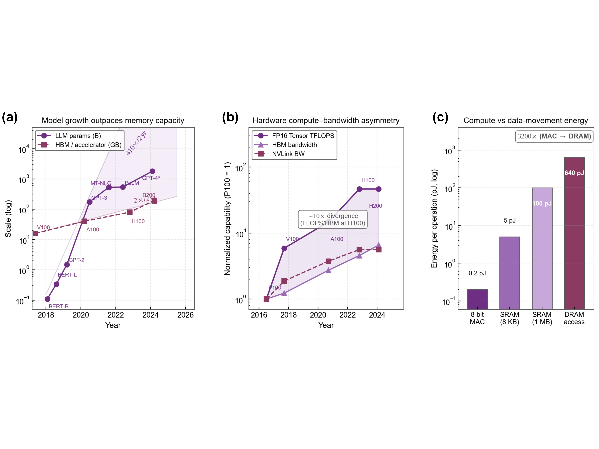
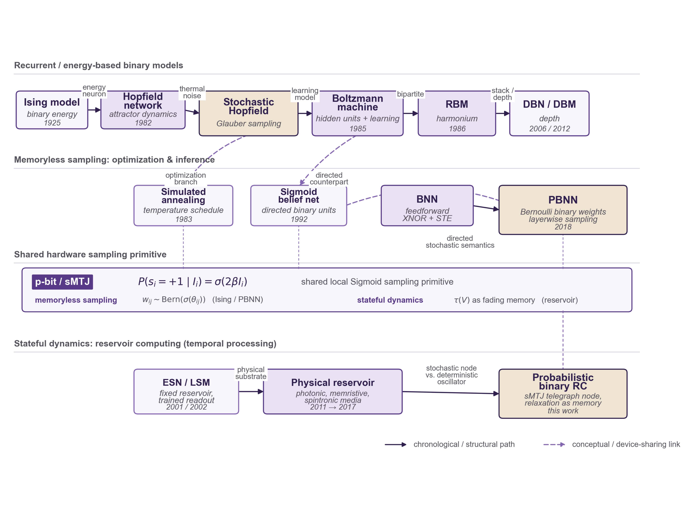
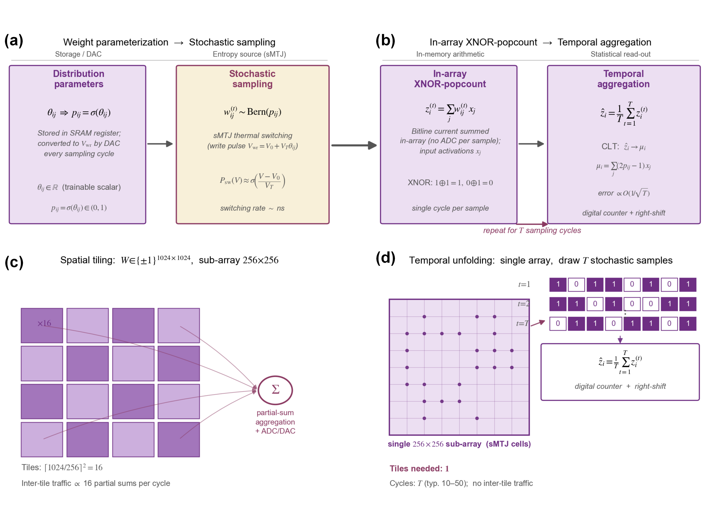

# 第一章 绪论

## 1.1 研究背景：从数值计算范式到概率计算范式

### 1.1.1 数值计算范式的规模危机

过去十余年，深度神经网络在视觉、语音与语言等任务上确立了主导范式，但其可持续发展正遭遇一类不同于传统算力不足的结构性困境。Gholami等人对二十年硬件与模型规模的系统统计表明[^gholami]，服务器级硬件的峰值浮点算力以每两年约3.0倍增长，DRAM带宽仅为1.6倍每两年、互连带宽更低至1.4倍每两年；与此同时，大型Transformer模型的参数量在两年内扩大约410倍，远超单卡片上存储2倍每两年的演进速度。结果是，限制系统性能的已非计算单元本身，而是其与存储之间的数据通路；计算单元大多数时间处于等待数据而非有效运算的状态。

**图1.1** AI规模演进与冯诺依曼架构的能耗结构。模型参数规模、计算吞吐与存储/互连带宽的增长速率逐步分离，数据访问能耗相对算术运算能耗的差距共同揭示了数值计算范式下存储墙的系统级约束。

将上述失衡折算到单次运算的能量预算上，问题更为尖锐。Horowitz在ISSCC 2014给出的45 nm工艺能耗数据[^horowitz]经Sze等人[^sze2020]整理为后续广泛引用的基准：8位整数加法约0.03 pJ、8位整数乘法约0.2 pJ、32位SRAM(8 KB) 读取约5 pJ、32位DRAM读取约640 pJ。图1.1(c) 据此绘制，可见一次DRAM访问所耗能量可支撑同一工艺下数千次MAC运算。该数据揭示的是数据搬移比算术运算昂贵约三个数量级这一定量事实，亦即存储墙成为系统级根因的直接依据；上述统计还显示，训练大型语言模型时数据搬移消耗的能量已超过乘加运算本身。

困境的深层根源在于，现代神经网络以显式高精度数值计算为基本语义：每一个权重以16至32位浮点数表达，每一次前向传播都需把这些数值从存储搬至计算单元、完成确定性乘加、再写回。数值精度的每一位在硬件层面都对应物理资源 (存储元胞数、乘法器位宽、总线位宽)，也对应数据搬移的每一位能量。当模型规模增长至万亿参数时，这一语义所要求的物理资源规模便成为系统的基础限制。

### 1.1.2 概率计算：以统计代替精度的另一条路径

前节描绘的规模危机，根源在于数字范式对高精度数值表示与高带宽确定性搬移的依赖。然而高精度并非计算的内在前提，而更像是该范式的一项历史选择，一个有力的旁证正是智能本身。生物大脑以约20 W的功率完成感知、决策与学习，其物质基础却远谈不上精确：突触权重在分子尺度持续涨落，神经元发放近似随机点过程，离子通道的开闭充满热噪声。智能在如此不可靠的元件之上稳健涌现，印证了一个早被论证的论断：可靠的计算不必以可靠的元件为前提，器件误差也不必视为意外，反而可作为计算过程的内在组成[^vonneumann1956]。与此呼应，许多与智能密切相关的任务在数学上本就是概率性的：组合优化是在解空间中采样以逼近最优，贝叶斯推断是对后验分布求期望，生成式建模是从分布中抽样。对这类任务，用确定性算术先逼近一个概率量、再耗费电路代价抑制器件噪声，并非唯一选择；让硬件直接产生受控的随机性、再以统计平均还原结果，反而与计算对象的概率本性更为契合。

这一视角的深层之处，在于把可靠性理解为系统层面的统计属性，而非单元层面的物理属性。数字范式以使每个元件都近乎完美来换取系统可靠，为此须以电压裕度、纠错与刷新等手段持续对抗热力学涨落；大脑与von Neumann的冗余多路复用方案则相反，以大量不完美元件的统计聚合得到可靠输出。两条路线都能导向可靠计算，差别只在于把涨落当作须压制的误差，还是可调用的资源。对目标本身即为统计量、又能容忍近似的智能类负载，后一条路线尤为自然，这也是本文把器件热涨落由噪声重新定位为熵源的立足点。

循此思路，硬件不再承担精确数值，转而承担统计量：运算结果由大量低精度随机事件的统计平均给出，而非由一次高精度确定性运算给出。该思想在早期的随机计算[^alaghi]、退火机与玻尔兹曼机中均可见雏形，近年在概率计算 (probabilistic computing) 的旗号下得以统一，其核心基本单元为概率比特 (probabilistic bit, p-bit)[^chowdhury_full_stack]。

p-bit是一个状态空间为$\{+1,\,-1\}$、但取值由输入偏置$I$连续调节的受控伯努利随机变量：

$$
P(s = +1 \mid I, T) \;=\; \sigma\!\left(\frac{I}{T}\right) \;=\; \frac{1}{1+\exp(-I/T)},
$$

其中$T$是控制涨落强度的等效温度。该单元的状态以受控概率在$\pm 1$间随机波动；其在$I\to+\infty$与$I\to-\infty$的极限下分别退化为常规数字逻辑的高低电平，因而天然兼容经典二值信号链路。与真随机数发生器 (TRNG) 相比，p-bit并非只产生固定50%概率的随机序列，而是提供了由输入连续调制概率的能力，这是其作为可控随机源区别于TRNG的关键属性。与量子比特相比，p-bit基于经典物理的热涨落，室温可用、无退相干问题，易于与现有CMOS工艺集成[^camsari_pbit]。

概率计算的意义可从两个层次理解。在语义上，它把数值精度从空间维度 (比特位宽) 转移到时间维度 (采样次数)：一个$B$比特精度的结果不再需要$B$位宽的数据通路，只需对单比特随机变量进行$T\sim 2^B$次独立采样并取平均，由大数定律统计量以$O(1/\sqrt T)$速率逼近真值。在物理上，这一语义对硬件的需求从高精度乘法器加高带宽访存，转为可调概率的二值单元加计数器；后者对器件本征物理属性 (如热涨落) 直接可用，而前者须借电路精细设计去抑制物理属性 (噪声、偏差)。原本视作缺陷的器件噪声由此被纳入计算的基本资源。

在该范式下，前节所述的能耗结构发生质变：因权重仅以单比特出现，存储密度提升；因乘加退化为异或与计数，数据通路位宽骤减；因随机源来自器件本身，专用熵源电路的面积与功耗被消除。三项变化同时发生的根源在于概率取代精度这一计算范式的改变，而非某一具体电路优化的累积。本文的研究即处于该范式之内。

还需指出，在这条以统计代替精度的路径内，器件随机性可被使用的方式有两种，二者都以随机二值事件的统计平均替代高精度运算，区别在于是否保留器件的时域状态。其一为无记忆采样：相邻取样彼此独立，统计平均估计一个静态量，精度由采样次数$T$而非比特位宽决定，组合优化的伊辛机 (估计平衡态局域场) 与前馈推断的概率二值神经网络 (估计权重期望) 均属此类。其二为有状态动力学：器件磁化在步间保持相关，弛豫过程本身充当记忆，节点读出仍由对随机二值态的窗口平均给出，因而同属统计代替精度，只是时域相关被额外用作计算资源，这正是储备池计算 (reservoir computing) 之所依。以概率二值器件作为动力学节点构成的储备池，本文称为概率二值储备池计算 (probabilistic binary reservoir computing)。两种方式共享同一类sMTJ概率二值单元与同一条由随机事件到统计读出的主干，本文据此沿两条路径展开：1.1.3至1.1.6节梳理无记忆采样下的伊辛与PBNN脉络，1.3.3节转入有状态动力学下的概率二值储备池计算。

### 1.1.3 伊辛模型：概率二值计算的统一数学框架

概率二值计算的理论根基是统计物理中的伊辛模型。该模型由Lenz提出、Ising完善用于解释铁磁相变，在现代语境下已成为一大类计算问题的通用表述框架。其基本单元为二值自旋$s_i\in\{+1,\,-1\}$，系统总能量由哈密顿量

$$
H(\{s_i\}) \;=\; -\tfrac{1}{2}\sum_{i,j} J_{ij}\,s_i s_j \;-\; \sum_i h_i\,s_i
$$

描述，其中$J_{ij}$为自旋间的耦合权重、$h_i$为单个自旋所受外场偏置。在温度$T$下系统处于给定构型的概率严格服从玻尔兹曼分布

$$
P(\{s_i\}) \;=\; \frac{1}{Z}\exp\!\left(-\frac{H(\{s_i\})}{k_\mathrm{B} T}\right),
$$

即能量越低的构型出现概率越高；高温下涨落占主导、系统探索构型空间以避免陷入局部极小，低温下能量主导、系统收敛至基态。从高温至低温的降温过程正是模拟退火算法的物理本源。

该模型成为概率二值计算的统一框架，源于其数学结构、硬件对接与应用覆盖三方面的会聚。计算通用性方面，几乎所有NP-hard组合优化问题 (Max-Cut、TSP、SAT、整数分解等) 都可多项式时间映射为伊辛哈密顿量的最小化问题[^lucas_ising]，而玻尔兹曼机、贝叶斯网络、受限玻尔兹曼机等概率机器学习模型在结构上本就是伊辛模型的特例或变形。Gibbs采样格式则与p-bit的更新规律精确等价：固定其余自旋$\{s_j\}_{j\neq i}$，自旋$s_i$所受局域场为$I_i = \sum_j J_{ij} s_j + h_i$，由玻尔兹曼分布可直接推得

$$
P(s_i = +1 \mid \{s_{j\neq i}\}) \;=\; \sigma\!\left(\frac{2 I_i}{k_\mathrm{B} T}\right),
$$

其形式与p-bit的受控伯努利分布完全一致；一个p-bit在硬件上完成的恰是伊辛模型中单个自旋的条件采样，p-bit阵列的并行演化即Gibbs采样的原生硬件化。应用覆盖上，伊辛模型同时容纳组合优化 (以哈密顿量最小化为目标) 与机器学习 (以玻尔兹曼分布建模数据分布)，因而概率二值硬件可在同一物理架构下承担这两类传统上分离的任务，无需在电路结构上作本质区分。

至此可建立从上至下的对应链：概率二值计算范式对应伊辛模型作为数学框架，伊辛模型对应p-bit作为最小功能单元，p-bit对应具体物理载体 (CMOS、sMTJ、RRAM等)。这一四层结构既解释了为何概率二值计算天然服务于NP-hard优化与概率推断，也框定了其硬件设计的目标函数。下一节先沿这条主线追溯第二、第三层 (伊辛与p-bit) 的概念脉络如何从1980年代的Hopfield网络与玻尔兹曼机一脉相承地发展而来，再回到具体物理载体的实现路径。

### 1.1.4 从伊辛模型到PBNN：二值随机模型的演化脉络

伊辛模型作为信息处理装置的范式始于Hopfield 1982年提出的递归神经网络[^hopfield1982]。Hopfield网络由$N$个二值神经元$s_i\in\{-1,\,+1\}$与对称权重矩阵$J_{ij} = J_{ji}$、$J_{ii} = 0$构成，能量函数与伊辛模型完全一致

$$
E(\mathbf{s}) \;=\; -\tfrac{1}{2}\sum_{i\neq j} J_{ij}\, s_i s_j \;-\; \sum_i \theta_i\, s_i,
$$

但更新规则为确定性符号函数

$$
s_i \;\leftarrow\; \mathrm{sgn}\!\left(\sum_j J_{ij}\, s_j - \theta_i\right).
$$

异步执行该更新可证明能量单调下降，系统终将收敛至能量函数的某个局部极小，对应一个吸引子状态。该性质使Hopfield网络可作为内容寻址联想存储器，亦可通过将组合优化问题的目标函数嵌入耦合矩阵$J_{ij}$来求解，典型实例为Hopfield与Tank在旅行商问题上的工作[^hopfield_tank]。Hopfield网络与前节所述伊辛机在数学结构上同构，差异仅在于前者使用确定性贪心更新、后者使用随机更新。

Hopfield范式存在两点关键缺陷：确定性符号更新易于陷入次优局部极小、无法跨越能量势垒；网络仅产生确定的吸引子，不构成对配置空间的概率分布，故无统计意义上的采样能力，亦无法直接处理含潜在变量的概率推断问题。将确定性符号函数替换为基于Glauber动力学的随机更新

$$
P(s_i = +1 \mid \mathbf{s}_{\setminus i}) \;=\; \sigma\!\left(2\beta\sum_j J_{ij}\, s_j - 2\beta\,\theta_i\right),
$$

即得随机Hopfield网络。该网络在异步遍历更新下满足细致平衡，平稳分布恰为同一能量函数下的玻尔兹曼分布。该替换在优化层面允许由$\beta$控制的热噪声跨越势垒，配合$\beta$的逐步增大即模拟退火[^kirkpatrick]，可显著缓解局部极小问题；在概率层面则把网络从确定性吸引子系统转变为采样器，其状态分布对应一个良定义的概率模型。该随机更新规则与p-bit在受控热涨落下的Sigmoid型条件概率在数学形式上完全一致，故p-bit是随机Hopfield神经元的物理实现，而非仅是伊辛机求解器的功能模块。

玻尔兹曼机由Ackley、Hinton与Sejnowski于1985年提出[^ackley]，在随机Hopfield网络的基础上引入两项扩展。其一是将神经元划分为可见单元与隐含单元，前者对应可观测变量，后者作为潜在变量以捕获可见层之间的高阶统计依赖；其二是把网络视为可学习的概率模型，权重通过最大化可见层数据的对数似然进行训练，由此导出含数据相关项与模型相关项之差的Hebbian形式梯度。这两项扩展将Hopfield范式从用预先编码的权重求解给定问题，转化为用未知权重从数据中学习概率分布，构成从联想记忆与优化器到生成式概率模型的根本转变。

玻尔兹曼机的早期实用化受限于训练所需MCMC采样的高计算代价。Smolensky于1986年在和谐理论 (harmony theory) 中提出harmonium模型[^smolensky]，将玻尔兹曼机的拓扑限制为可见层$\mathbf{v}$与隐含层$\mathbf{h}$之间的二分图，禁止层内连接，能量函数为

$$
E(\mathbf{v}, \mathbf{h}) \;=\; -\,\mathbf{v}^{\top} W \mathbf{h} \,-\, \mathbf{a}^{\top}\mathbf{v} \,-\, \mathbf{b}^{\top}\mathbf{h}.
$$

该结构即后来的受限玻尔兹曼机 (RBM)。二分约束使得给定一层时另一层的条件分布完全因子化，

$$
P(h_j = 1 \mid \mathbf{v}) \;=\; \sigma\!\left(\sum_i W_{ij}\, v_i + b_j\right),\qquad
P(v_i = 1 \mid \mathbf{h}) \;=\; \sigma\!\left(\sum_j W_{ij}\, h_j + a_i\right),
$$

层内并行Gibbs采样由此成为可能，结合Hinton提出的对比散度算法[^hinton_cd]，使RBM训练在通用处理器上变得可行。其后Hinton、Osindero与Teh通过逐层堆叠RBM并以贪心方式预训练，构建了深度信念网络 (deep belief network, DBN)[^hinton_dbn]，将能量基模型推向深度学习的早期复兴；Salakhutdinov与Hinton进一步发展了允许多层潜变量联合训练的深度玻尔兹曼机[^salakhutdinov_dbm]。在并行的有向图模型路径上，Neal于1992年提出的sigmoid信念网络[^neal_sbn]同样以二值随机神经元为基本单元，但以有向无环图替代无向图，其条件分布同为Sigmoid型，更新调度由随机异步遍历改为按拓扑顺序的祖先采样。

现代前馈路线在另一侧推进。二值神经网络把连续权重与激活压缩为$\pm1$，以XNOR-popcount替代乘加，并借直通估计器保持深层前馈网络的可训练性；Shayer等人[^shayer]与Peters等人[^peters]进一步将确定二值权重推广为由潜参数控制的伯努利变量，训练时利用概率统计量近似完成前向与梯度估计，由此形成概率二值神经网络 (probabilistic binary neural network, PBNN)。因此，PBNN并非DBN或DBM的直接后继，而位于两条路线的汇合处：其按层有序的随机二值单元与sigmoid信念网络共享有向条件采样语义，其前馈训练、位运算与反向传播机制则承接现代BNN；当这一抽样机制落到硬件层时，又可由p-bit或sMTJ提供原生的Sigmoid伯努利采样。

将$\{0,\,1\}$编码与$\{-1,\,+1\}$编码通过线性变换$s = 2v - 1$互译后，RBM能量函数与伊辛/Hopfield能量函数仅在常数项与偏置重定标处有差异，本质上属于同一类对象。由此可勾勒出一条清晰的演化路径：伊辛模型给出对称二值耦合系统的能量描述与平衡态统计；Hopfield网络以确定性动力学将该能量描述用于计算，建立"能量极小即为答案"的范式；引入热噪声使其转化为对玻尔兹曼分布的采样器，并在优化侧导出模拟退火；玻尔兹曼机引入隐含单元与最大似然学习，使该范式从优化器扩展为可学习的生成模型；RBM、DBN与DBM通过拓扑约束和深层堆叠推动无向能量模型继续发展；sigmoid信念网络则在有向图方向保留了Sigmoid条件采样；现代BNN与PBNN进一步把二值随机单元嵌入按层前馈、可反向传播的深度网络。各分支的差异在于网络拓扑、更新调度与学习目标，而它们在局部二值采样层面共享Sigmoid型条件概率。需要说明，上述脉络以能量函数与平衡态采样为共同基础；1.1.2节所引出的概率二值储备池计算并不通过能量极小化求解，而是利用器件的非平衡时域动力学，因而是一条与之并行、而非由其衍生的分支，其研究现状与空白见1.2.5节，研究动机与本文定位见1.3.3节。

**图1.2** 二值随机模型的发展脉络与概率二值器件的两类用法。最上层为伊辛模型、Hopfield网络、玻尔兹曼机与RBM/DBN/DBM构成的无向能量模型主线；第二层为无记忆采样下的优化与前馈推断分支，含模拟退火、sigmoid信念网络与现代前馈BNN，并将PBNN表示为有向随机二值采样语义与前馈二值训练路线的汇合；中间一层以p-bit/sMTJ标出二者共享的局部Sigmoid采样，并显式区分其两类用法，即向上的无记忆伯努利采样，服务伊辛与PBNN，以及向下的有状态时域动力学；最下层即后者对应的储备池计算脉络，从回声状态网络与液态状态机经物理储备池到本文的概率二值储备池计算。储备池计算以非平衡时域动力学为基础，是一条与上方能量模型谱系并无衍生关系、仅在同一器件处交汇的并行范式；PBNN与概率二值储备池计算分处采样两侧并共享同一sMTJ。

### 1.1.5 p-bit的物理实现路径与其代价

如何在硬件上实现具备$\sigma(I/T)$特性的p-bit，是整条技术栈中决定实际能效的核心环节。主流路径分为纯CMOS与新兴非易失器件两大类，其权衡并不相同。

纯CMOS路径下又分数字与模拟两条。数字CMOS p-bit以熵源 (LFSR或环形振荡器TRNG)、Sigmoid查找表与比较器构成三级流水线：取$N$位均匀随机数$r$与查找表输出的阈值$\sigma(I)\cdot 2^N$比较，输出$+1$的概率严格等于$\sigma(I)$。该方案设计门槛低、工艺兼容性好、概率精度可控，是目前唯一在量产芯片中落地的选择，代价在于每bit需一整条数字流水线，面积与功耗较大；整个系统中熵源电路常占加速器10%以上的面积功耗预算[^zink]。模拟CMOS p-bit则利用亚阈区MOSFET的指数特性与交叉耦合反相器的热噪声放大，单级电路即可产生受控Sigmoid分布的随机输出[^pbit_analog]，能效比数字方案高1至2个数量级，但对工艺偏差与温度强相关，需额外校准。

新兴非易失器件路线中，基于磁隧道结 (MTJ) 的随机磁隧道结 (stochastic MTJ, sMTJ) 是迄今研究最充分、产业化进度最快的方案。其核心思想是把常规MRAM用的高势垒 ($\Delta = E_\mathrm{b}/k_\mathrm{B}T > 40\sim 60$)MTJ替换为低势垒MTJ($\Delta\sim 1\text{–}10$)，使自由层的两个磁化稳态间势垒高度与室温热噪声能量$k_\mathrm{B}T$可比，室温下磁矩即在P/AP之间连续随机翻转、电阻同步跳变；翻转概率则通过自旋转移矩 (STT) 或自旋轨道矩 (SOT) 电流注入所施加的等效力矩进行调节，$P_\mathrm{sw}(V)$对写入电压天然呈Sigmoid形状。该方案的吸引力在于多个维度的同时占优：单元尺寸可缩至20 nm以下，远小于数字CMOS p-bit；翻转功耗在fJ/次量级，比CMOS方案低约3个数量级；天然非易失，静态功耗接近零；亚纳秒至纳秒量级的翻转速率使其吞吐率不再受CMOS时钟限制。后续小节将结合实验结果说明其Sigmoid采样依据。

基于其他材料的方案亦在探索之中。RRAM/忆阻器利用阻变材料的随机电报噪声产生随机性，结构最简且天然存算一体，但器件一致性仍弱于sMTJ；相变存储器 (PCRAM) 利用相变材料晶态/非晶态的概率性转换，功耗与翻转延迟均不占优。综合而言，sMTJ在能效、集成度、工艺成熟度三个维度同时领先，是本文所采用的物理载体。

### 1.1.6 p-bit阵列的系统组织：两类基础架构

单个p-bit不具备计算能力，需经阵列互联方能承担具体任务。围绕前节建立的伊辛框架，主流架构分为两类，分别对应伊辛模型的两种使用方式。

概率自旋逻辑 (probabilistic spin logic, PSL) 由p-bit的提出者Datta团队主导：每个p-bit对应一个自旋，p-bit间的互联电路实现耦合矩阵$J_{ij}$，外部偏置电路提供外场$h_i$，全阵列同步更新并通过逐步降低等效温度$T$使系统自发向基态收敛。权重$J_{ij}$的物理载体决定了架构的能效上限：数字方案用SRAM存权、数字MAC算局域场，精度高但回到冯诺依曼结构；模拟存算一体方案用RRAM/sMTJ交叉阵列直接在阵列内原位完成$\sum_j J_{ij} s_j$，彻底消除权重搬移。小规模sMTJ原理验证与面向稀疏伊辛问题的FPGA实现分别展示了该路线在器件级和系统级的可行性。

概率二值神经网络是伊辛框架向前馈神经网络的延展。其核心区别在于更新顺序：PSL是全阵列同步演化至热平衡的无向网络，PBNN则是严格按层顺序执行的有向网络，每一层的p-bit在前一层输出固定的条件下按$\sigma(\cdot)$抽样，层间形成前馈流水线。这一结构差异使PBNN能够直接嫁接现代深度学习的训练框架 (反向传播、STE、批归一化)，而不必依赖玻尔兹曼机典型的对比散度训练。Singh等人[^singh2023]在IEDM 2023首次给出了基于sMTJ的前馈概率神经网络硬件演示，把sMTJ与FPGA结合实现了按层有序更新，标志着p-bit从以优化为主的PSL向以学习为主的PBNN扩展；后续SOT-MRAM存算阵列工作则进一步表明该思路可向前馈推理硬件延展。

PSL与PBNN并非两条分离的路线：两者共享同一套物理单元 (p-bit、权重阵列、偏置电路)，差异主要在控制时序与反向传播方法。这种共享性意味着一个概率二值计算架构在恰当的外围调度下可同时承担组合优化与神经推断两类任务，正是概率二值硬件作为通用异构加速核心的定位基础。在这两类基于瞬时采样的架构之外，同一概率二值器件还可作为储备池的动力学节点承担时序处理，即1.1.2节所引出的概率二值储备池计算；它与PSL、PBNN共享器件却利用其不同侧面，将在1.3.3节展开。

## 1.2 概率二值计算的器件-算法协同机制

前述伊辛优化、PBNN推断与概率二值储备池计算三类任务，本质上是同一条以统计代替精度路径的不同实现：器件输出受控的随机二值事件，再由统计读出 (对样本求平均) 恢复所需的计算量，从而免去高精度算术。这一由随机事件到统计读出的协同主干为三者共享，差别只落在一条轴上，即器件被无记忆地使用 (相邻事件独立，对应伊辛与PBNN) 还是有状态地使用 (事件时域相关、磁化弛豫充当记忆，对应储备池)。本节沿此轴展开器件-算法协同：先以PBNN为主线给出无记忆模式的完整对应 (1.2.1至1.2.3节)，因其最充分地串起单元级采样与阵列级求和；再给出有状态模式下储备池的器件-算法对应 (1.2.4节)；两种模式由同一sMTJ物理 (Sigmoid翻转概率及其时域翻转速率) 支撑，差异在于如何读出与是否保留状态，而非是否依赖统计；在此基础上，1.2.5节沿这两种利用方式分别梳理研究现状与尚未闭合的空白。

### 1.2.1 无记忆采样：PBNN的前向数学与CLT桥梁

沿用前述PBNN定义，其前向过程可由分布参数化、预激活的高斯化与反向传播三段构成。每个权重不再作为一个确定标量，而是由潜参数$\theta_{ij}\in\mathbb{R}$通过Sigmoid函数映射为取$+1$的概率

$$
p_{ij} \;=\; \sigma(\theta_{ij}) \;=\; \frac{1}{1+e^{-\theta_{ij}}}, \qquad
w_{ij}\sim\mathrm{Bern}(p_{ij}),\;\; w_{ij}\in\{-1,\,+1\}.
$$

这是前节p-bit定义在权重维度上的直接应用，每个权重对应一个以$\theta_{ij}$为偏置的p-bit。

给定输入$\{x_j\}_{j=1}^N$，第$i$个神经元的预激活

$$
z_i \;=\; \sum_{j=1}^N w_{ij}\, x_j
$$

是$N$个独立有界随机变量之和。由Lyapunov中心极限定理，当$N$充分大时其分布收敛至高斯：

$$
z_i \;\sim\; \mathcal{N}(\mu_i,\,\sigma_i^2),\qquad
\mu_i = \sum_j (2 p_{ij} - 1)\, x_j,\qquad
\sigma_i^2 = \sum_j 4\, p_{ij}(1 - p_{ij})\, x_j^2.
$$

二值激活的输出概率随即由标准正态累积分布函数给出$P(\mathrm{sign}(z_i) = +1) = \Phi(\mu_i/\sigma_i)$。该闭式表达允许训练时梯度经$\mu_i,\,\sigma_i$回传至$\theta_{ij}$，绕过对$2^N$个权重组合的显式枚举；推理时则可选择显式抽取二值样本以同时获得集成式预测与不确定性估计。

反向传播方面，对二值化算子$\mathrm{sign}(\cdot)$的梯度采用Bengio等人[^ste]提出的直通估计器 (STE) 在单位区间内以线性近似直通传递；对概率采样本身，前述CLT高斯近似已可微，梯度$\partial\mu_i/\partial\theta_{ij}$与$\partial\sigma_i^2/\partial\theta_{ij}$可直接计算。该框架在数学上等价于一类变分推断，梯度估计方差受CLT自然压缩，训练稳定性显著优于逐样本反向的REINFORCE类估计器。

该框架对硬件提出两项具体需求：前向过程需要$w_{ij}^{(t)}\sim\mathrm{Bern}(p_{ij})$的单比特伪/真随机源以及标准的XNOR-popcount乘加；预激活的高斯统计是大量独立伯努利项之和的自然结果，因而并不需要高精度数值累加器。该自由度直接决定了PBNN在物理实现上的可塑性：只要器件本征能产生受控伯努利样本，CLT高斯化就由阵列级电流求和免费获得。

### 1.2.2 器件物理：Sigmoid翻转概率与时域翻转速率

前节已指出sMTJ的翻转概率对写入电压呈Sigmoid形状。此处给出其物理起源，并展示它如何与PBNN的算法流程精确对齐。

低势垒MTJ在热激活翻转机制下，单次电压脉冲的翻转概率由Arrhenius型律给出[^mdpi2025]

$$
P_\mathrm{sw}(V,\,t_\mathrm{p}) \;=\; 1 - \exp\!\left[-\frac{t_\mathrm{p}}{\tau_0}\exp\!\left(-\frac{E_\mathrm{b}}{k_\mathrm{B}T}\!\left(1 - \frac{V}{V_\mathrm{c}}\right)\right)\right],
$$

其中$E_\mathrm{b}$为磁各向异性势垒、$V_\mathrm{c}$为临界电压、$\tau_0$为attempt time、$t_\mathrm{p}$为脉冲宽度。当$t_\mathrm{p}$与$\Delta = E_\mathrm{b}/k_\mathrm{B}T$处于合适区间时，$P_\mathrm{sw}(V)$在过渡区间高度近似一个中心为$V_0$、斜率由$k_\mathrm{B}T/V_\mathrm{c}$决定的Sigmoid曲线。Safranski等人[^safranski]与Daniel等人[^daniel]均直接测得该Sigmoid形状并以$P_\mathrm{sw}(V) = \sigma((V - V_0)/V_T)$进行了拟合；前馈sMTJ-p-bit实验与VCMA-MTJ实验也给出了连续可调的概率台阶。

该Sigmoid来自Arrhenius律本身，而非器件外围电路的后处理近似。Arrhenius指数在过渡区的Taylor展开即还原为logistic函数，其中温度参数$T$在物理上即室温$k_\mathrm{B}T$，在算法上即前文伊辛模型的等效温度。更进一步，Arrhenius律还有第三个投影：把脉冲内的累积翻转概率换成自由演化下的瞬时翻转速率，即得超顺磁磁矩的随机电报动力学，其两态间的特征停留时间 (相关时间) $\tau$由势垒与偏置共同决定，并随偏置连续可调。这一时域侧面是有状态模式的物理基础。因此本节建立的器件接口虽以PBNN采样为例，其底层Arrhenius物理为三类任务所共享：Sigmoid翻转概率支撑无记忆采样，时域翻转速率与相关时间$\tau$支撑有状态动力学。

在PBNN上下文中，只需令外围DAC将潜参数$\theta_{ij}$映射至写入电压$V_\mathrm{wr} = V_0 + V_T \theta_{ij}$并施加到对应sMTJ，该单元在一次写入后的磁化状态即为从$\mathrm{Bern}(\sigma(\theta_{ij}))$中抽取的一个原生样本，无需CMOS TRNG、无需查找表、无需比较器。在阵列维度，同一行的$N$个sMTJ并行抽样，以输入$x_j$驱动行线后位线电流即等于$\sum_j w_{ij}^{(t)} x_j$，这是一次XNOR-popcount，也是前节所述CLT对预激活的一次采样$z_i^{(t)}$。重复$T$次独立写入与位线累加，外围数字计数器即对样本取经验平均

$$
\hat\mu_i \;=\; \frac{1}{T}\sum_{t=1}^T z_i^{(t)} \;\xrightarrow[T\to\infty]{}\; \mu_i,
$$

其均方误差以$O(1/T)$衰减。至此，PBNN前向所需的两个核心元素，即权重的伯努利-Sigmoid采样与预激活的高斯统计，分别由单元级物理与阵列级电流求和承担，无需任何外围高精度数值运算。

将sMTJ与PBNN的对应关系整理如下。

**表1.1** PBNN算法需求与sMTJ器件物理属性的对应关系。

| PBNN算法需求 | sMTJ物理属性 | 物理律 |
| :--- | :--- | :--- |
| 单比特权重存储$w_{ij}\in\{\pm 1\}$ | MTJ的P/AP两阻态，TMR>100% | 隧穿磁阻效应[^ikeda] |
| 二值乘加$\sum_j w_{ij} x_j$ | 位线电流求和，XNOR-popcount | 欧姆定律加基尔霍夫定律 |
| 伯努利采样$w_{ij}\sim\mathrm{Bern}(\sigma(\theta_{ij}))$ | $P_\mathrm{sw}(V)\approx\sigma((V-V_0)/V_T)$ | Arrhenius热激活律 |
| 高吞吐时域采样 | 亚纳秒至纳秒级切换 | STT/SOT/VCMA动力学[^honjo] |

四处对应都来自器件基本物理，而非特定电路优化，构成了本文选择MRAM作为概率二值计算载体的核心依据，也是后续各章设计决策的物理基础。

### 1.2.3 $\theta_{ij}$的硬件栖居：参数、样本与作用

PBNN不存储确定性权重而存储分布参数$\theta_{ij}$，这一陈述在硬件上需进一步澄清。直觉式理解容易误认为要在阵列中用多比特单元保存连续的$\theta_{ij}$，但这会抹掉MRAM作为单比特器件的全部优势，与前节所述的Sigmoid直接对齐相矛盾。本文采用的解读完全不同。

$\theta_{ij}$以两种形态分别栖居于片上两个子系统。在外围数字域，每个$\theta_{ij}$作为可训练的浮点标量保存在靠近阵列的SRAM寄存器或片上缓存中；训练阶段，反向传播的梯度更新的正是这些数字寄存器，推理阶段，控制器在每个采样周期读取该寄存器、经DAC转换为模拟写入电压$V_\mathrm{wr}^{(ij)}$。这一侧与常规数字-模拟接口并无不同，存储规模等于阵列规模，而不是阵列规模乘以精度位数。在存算阵列的MTJ本体侧，任一瞬时的MTJ仅持有1比特 (当前磁化状态)，但该比特作为参数载体的信息量并不在其当前值，而在给定相同$V_\mathrm{wr}$下其翻转概率，即统计意义上的分布参数。

换言之，$\theta_{ij}$并非存放在MTJ内部，而是通过每次写入电压的调制作用于MTJ；MTJ所存的，是该分布的一次实例化样本。这一解读直接对应统计学中参数 (parameter) 与样本 (sample) 的区分：PBNN的权重张量是参数张量而非样本张量；样本是其每一次前向采样的产物，在时域上每个采样周期不同。

该解读带来三项工程含义。阵列的存储密度按1比特/权重计算，与常规MRAM相当，不存在分布存储导致的额外面积开销。DAC精度只需能分辨$\sigma(\theta_{ij})$过渡区间的斜率，典型4–6位即可满足；DAC按行复用，不增加单元面积。阵列单元本身的器件变异 (切换电压分布、TMR分布、势垒高度) 直接决定实际$p_{ij}$相对目标值的偏差，与传统CIM量化误差的视角截然不同：误差不来自位宽不够，而来自物理概率相对理想Sigmoid的偏移。这正是后续章节进行仿真建模时所要刻画的核心非理想效应。

### 1.2.4 有状态动力学：储备池计算的器件-算法对应

把同一sMTJ不再每步重置、而任其自由演化，器件便从无记忆采样源变为有状态的随机电报节点；前述统计代替精度原则依然适用，只是读出对象与时间结构都发生变化。节点的模拟激活由一个读出窗口内对$\pm 1$态的平均给出 (集合维度上由多器件并行、时间维度上由窗口内多次采样)，精度同样由样本数而非比特位宽决定。与无记忆模式的差别在于，器件磁化在窗口之间保持相关，弛豫时间$\tau$内的历史不被抹去，由此提供衰减记忆；储备池计算正利用这一点，以固定且不训练的随机节点群把输入历史映射到高维状态，仅训练线性读出。

由此可把储备池的算法需求与sMTJ物理逐项对应，与1.2.1节的无记忆映射形成对照：非线性来自翻转概率对偏置的$\tanh$型依赖；衰减记忆来自相关时间$\tau$，且$\tau$随偏置电压指数可调；高维投影来自器件群体及其参数离散 (例如势垒在器件间的分布)；统计读出则由窗口内的随机二值平均完成。其中最值得强调的是，最昂贵的递归运算在此被器件的物理弛豫所替代：无需显式存储并训练一个$N\times N$的递归权重矩阵，这是有状态模式相对数字回声状态网络的根本节省。本小节只交代器件-算法接口本身；该路径与其他物理储备池的比较及研究现状见1.2.5节，研究动机与本文定位见1.3.3节。

### 1.2.5 研究现状与尚未闭合的空白

1.2.1至1.2.4节区分了概率二值器件随机性的两种利用方式，即无记忆采样与有状态动力学；围绕两者的研究亦循此分野展开，各自相对成熟，却都尚未闭合。先看无记忆采样一侧：聚焦MRAM-PBNN这一子方向的文献可沿三条相对独立的线索分类。

第一条是确定性BNN的MRAM实现。Pham等人的STT-BNN[^sttbnn]以2T2J单元差分存储权重，源线电压一次完成整行XNOR-popcount，CIFAR-10/MNIST精度达80.01%/98.42%，能效311 TOPS/W；Fan与Angizi[^fan]较早在SOT-MRAM上实现双模式单元，同一阵列既作非易失存储又执行AND/OR/XNOR逻辑；Fujiwara与Kawahara的TGBNN[^tgbnn]将训练梯度三值化并直接利用MRAM的概率写入特性完成权重更新，在MNIST上首次把存储器件的随机性写入了训练循环。这一线索把阵列视作乘加引擎，概率信号由CMOS伪随机源外部提供，长处在阵列计算，但PBNN所需的随机性仍未原生化。

第二条是p-bit器件与PSL系统。Camsari等人的3T-1MTJ嵌入式p-bit奠定了概念基础；Borders等人八个单元构成的sMTJ-PSL完成了整数分解实验验证[^borders]；Aadit等人的稀疏伊辛机把问题图稀疏化后在FPGA上实现6个数量级的Gibbs采样加速[^aadit]；后续sMTJ与VCMA-MTJ器件研究又把随机电报噪声推进至纳秒、亚纳秒量级，并提供了可调概率台阶。这一线索主要服务于组合优化与玻尔兹曼采样，对前馈神经网络所需按层有序更新的适配尚在起步阶段；前馈sMTJ-p-bit演示是其中一个重要转折。

第三条是MRAM-PBNN的协同实现。Huang等人[^huang]与Gu等人[^gu2024]是相对系统的尝试，将SOT-MRAM阵列同时作为权重存储、XNOR-popcount引擎与伯努利采样源，在MNIST上验证了概率二值推断的精度竞争力。然而，在如何利用sMTJ的时域采样能力以避开大矩阵向多阵列的空间分块方面，现有工作仍采用传统的空间展开方案；概率二值计算把精度维度转移到时间维度这一本质优势，在映射层面尚未被充分使用。

综合三条线索，无记忆采样侧尚未闭合的关键空白在于：以sMTJ的本征Sigmoid采样为随机源、以其亚纳秒切换速率为时域展开的节拍，把阵列规模从权重矩阵规模中解耦，既不需要在单比特器件上叠加多单元表达高精度，也不需要在大矩阵上跨阵列分块。

转入有状态动力学一侧。储备池计算自回声状态网络[^esn_jaeger]与液态状态机[^rc_maass]提出以来，逐步发展出物理储备池这一分支，其核心观察是：任何具备足够丰富的固定非线性动力学与适当衰减记忆的物理系统，都可不经训练直接充当储备池，仅训练末端的线性读出。沿此思路，光子延迟系统以单个非线性节点配合延迟反馈构造大量虚拟节点，最早给出高性能物理储备池的实验范例[^rc_appeltant]；忆阻器与原子开关网络、软体与机械系统以及自旋电子学等多种介质随后相继被验证，相关进展已有系统综述[^rc_tanaka][^rc_nakajima]。在自旋电子学内部，主流路线以自旋力矩纳米振荡器为动力学节点，借其非线性振荡瞬态与时分复用的虚拟节点完成口语数字识别等任务[^rc_torrejon]，并进一步扩展到耦合振荡器与自旋波系统[^rc_grollier]；这一主线所利用的是确定性 (含少量热噪声) 的连续相位动力学，与超顺磁器件依靠热涨落的随机两态翻转在物理机制上并不相同。

相比之下，以超顺磁随机MTJ(即p-bit器件本身) 作为储备池节点的研究仍相当稀少：随机MTJ的文献主体集中于采样与优化 (PSL与玻尔兹曼机)，而自旋电子储备池的主体又建立在确定性振荡器之上，二者之间存在明显空白。更关键的是一个尚未澄清的疑问：器件随机性在采样任务中是被刻意利用的资源，在储备池中却未必有利，因为热涨落会削弱储备池所依赖的状态可重复性，随机翻转器件能否胜任储备池节点并不显然。

综观两侧，无记忆采样侧的空白在于映射方式，即尚未把精度维度从空间真正搬到时间；有状态动力学侧的空白在于器件适配性，即随机翻转器件能否充当储备池节点尚无定论。二者彼此独立，却共享同一个机会：已校准的sMTJ既可作瞬时随机源，又可作有状态的动力学节点。本文正从这一组缺口切入。

## 1.3 研究思路与本文组织

本节从创新点的角度组织全文思路，并在末节落实为具体工作与章节安排。本文的贡献围绕以统计代替精度这一主线，在范式、架构与任务三个层面递进展开。范式层面 (1.3.1节)，由空间展开转向时域展开，把概率精度从受物理约束的阵列规模解放到可累积的时间维度；架构层面 (1.3.2节)，给出存储、采样与乘加三位一体的全自旋实现，从物理上消除独立的CMOS熵源；任务层面 (1.3.3节)，把同一器件的时域相关性用作衰减记忆，开辟储备池计算这一第三类任务。前两者面向无记忆采样，着力于以更低的硬件代价换取所需精度；后者把可用资源从瞬时随机性延伸到时域动力学。三项贡献共享同一器件级Sigmoid接口与同一仿真后端，1.3.4节据此汇总各段工作并给出全文组织。

### 1.3.1 空间展开到时域展开的范式转换

传统CIM设计将权重矩阵$\mathbf{W}\in\{\pm 1\}^{M\times N}$完全展开于物理阵列之上，单次行激活即完成$N$个乘加运算，以阵列规模换取延迟。然而CIM阵列本身的规模受多重硬性物理约束：IR drop沿金属线累积[^memristor_router]，未选中单元漏电与sneak path随规模膨胀[^bhardwaj]，列级ADC成本随精度超线性增长且常占加速器约60%能耗与80%面积[^hcim]，工艺良率随单元数线性下降。这些因素共同把典型RRAM/MRAM-CIM子阵列压在$128\times 128$至$512\times 512$之间。当权重矩阵大于阵列时必须分块映射 (tiling)，各子块独立产生部分和 (partial sum)，再经多级ADC、缓存、互连、累加层级汇聚。DNN+NeuroSim的模拟显示，在ResNet-18量级网络上，这一层级间的部分和搬移所产生的能量已占总体的30%~50%[^neurosim_v15]。CIM由此在子阵列内部消除了存储墙，却在子阵列之间以部分和搬移的形式重建了存储墙；这是阵列规模上限与算法矩阵规模的不对称所必然造成的二级存储墙。

**图1.3** PBNN前向流水线及空间/时域展开对比。传统CIM以多子阵列空间分块承载大规模权重矩阵，PBNN则利用sMTJ的重复伯努利采样把概率精度转移到时间维度，从而降低跨阵列部分和聚合与数据搬移开销。

本文所采用的PBNN在前向过程中并不存储确定性权重，而是存储分布参数$\theta_{ij}$，其等效乘加由对伯努利采样序列$\{w_{ij}^{(t)}\}_{t=1}^{T}$在时间维度上的累积逼近：

$$
\hat z_i \;=\; \frac{1}{T}\sum_{t=1}^T\sum_{j=1}^N w_{ij}^{(t)}\, x_j
\;\xrightarrow[T\to\infty]{}\;
\mu_i \;=\; \sum_{j=1}^N (2 p_{ij} - 1)\, x_j.
$$

该表达式的硬件含义在于：每一个物理单元在每个采样周期仅需提供$\pm 1$的单比特信息，同一物理单元可在不同采样周期扮演不同随机实例的角色，从而把原本表达精度$B$所需的$O(2^B)$空间展开代价完全转移至时间维度。对$1024\times 1024$的权重矩阵在$256\times 256$子阵列上的映射：空间展开需16个分块与分块间部分和聚合，而时域展开可在单个物理阵列上经$T\approx 10\text{–}50$个采样周期完成，避开了跨阵列数据搬移及其ADC、缓存与片上网络开销。在sMTJ亚纳秒至纳秒级切换速率[^yang2024]支撑下，$T$次采样总延迟仍在几十纳秒量级，远小于多阵列部分和搬移的延迟。该范式对阵列规模的硬性上限提供了一条绕行路径，其本质是概率取代精度这一范式转换在架构维度的自然体现。

### 1.3.2 全自旋概率二值计算架构

时域展开的可行性，另一半取决于随机比特源的速度、能耗与工艺兼容性。本文所构建的架构将三项功能统一于同一MRAM工艺：稳定MTJ负责存储当前采样实例，sMTJ作为概率比特生成器，其翻转概率由字线电压与脉冲宽度通过调制自由层磁化动力学而受控，位线电流求和完成XNOR-popcount。所产生的随机比特流经行选择器进入存算子阵列，直接参与乘加。整个链路中存储、随机数生成与乘加三项功能均由自旋器件承担，CMOS仅负责DAC、计数器与控制时序，不再需要独立的CMOS TRNG/PRNG模块；前文所指CMOS熵源占加速器10%以上面积功耗预算的开销由此被物理上消除。

该设计的协同优势体现在三个层面。存储、采样、乘加三位一体消除了CMOS随机源与存算阵列之间的数据传输，每次采样所需的能量由随机位生成本身支配，而不由数据移动支配。sMTJ的亚纳秒翻转使采样吞吐率与子阵列读出节拍自然对齐，避免了p-bit速率与阵列节拍失配所引入的采样冗余。$\theta_{ij}$的更新与推理共用同一MRAM写入通路：训练阶段梯度直接作用于外围数字寄存器，推理阶段通过同一DAC-写入驱动链路把$\theta_{ij}$重新加载为$V_\mathrm{wr}$，训练与推理在同一物理结构上自然共存；推理阶段的即时采样集成同时提供了原生的不确定性量化能力，这是确定性数值网络难以低成本获取的。

### 1.3.3 概率二值储备池计算：时域动力学路径

如1.1.2节所引出的，概率二值器件的随机性存在两种互补的利用方式，本文的第三项贡献正落在第二种之上。1.3.1节的时域展开范式与1.3.2节的全自旋架构都把器件当作受控伯努利源：无论是PSL的同步退火、PBNN的按层前馈，还是把概率精度从空间维度搬到时间维度的展开，都依赖各次采样在统计上彼此独立，时间维度仅用于累积独立样本、平均掉涨落。本节转入第二种利用方式，即不抹平相关，而是利用器件随机翻转的时间相关性：已校准的sMTJ不再每步重置、任其自由演化，它便从无记忆采样源变为有状态的随机电报节点，从而开辟时序处理这一第三类任务。

这一复用之所以成立，在于储备池计算对动力学节点的两项要求恰好由超顺磁器件物理直接满足：翻转概率对偏置的$\tanh$型依赖提供非线性，磁矩在两态间的随机停留提供衰减记忆，且该停留时间随偏置电压指数可调。由此，储备池计算中代价最高的稠密递归，即数字回声状态网络需显式存储并训练的$N\times N$递归权重矩阵，被器件层的物理弛豫所替代，记忆时间则由偏置电压这一硬件量直接整定，无需额外的记忆单元或递归权重训练。把概率二值器件由瞬时随机源拓展为有状态的时域动力学节点，正是本节创新的核心。

沿此思路，本文第五章在第二章器件模型之上把sMTJ用作有状态的随机电报节点，系统检验其时序计算能力 (记忆容量、NARMA与Mackey-Glass混沌预测等基准)、面向储备池的器件优化区间，以及相对数字回声状态网络的硬件能效，从而把1.2.5节所指出的有状态动力学侧空白填补为可复现的定量结论。这一任务把可用的器件资源由前两项创新所依赖的瞬时随机性进一步延伸到时域动力学，与组合优化、机器学习推断共同构成同一硬件单元在不同调度下承担的三类任务。

### 1.3.4 本文工作与章节组织

围绕前述时域展开范式、全自旋三位一体架构与时域动力学路径，本文沿器件、伊辛求解、算法三层主线打通由同一硬件单元承担多类任务的评估链路，完成四段工作。其一，建立三端SOT-sMTJ的紧凑物理模型与开源仿真平台，把器件端口电学、磁化动力学与统计翻转行为接成同一可调用接口，并以300 mm SOT-MRAM工艺平台的实测数据完成标定，使后续两类任务在器件层共享同一可信的物理基础。其二，将sMTJ作为伊辛自旋的物理实现接入组合优化求解链路，把Max-Cut、旅行商问题与整数分解统一归约为$(J,h)$接口下的伊辛哈密顿量最小化，评估理想Gibbs动力学的求解能力、器件非理想性的灵敏度结构以及跨硬件平台的能耗与时间代价。其三，将同一硬件单元转作PBNN的伯努利权重单元，基于PyTorch搭建覆盖器件、阵列、网络、采样、PPA与实验六层的端到端仿真器，量化精度、鲁棒性与能耗在跨架构条件下的相对位置。其四，将同一器件用作概率二值储备池计算的随机动力学节点，利用其磁矩在两态间随机停留所形成的衰减记忆承担时序处理任务，给出面向储备池优化的器件参数指导与相对数字回声状态网络的硬件能效评估；这一任务把可用的器件资源由前三段所依赖的瞬时随机性进一步延伸到时域动力学。上述工作共享同一器件级Sigmoid接口$(u_\mathrm{th},\beta_s)$与同一仿真后端，由此把同一阵列在不同调度下承担组合优化、机器学习推断与时序处理三类任务这一系统价值落实到可复现的工具链上。该需求与现有eNVM-CIM评估框架并不对应：后者以确定性多比特权重为核心信号、以ADC与缓冲为外围预算，对PBNN所依赖的Bernoulli采样语义、时域累积与sMTJ概率行为均无直接建模能力，因此本文不复用既有仿真后端，而以PyTorch自行搭建以匹配概率二值计算的语义。

全文组织如下。第二章建立器件层物理基础，从T型电路、含SOT/VCMA驱动与热噪声的扩展sLLG方程到工作区Sigmoid近似四个层面贯通三端SOT-sMTJ的紧凑模型，开发开源仿真平台vgsot-sim并以300 mm工艺平台的单器件测试与PDK失配数据完成标定，所输出的Sigmoid接口与五参数行为模型作为后续两章共享的物理基础。第三章把sMTJ概率单元接入组合优化任务，构建以异步Gibbs采样与几何退火为内核的伊辛求解仿真框架，在Max-Cut、旅行商问题与整数分解三类基准上评估求解能力的边界与器件非理想性的影响，并将算法层成功概率投影至sMTJ阵列、CMOS p-bit、FPGA SBM与CPU四类硬件平台作时间与能耗对比。第四章把同一硬件单元转用于机器学习推断，搭建端到端的sMTJ-PBNN硬件仿真器，并通过CLT高斯化前向、三档共享检查点的设计在MNIST与UCI基准上完成训练精度、推理鲁棒性与能耗的系统评估。第五章把同一器件用作储备池计算的随机动力学节点，在记忆容量、Mackey-Glass混沌预测等时序基准上检验其可计算性，并给出面向储备池的器件优化指导与相对数字回声状态网络的硬件能效评估。第六章对全文工作进行总结，并讨论后续在器件、电路与算法三个层面继续推进的方向。

## 参考文献

[^gholami]: Gholami A, Yao Z, Kim S, Hooper C, Mahoney M W, Keutzer K. AI and memory wall. *IEEE Micro*, 2024, 44(3): 33–39. [doi:10.1109/MM.2024.3373763](https://doi.org/10.1109/MM.2024.3373763)
[^horowitz]: Horowitz M. Computing's energy problem (and what we can do about it). *Proc. IEEE International Solid-State Circuits Conference (ISSCC)*, 2014: 10–14. [doi:10.1109/ISSCC.2014.6757323](https://doi.org/10.1109/ISSCC.2014.6757323)

[^sze2020]: Sze V, Chen Y H, Yang T J, Emer J S. *Efficient Processing of Deep Neural Networks*. Morgan & Claypool Synthesis Lectures on Computer Architecture, 2020. [doi:10.2200/S01004ED1V01Y202004CAC050](https://doi.org/10.2200/S01004ED1V01Y202004CAC050)

[^vonneumann1956]: von Neumann J. Probabilistic logics and the synthesis of reliable organisms from unreliable components. In: Shannon C E, McCarthy J, eds. *Automata Studies (Annals of Mathematics Studies, No. 34)*. Princeton: Princeton University Press, 1956: 43–98.

[^alaghi]: Alaghi A, Hayes J P. Survey of stochastic computing. *ACM Transactions on Embedded Computing Systems*, 2013, 12(2s): 92:1–92:19. [doi:10.1145/2465787.2465794](https://doi.org/10.1145/2465787.2465794)

[^chowdhury_full_stack]: Chowdhury S, Grimaldi A, Aadit N A, Niazi S, Mohseni M, Kanai S, Ohno H, Fukami S, Theogarajan L, Finocchio G, Datta S, Camsari K Y. A full-stack view of probabilistic computing with p-bits: Devices, architectures and algorithms. *IEEE Journal on Exploratory Solid-State Computational Devices and Circuits*, 2023, 9(1): 1–11. [doi:10.1109/JXCDC.2023.3256981](https://doi.org/10.1109/JXCDC.2023.3256981)

[^camsari_pbit]: Camsari K Y, Salahuddin S, Datta S. Implementing p-bit with embedded MTJ. *IEEE Electron Device Letters*, 2017, 38(12): 1767–1770. [doi:10.1109/LED.2017.2768321](https://doi.org/10.1109/LED.2017.2768321)

[^borders]: Borders W A, Pervaiz A Z, Fukami S, Camsari K Y, Ohno H, Datta S. Integer factorization using stochastic magnetic tunnel junctions. *Nature*, 2019, 573(7774): 390–393. [doi:10.1038/s41586-019-1557-9](https://doi.org/10.1038/s41586-019-1557-9)

[^aadit]: Aadit N A, Grimaldi A, Carpentieri M, Theogarajan L, Martinis J M, Finocchio G, Camsari K Y. Massively parallel probabilistic computing with sparse Ising machines. *Nature Electronics*, 2022, 5(7): 460–468. [doi:10.1038/s41928-022-00774-2](https://doi.org/10.1038/s41928-022-00774-2)

[^singh2023]: Singh N S, Niazi S, Chowdhury S, Selcuk K, Kaneko H, Kobayashi K, Kanai S, Ohno H, Fukami S, Camsari K Y. Hardware demonstration of feedforward stochastic neural networks with fast MTJ-based p-bits. *Proc. IEEE International Electron Devices Meeting (IEDM)*, 2023: 1–4. [doi:10.1109/IEDM45741.2023.10413686](https://doi.org/10.1109/IEDM45741.2023.10413686)

[^lucas_ising]: Lucas A. Ising formulations of many NP problems. *Frontiers in Physics*, 2014, 2: 5. [doi:10.3389/fphy.2014.00005](https://doi.org/10.3389/fphy.2014.00005)

[^peters]: Peters J W T, Welling M. Probabilistic binary neural networks. [arXiv:1809.03368](https://arxiv.org/abs/1809.03368), 2018.

[^shayer]: Shayer O, Levi D, Fetaya E. Learning discrete weights using the local reparameterization trick. *Proc. International Conference on Learning Representations (ICLR)*, 2018. [arXiv:1710.07739](https://arxiv.org/abs/1710.07739)

[^ste]: Bengio Y, Léonard N, Courville A. Estimating or propagating gradients through stochastic neurons for conditional computation. [arXiv:1308.3432](https://arxiv.org/abs/1308.3432), 2013.

[^zink]: Zink B R, Lv Y, Wang J P. Review of magnetic tunnel junctions for stochastic computing. *IEEE Journal on Exploratory Solid-State Computational Devices and Circuits*, 2022, 8(2): 173–184. [doi:10.1109/JXCDC.2022.3227062](https://doi.org/10.1109/JXCDC.2022.3227062)

[^pbit_analog]: Parihar A, Shukla N, Jerry M, Datta S, Raychowdhury A. Stochastic IMT (insulator-metal-transition) neurons: An interplay of thermal and threshold noise at bifurcation. *Frontiers in Neuroscience*, 2018, 12: 210. [doi:10.3389/fnins.2018.00210](https://doi.org/10.3389/fnins.2018.00210)

[^safranski]: Safranski C, Kaiser J, Trouilloud P, Hashemi P, Hu G, Sun J Z. Demonstration of nanosecond operation in stochastic magnetic tunnel junctions. *Nano Letters*, 2021, 21(5): 2040–2045. [doi:10.1021/acs.nanolett.0c04652](https://doi.org/10.1021/acs.nanolett.0c04652)

[^daniel]: Daniel J, Sun Z, Zhang X, Tan Y, Dilley N, Chen Z, Appenzeller J. Experimental demonstration of an on-chip p-bit core based on stochastic magnetic tunnel junctions and 2D MoS$_2$ transistors. *Nature Communications*, 2024, 15: 4098. [doi:10.1038/s41467-024-48152-0](https://doi.org/10.1038/s41467-024-48152-0)

[^mdpi2025]: Lee W, Kim H, et al. VCMA-MRAM in-memory stochastic sampling for edge Boltzmann machine inference. *Electronics*, 2026, 15(8): 1622. [doi:10.3390/electronics15081622](https://doi.org/10.3390/electronics15081622)

[^honjo]: Honjo H, Nguyen T V A, Watanabe T, et al. First demonstration of field-free SOT-MRAM with 0.35 ns write speed and 70 thermal stability factor. *Proc. IEEE International Electron Devices Meeting (IEDM)*, 2019: 28.5.1–28.5.4. [doi:10.1109/IEDM19573.2019.8993443](https://doi.org/10.1109/IEDM19573.2019.8993443)

[^yang2024]: Yang H, et al. Field-free spin-orbit torque switching in ferromagnetic trilayers at sub-ns timescales. *Nature Communications*, 2024, 15: 1814. [doi:10.1038/s41467-024-46113-1](https://doi.org/10.1038/s41467-024-46113-1)
[^ikeda]: Ikeda S, Miura K, Yamamoto H, et al. A perpendicular-anisotropy CoFeB–MgO magnetic tunnel junction. *Nature Materials*, 2010, 9(9): 721–724. [doi:10.1038/nmat2804](https://doi.org/10.1038/nmat2804)

[^sttbnn]: Pham T N, Trinh Q K, Chang I J, Alioto M. STT-BNN: A novel STT-MRAM in-memory computing macro for binary neural networks. *IEEE Journal on Emerging and Selected Topics in Circuits and Systems*, 2022, 12(2): 569–579. [doi:10.1109/JETCAS.2022.3169759](https://doi.org/10.1109/JETCAS.2022.3169759)

[^fan]: Fan D, Angizi S. Energy efficient in-memory binary deep neural network accelerator with dual-mode SOT-MRAM. *Proc. IEEE International Conference on Computer Design (ICCD)*, 2017: 609–612. [doi:10.1109/ICCD.2017.107](https://doi.org/10.1109/ICCD.2017.107)

[^tgbnn]: Fujiwara Y, Kawahara T. TGBNN: Training algorithm of binarized neural network with ternary gradients for MRAM-based computing-in-memory architecture. *IEEE Access*, 2024, 12: 150962–150971. [doi:10.1109/ACCESS.2024.3476417](https://doi.org/10.1109/ACCESS.2024.3476417)

[^huang]: Huang P, et al. SOT-MRAM-enabled probabilistic binary neural networks for noise-tolerant and fast training. [arXiv:2309.07789](https://arxiv.org/abs/2309.07789), 2023.

[^gu2024]: Gu Y, Huang P, Chen T, et al. A noise-tolerant, resource-saving probabilistic binary neural network implemented by the SOT-MRAM compute-in-memory system. [arXiv:2403.19374](https://arxiv.org/abs/2403.19374), 2024.

[^memristor_router]: Chen J, Yang S, Wu H, Indiveri G, Payvand M. Scaling limits of memristor-based routers for asynchronous neuromorphic systems. [arXiv:2307.08116](https://arxiv.org/abs/2307.08116), 2023.

[^bhardwaj]: Bhardwaj K, Hur R W, Khan A I. Toward capacitive in-memory-computing: A device-to-systems level perspective on the future of artificial intelligence hardware. *Advanced Intelligent Discovery*, 2025. [doi:10.1002/aidi.202500143](https://doi.org/10.1002/aidi.202500143)
[^hcim]: Negi S, Saxena U, Sharma D, Roy K. HCiM: ADC-less hybrid analog-digital compute in memory accelerator for deep learning workloads. [arXiv:2403.13577](https://arxiv.org/abs/2403.13577), 2024.

[^neurosim_v15]: Read J, Lee M Y, Huang W H, Luo Y C, Lu A, Yu S. NeuroSim V1.5: Improved software backbone for benchmarking compute-in-memory accelerators with device and circuit-level non-idealities. [arXiv:2505.02314](https://arxiv.org/abs/2505.02314), 2025.

[^hopfield1982]: Hopfield J J. Neural networks and physical systems with emergent collective computational abilities. *Proceedings of the National Academy of Sciences*, 1982, 79(8): 2554–2558. [doi:10.1073/pnas.79.8.2554](https://doi.org/10.1073/pnas.79.8.2554)

[^hopfield_tank]: Hopfield J J, Tank D W. "Neural" computation of decisions in optimization problems. *Biological Cybernetics*, 1985, 52(3): 141–152. [doi:10.1007/BF00339943](https://doi.org/10.1007/BF00339943)

[^kirkpatrick]: Kirkpatrick S, Gelatt C D, Vecchi M P. Optimization by simulated annealing. *Science*, 1983, 220(4598): 671–680. [doi:10.1126/science.220.4598.671](https://doi.org/10.1126/science.220.4598.671)

[^ackley]: Ackley D H, Hinton G E, Sejnowski T J. A learning algorithm for Boltzmann machines. *Cognitive Science*, 1985, 9(1): 147–169. [doi:10.1207/s15516709cog0901_7](https://doi.org/10.1207/s15516709cog0901_7)

[^smolensky]: Smolensky P. Information processing in dynamical systems: Foundations of harmony theory. In: Rumelhart D E, McClelland J L, eds. *Parallel Distributed Processing, Vol. 1: Foundations*. Cambridge MA: MIT Press, 1986: 194–281. [doi:10.7551/mitpress/5236.001.0001](https://doi.org/10.7551/mitpress/5236.001.0001)

[^hinton_cd]: Hinton G E. Training products of experts by minimizing contrastive divergence. *Neural Computation*, 2002, 14(8): 1771–1800. [doi:10.1162/089976602760128018](https://doi.org/10.1162/089976602760128018)

[^hinton_dbn]: Hinton G E, Osindero S, Teh Y W. A fast learning algorithm for deep belief nets. *Neural Computation*, 2006, 18(7): 1527–1554. [doi:10.1162/neco.2006.18.7.1527](https://doi.org/10.1162/neco.2006.18.7.1527)

[^salakhutdinov_dbm]: Salakhutdinov R, Hinton G. An efficient learning procedure for deep Boltzmann machines. *Neural Computation*, 2012, 24(8): 1967–2006. [doi:10.1162/NECO_a_00311](https://doi.org/10.1162/NECO_a_00311)

[^neal_sbn]: Neal R M. Connectionist learning of belief networks. *Artificial Intelligence*, 1992, 56(1): 71–113. [doi:10.1016/0004-3702(92)90065-6](https://doi.org/10.1016/0004-3702(92)90065-6)

[^esn_jaeger]: Jaeger H, Haas H. Harnessing nonlinearity: predicting chaotic systems and saving energy in wireless communication. *Science*, 2004, 304(5667): 78–80. [doi:10.1126/science.1091277](https://doi.org/10.1126/science.1091277)

[^rc_maass]: Maass W, Natschläger T, Markram H. Real-time computing without stable states: a new framework for neural computation based on perturbations. *Neural Computation*, 2002, 14(11): 2531–2560. [doi:10.1162/089976602760407955](https://doi.org/10.1162/089976602760407955)

[^rc_appeltant]: Appeltant L, Soriano M C, Van der Sande G, Danckaert J, Massar S, Dambre J, Schrauwen B, Mirasso C R, Fischer I. Information processing using a single dynamical node as complex system. *Nature Communications*, 2011, 2: 468. [doi:10.1038/ncomms1476](https://doi.org/10.1038/ncomms1476)

[^rc_tanaka]: Tanaka G, Yamane T, Héroux J B, Nakane R, Kanazawa N, Takeda S, Numata H, Nakano D, Hirose A. Recent advances in physical reservoir computing: a review. *Neural Networks*, 2019, 115: 100–123. [doi:10.1016/j.neunet.2019.03.005](https://doi.org/10.1016/j.neunet.2019.03.005)

[^rc_nakajima]: Nakajima K. Physical reservoir computing—an introductory perspective. *Japanese Journal of Applied Physics*, 2020, 59(6): 060501. [doi:10.35848/1347-4065/ab8d4f](https://doi.org/10.35848/1347-4065/ab8d4f)

[^rc_torrejon]: Torrejon J, Riou M, Araujo F A, Tsunegi S, Khalsa G, Querlioz D, Bortolotti P, Cros V, Yakushiji K, Fukushima A, Kubota H, Yuasa S, Stiles M D, Grollier J. Neuromorphic computing with nanoscale spintronic oscillators. *Nature*, 2017, 547(7664): 428–431. [doi:10.1038/nature23011](https://doi.org/10.1038/nature23011)

[^rc_grollier]: Grollier J, Querlioz D, Camsari K Y, Everschor-Sitte K, Fukami S, Stiles M D. Neuromorphic spintronics. *Nature Electronics*, 2020, 3(7): 360–370. [doi:10.1038/s41928-019-0360-9](https://doi.org/10.1038/s41928-019-0360-9)
