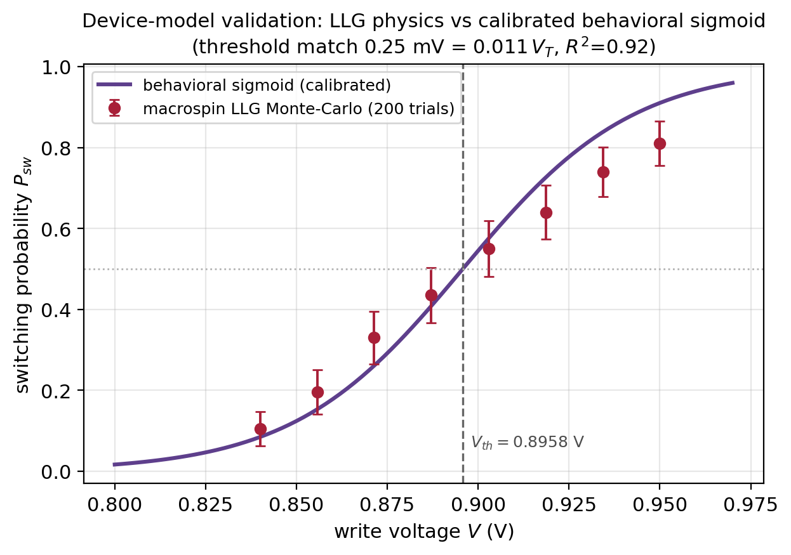
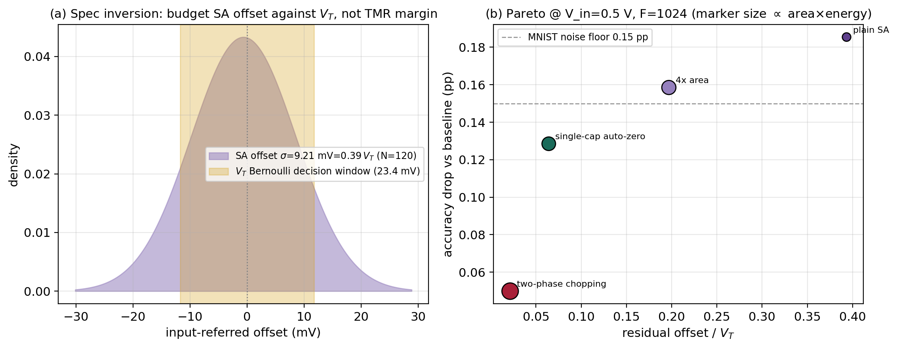
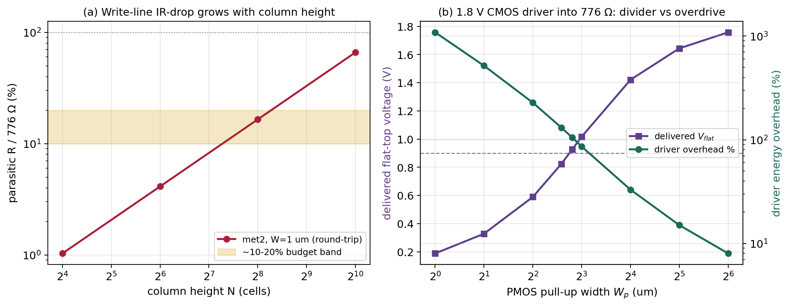
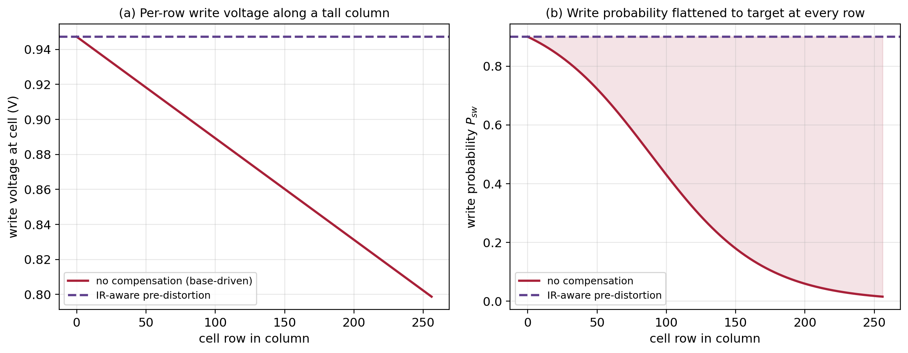
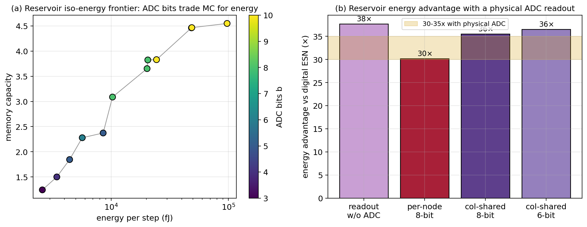

# 器件物理驱动的概率自旋电子电路协同设计与开源 EDA 验证

## 摘要

本文以一个晶圆标定的超顺磁磁隧道结（sMTJ）紧凑模型为出发点，系统地让器件物理的定量结论去**驱动外围电路的设计与优化**，并在全开源工艺设计套件（SkyWater sky130）上以晶体管级仿真与版图寄生提取加以验证。核心方法是反向的器件—电路协同设计：由 sMTJ 的开关概率 Sigmoid（其斜率定义一个宽度约 23 mV 的伯努利判决窗 $$V_T$$）出发，依次导出读出灵敏放大器的失调预算准则、写通路的供电完整性补偿、储备池读出的能量—精度协同，以及概率位采样的早退控制。每一条电路设计都对应一个可量化的器件级判据，而非对既有电路的简单复用。在此过程中，凡是器件/系统抽象模型与电路现实脱节之处（读出能量被当作可忽略、外围能量以工艺占位常数表示），均以提取到的 sky130 数据反向修正模型并重算。所有结论以比值形式报告，以便从 130 nm 节点向先进节点迁移。

## 1. 开源仿真流程与器件双模型

电路级工作建立在一条无需商业许可证的开源工具链上：器件采用自写的 Verilog-A SOT-sMTJ 紧凑模型，经 OpenVAF 编译后由 ngspice 调用；CMOS 外围取 sky130 工艺套件；版图、寄生提取、规则检查与版图—原理图一致性分别由 Magic、Netgen 与 KLayout 完成。器件侧并行保留两套模型：一套是对实测数据回归得到的代数紧凑模型，计算量小，承担全部电路与系统级迭代；另一套是宏自旋 Landau–Lifshitz–Gilbert（LLG）随机动力学求解器，物理上更完整、计算量大，专用于交叉验证。

图 1 给出二者的一致性。在 0.75 ns 自旋轨道矩写脉冲、含热涨落的反平行到平行翻转协议下，用 LLG 求解器对开关概率随写电压的关系做蒙特卡洛（写电流经标定沟道电阻 $$R_\mathrm{SOT}=776\,\Omega$$ 折算为端电压），与紧凑模型的标定 Sigmoid 相叠。两者判决阈值分别为 $$0.8960\,\mathrm V$$ 与 $$0.8958\,\mathrm V$$，相差 $$0.2\,\mathrm{mV}$$，约为判决窗 $$V_T=23.4\,\mathrm{mV}$$ 的百分之一，上升段决定系数 $$R^2=0.92$$。一个由第一性原理求解器独立得到的开关统计与一个对测量回归得到的紧凑模型在阈值上吻合到 $$0.01\,V_T$$，支持以代数模型驱动整条设计流程。约 $$0.92\,\mathrm V$$ 以上 LLG 的开关概率低于单调饱和的 Sigmoid，对应大过驱下的进动回切，故紧凑模型的适用域限定在阈值附近的工作区。

**图1** 紫线为对实测数据回归的开关概率 Sigmoid；红点为宏自旋 LLG 随机求解器（每点 200 次蒙特卡洛，误差棒为 Wilson 95% 区间）。竖虚线为标定阈值 $$V_{th}=0.8958\,\mathrm V$$。两模型阈值吻合到 $$0.01\,V_T$$；高压端的偏离对应过驱进动回切。

## 2. 斜率匹配的概率位读出协同设计

概率位的判决正确与否，其尺度是器件自身开关概率 Sigmoid 的斜率所定义的伯努利判决窗 $$V_T$$，而非确定性隧穿磁阻（TMR）读出余量。这一规格替换是本文读出设计的出发点：读出灵敏放大器的输入折合失调应按 $$V_T$$ 预算。这与现有概率位存内计算的读出处理不同——后者或以 TMR 余量保证读出裕度并把比较器当作理想[^pbnn_cim]，或在算法/训练侧补偿器件 Sigmoid 的斜率与位移而仍假设理想比较器[^pbit_var]，均未把比较器失调规格与器件 Sigmoid 斜率联系起来。

在 sky130 上实现 StrongARM 锁存比较器，对输入对与锁存管阈值失配做 120 次蒙特卡洛（Pelgrom 面积反比律，失配系数取该工艺量级），得到输入折合失调 $$\sigma_\mathrm{off}=9.21\,\mathrm{mV}=0.39\,V_T$$。即未经失调消除的平凡比较器，其失调已与判决窗同量级，会以每输出列一个系统性阈值偏移的形式注入误差。

关键在于这一失调能否被读出链路吸收。以电流灵敏读出的跨阻 $$R_\mathrm{TI}$$ 为桥，把毫伏失调折算到 popcount 域：$$\sigma_\mathrm{pc}=\sigma_\mathrm{off}\cdot 2\,\mathrm{PC_{FS}}/V_\mathrm{in}$$，其中 $$\mathrm{PC_{FS}}\!\approx\!3\sqrt F$$ 为扇入 $$F$$ 决定的满量程 popcount，$$V_\mathrm{in}$$ 为比较器差分输入范围，跨阻取动态范围允许的最大增益。这给出一条协同设计准则：跨阻增益由扇入设定，并据此判定何时平凡比较器即足够。图 2 给出扫描结果——在最大增益下平凡比较器的 $$0.39\,V_T$$ 仅映射到 $$\sigma_\mathrm{pc}\!\approx\!2\text{–}4$$ 个 popcount，落在精度曲线膝点之下，精度损失在单次训练 0.15 个百分点的统计涨落以内；仅当 $$V_\mathrm{in}\le0.4\,\mathrm V$$ 且扇入很宽时才越过膝点。因此对常见扇入与 $$V_\mathrm{in}\ge0.5\,\mathrm V$$，平凡比较器即为帕累托最优；自调零或斩波只在低压、宽扇入、增益欠预算的区域才挣回其面积与能量成本。

读出端省下的校准由写端补上。每列残余的系统性阈值偏移折叠进既有写数模转换器：由于写脉冲在关键路径上、写能量占主导，附加 3–4 个微调位（一次性按列标定、静态保持）即可把每列偏移压回统计涨落地板，其附加开关能量不足单次写能量的 1%。读出端的省与写端的补共同构成这套读出协同设计的两半。

**图2** (a) sky130 StrongARM 输入折合失调分布（$$0.39\,V_T$$）与器件判决窗 $$V_T$$（金色带）的相对关系——按 $$V_T$$ 而非磁阻余量预算失调。(b) 在 $$V_\mathrm{in}=0.5\,\mathrm V$$、扇入 1024 下，四种失调消除方案的精度跌幅对剩余失调，标记面积正比于面积×能量成本；除最低压宽扇入区外，跌幅均在统计涨落内，平凡比较器位于帕累托前沿。

## 3. 写通路能量、供电完整性与 IR 感知写预畸变

器件沟道的纯欧姆写能量为 0.78 pJ，不含写驱动与互连开销。用 sky130 标准 1.8 V CMOS 反相器驱动 776 Ω 写支路并扫描上拉管宽度（图 3b），得到端到端图景：要把标定的约 0.9 V 写电压交付到器件，需约 7 µm 上拉管，此时器件吸收 0.785 pJ，而电源取出约 1.61 pJ——驱动开销约 105%，端到端约为器件级的 2.05 倍。开销来自驱动导通电阻与 776 Ω 的分压。缩小驱动会欠驱（远端写失败），放大驱动会过驱（端电压趋向 1.8 V，器件能量随平方升至 1.9–2.9 pJ）；高效的写需要一条受控的约 0.9 V 写电压轨。因此应并列报告器件级 0.78 pJ 与端到端约 1.6 pJ 两个数。

供电完整性方面，用 Magic 电阻提取在 sky130 上标定各层方块电阻（提取得多晶硅 $$48.0\,\Omega/\square$$ 对工艺值 $$48.2$$ 相差 0.5%），按真实列写线长度标度（图 3a）：列高 $$N\le64$$ 时金属写线往返寄生电阻不足器件 776 Ω 的 5%；$$N=256$$ 时在 met2、1 µm 线宽下达约 128 Ω，即 16.5%（高角约 19%）；误用局部互连层则达千欧量级。指导为：写线走 met2 及以上、加宽或对高列分段。

这一供电发现进一步倒逼出一个写通路设计（图 5）。在一条高列上，若仅向列首施加一个写电压，行 $$r$$ 处的单元实际所见电压为 $$V_\mathrm{target}-I_\mathrm{wr}R_\mathrm{par}(r)$$，远端因 IR 压降而跌破写点，使逐单元写概率随位置急剧变化：在 $$N=256$$、目标写概率 0.90 时，远端单元写概率塌陷至 0.016，几乎不被写入。据此提出**IR 感知逐行写预畸变**：寻址行 $$r$$ 时驱动 $$V_\mathrm{target}+I_\mathrm{wr}R_\mathrm{par}(r)$$，其中 $$R_\mathrm{par}(r)$$ 由提取的方块电阻与列几何算出，使每行单元都看到 $$V_\mathrm{target}$$。该预畸变是一张由几何决定的静态逐行查找表，码值跨 0–148 mV（约 5 个写数模转换器位），与逐列阈值微调合并即得一个位置+器件双重感知的写数模转换器，控制开销近零，仅需远端行的驱动电压裕度。

**图3** (a) 列写线往返金属寄生电阻占 776 Ω 的比例随列高 $$N$$ 增长（met2、1 µm 线宽），金色带为约 10–20% 的裕度区。(b) sky130 1.8 V CMOS 反相器驱动 776 Ω：交付平顶电压（紫，左轴）与驱动能量开销（绿，右轴）随上拉管宽度变化。

**图5** 沿高列的写通路设计。(a) 无补偿时单元写电压随行号线性下降，预畸变使各行均见目标电压。(b) 无补偿时写概率由近端 0.90 塌陷至远端 0.016（红色阴影为误差），预畸变将其在每行拉平到目标。

## 4. 读出外围能量与储备池读出协同

把读出灵敏放大器的提取参数注入系统能量模型，得到第一处系统级位移。提取得到的 StrongARM 比较器动态判决能量约 23–74 fJ，远高于此前所用的工艺占位读出能量；以其中位值代入概率位推断的每次乘累加能量，写能量占比由 98.7% 降至 93.8%，读出占比由 0.6% 升至 5.6%。读出外围不再可忽略。

储备池读出的能量则需更细的协同。原储备池能量模型把读出当作近乎免费，而读出精度实为记忆容量的限制者，二者矛盾。为此引入一个三方协同模型（图 4a）：在节点数 $$N$$、被数字化节点数 $$M$$、模数转换位数 $$b$$ 三者之间，对固定能量预算最大化记忆容量，模数转换能量以提取的 StrongARM 比较器作逐次逼近转换器的比较器项。结果是：读出确非免费——比较器即使 3 位分辨也已占储备池总能量近九成；但比较器项随位数线性增长，故分辨率的能量惩罚温和。需要说明的是，对集成式储备池而言"低/中等分辨读出即足"这一结论本身在近期工作中已有报道[^ens_rc]；本文区别于该工作之处，在于以**记忆容量每焦耳**为目标、把**节点数 $$N$$ 纳入联合权衡**、并采用**列共享模数转换器**摊销转换能量于超顺磁电报噪声节点之上。由此得到的读出架构是列共享、时分复用的中分辨逐次逼近转换器，而非逐节点高分辨转换。

据此重核硬件能效（图 4b）。在含上述提取模数转换能量的情况下，对一个 100 节点储备池，sMTJ 储备池相对数字回声状态网络的每次推断能量优势为约 30 倍（逐节点 8 位）至约 35 倍（列共享 8 位）；该优势之所以稳健，是因为数字网络每步的 $$O(N^2)$$ 稠密矩阵向量乘（约 10.2 µJ）远大于含转换的储备池读出。

**图4** (a) 储备池等能量前沿，记忆容量对每步能量，颜色为模数转换位数：读出主导能量，但比较器线性项使分辨率惩罚温和。(b) 在物理模数转换读出下相对数字回声状态网络的能量优势：自无转换读出的高估值降为约 30 倍（逐节点 8 位）至 35 倍（列共享），金色带为含转换的实际区间。

## 5. 受限的双模架构与自适应采样

将同一物理阵列以时分复用同时承担概率位推断与储备池处理，要求两种模式的热稳定因子不同：概率位取 $$\Delta=4.91$$（零偏弛豫时间约 68 ns），储备池取 $$\Delta\approx3.8$$（约 22 ns）。一块固定器件不能同时是两个势垒，时分复用需约 22.6% 的势垒摆幅（$$\Delta E_b\approx28.7\,\mathrm{meV}$$），可经电压控制磁各向异性栅（约 0.56 V，量级与已报道的电压可调各向异性器件相当）或约 88 K 温升达到。但三点限制必须登记：两种模式在时间上互斥；储备池所需的低势垒与概率位的写保持及读扰动相冲突；尚无在同一物理阵列上时分复用概率位写与储备池自由演化的实现——已报道的电压可调随机性器件或为脉冲驱动的可调随机电报噪声[^tunable_rtn]，或为电压控制各向异性的确定/泊松双功能宏[^vcma_macro]，均非概率位/储备池双模阵列。因此该统一阵列应作为受限的、电压栅控的、时分复用的架构提案陈述，并附上述量化调谐包络与势垒冲突这一限制。

采样侧有一处能效杠杆。概率位推断每决策做 $$T$$ 次伯努利采样并取平均，固定 $$T$$ 对易判与难判一视同仁。引入基于置信度的序贯早退后，在匹配错误率的意义下，平均采样数约为固定方案的一半（达到同一错误率，固定方案需 22 次，自适应方案平均 9.6 次；跨工作点约省 50%）。由于每次采样即一次随机写、而写占系统能量的主导，这一节省以接近 1:1 的比例传导到写能量。

## 6. 与实测工作的关系及限制

近期已有在 130 nm 商用 CMOS 上实测的概率计算芯片，以电压控制磁隧道结作熵源求解整数分解[^pbit_asic]。本文不与之竞争实测硅，而是以晶圆标定的紧凑模型为可信锚、在开源工艺上做晶体管级的器件—电路协同设计，开源工艺的选择服务于结果的可复现性。

限制如下，按通常的方法学口径陈述：随机性保留在数值采样环中、紧凑模型保持代数形式以适配开源编译器，含噪后仿的随机共仿尚未实现；sky130 为 130 nm/1.8 V，故所有结论以比值（失调比判决窗、记忆容量每焦耳、能量占比）报告而非绝对值；Magic 的电阻型寄生与 IR 压降为粗集总、仅给量级，串扰未建模，故写线 IR 仅为量级估计；磁隧道结在版图中以抽象黑盒单元表示并附不可制造声明，因无开源工艺提供可用的 SOT-MTJ 单元；紧凑模型在储备池低势垒区为重参数化、未经独立晶圆验证。

表 1 汇总由器件物理结论驱动的电路设计与规格。

**表1 器件物理结论 → 电路设计/规格**

| 器件/系统结论 | 由此驱动的电路设计或规格 |
|---|---|
| 开关概率 Sigmoid 斜率定义判决窗 $$V_T\approx23\,\mathrm{mV}$$ | 读出比较器失调按 $$V_T$$ 预算；跨阻增益由扇入设定的协同律；常见扇入下平凡比较器即帕累托最优 |
| 每列阈值/失调残余 | 折叠进写数模转换器的逐列 3–4 位静态微调，开销 <1% 写能量 |
| 写线 IR 压降随列高增长、使远端写概率塌陷 | IR 感知逐行写预畸变（静态查找表），与逐列微调合成位置+器件感知写数模转换器 |
| 1.8 V 驱动经分压交付 0.9 V | 受控约 0.9 V 写电压轨；并列报告器件级 0.78 pJ 与端到端约 1.6 pJ |
| 读出（含模数转换）主导储备池能量、比较器项线性 | 列共享、时分复用的中分辨逐次逼近转换器读出 |
| 采样对易/难判等量耗费 | 置信度序贯早退控制器，等精度下约省一半写采样 |

[^pbnn_cim]: 一种基于 SOT-MRAM 存内计算的概率二值神经网络实现，arXiv:2403.19374（以 TMR 余量保证读出、比较器理想化）。
[^pbit_var]: 利用玻尔兹曼机训练在大阵列中自动提取并补偿 p-bit 器件变异，arXiv:2410.16915（在算法/训练侧补偿 Sigmoid 斜率与位移，假设理想比较器）。
[^ens_rc]: Ensemble Reservoir Computing for Physical Systems，arXiv:2601.21807（扫描集成数与模数转换位数，指出 2–4 位即足）。
[^pbit_asic]: An integrated-circuit-based probabilistic computer that uses voltage-controlled magnetic tunnel junctions as its entropy source，Nature Electronics, 2025, s41928-025-01439-6（实测 130 nm CMOS）。
[^tunable_rtn]: Tunable Random Telegraph Noise in Stable Perpendicular Magnetic Tunnel Junctions for Unconventional Computing，arXiv:2509.13458, 2025（自旋转移矩脉冲驱动的可调随机电报噪声）。
[^vcma_macro]: 一种 28 nm CMOS 集成的 VCMA-MTJ 双功能宏，用于确定性存内计算突触与随机泊松神经元，IEEE Symp. VLSI Technology & Circuits, 2026。
